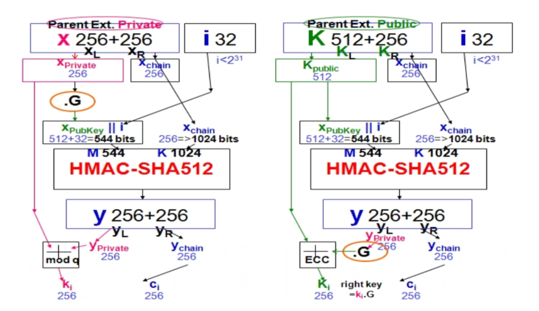
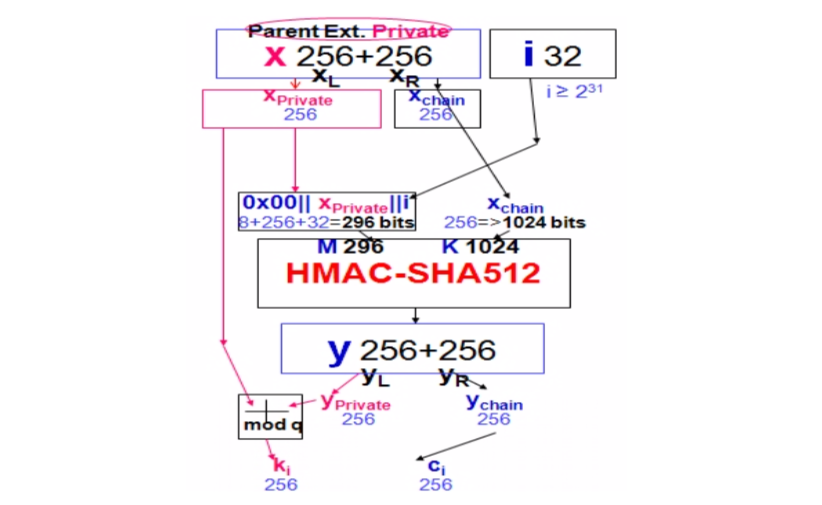
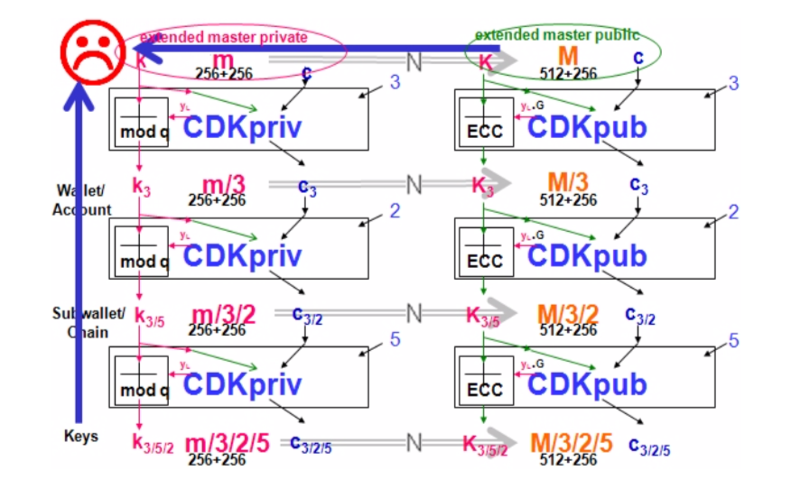

# BIP32

原文地址：https://github.com/bitcoin/bips/blob/master/bip-0032.mediawiki

## Abstract

This document describes hierarchical deterministic wallets (or "HD Wallets"): wallets which can be shared partially or entirely with different systems, each with or without the ability to spend coins.

The specification is intended to set a standard for deterministic wallets that can be interchanged between different clients. Although the wallets described here have many features, not all are required by supporting clients.

The specification consists of two parts. In a first part, **a system for deriving a tree of keypairs from a single seed is presented**. The second part **demonstrates how to build a wallet structure on top of such a tree**.

> **第一部分中，提出了一种用于从单个种子seed导出密钥对树（tree of keypairs）；第二部分说明如何在这个树结构上构建钱包。**

## Motivation

The Bitcoin reference client uses randomly generated keys. In order to avoid the necessity for a backup after every transaction, (by default) 100 keys are cached in a pool of reserve keys. Still, these wallets are not intended to be shared and used on several systems simultaneously. They support hiding their private keys by using the wallet encrypt feature and not sharing the password, but such "neutered" wallets lose the power to generate public keys as well.

> 随机生成密钥对，不实用BIP32之前的钱包的一些缺点：不能共享、不能动态生成公钥～

Deterministic wallets do not require such frequent backups, and elliptic curve mathematics permit schemes where one can calculate the public keys without revealing the private keys. This permits for example a webshop business to let its webserver generate fresh addresses (public key hashes) for each order or for each customer, without giving the webserver access to the corresponding private keys (which are required for spending the received funds).

> 举例一个场景，可以给每个客人甚至是每单生成一个新的地址。确定性钱包不需要频繁的备份。

However, deterministic wallets typically consist of a single "chain" of keypairs. The fact that there is only one chain means that sharing a wallet happens on an all-or-nothing basis. However, in some cases one only wants some (public) keys to be shared and recoverable. In the example of a webshop, the webserver does not need access to all public keys of the merchant's wallet; only to those addresses which are used to receive customer's payments, and not for example the change addresses that are generated when the merchant spends money. Hierarchical deterministic wallets allow such selective sharing by supporting multiple keypair chains, derived from a single root.

> 主要说，分层确定性钱包可以选择性的共享部分地址，而不是全部都要或者全部不要。

## Specification: Key derivation

### Conventions

In the rest of this text we will assume the public key cryptography used in Bitcoin, namely elliptic curve cryptography using the field and curve parameters defined by **secp256k1** (<http://www.secg.org/sec2-v2.pdf>). Variables below are either:

- Integers modulo the order of the curve (referred to as n).
- Coordinates of points on the curve.
- Byte sequences.

Addition (+) of two coordinate pair is defined as application of the EC group operation. Concatenation (||) is the operation of appending one byte sequence onto another.

As standard conversion functions, we assume:

- $point(p)$: returns the coordinate pair resulting from **EC point multiplication** (repeated application of the EC group operation) of the secp256k1 base point with the integer p.
- $ser_{32}(i)$: serialize a 32-bit unsigned integer i as a **4-byte** sequence, most significant byte first.
- $ser_{256}(p)$: serializes the integer p as a **32-byte** sequence, most significant byte first.
- $ser_P(P)$: serializes the coordinate pair P = (x,y) as a byte sequence using SEC1's compressed form: **(0x02 or 0x03) || ser256(x)**, where the header byte depends on the parity of the omitted y coordinate.
- $parse_{256}(p)$: interprets a 32-byte sequence as a 256-bit number, most significant byte first.

> 这部分主要是说明一下椭圆曲线上的一些操作。椭圆曲线上的乘法、对点的压缩、序列化反序列化。
>

### Extended keys

In what follows, we will define a function that derives a number of child keys from a parent key. In order to prevent these from depending solely on the key itself, we extend both private and public keys first **with an extra 256 bits of entropy**. This extension, called the **chain code**, is identical for corresponding private and public keys, and consists of 32 bytes.

We represent an extended private key as **(k, c)**, with k the normal private key, and c the chain code. An extended public key is represented as **(K, c)**, with **K = point(k)** and c the chain code.

Each extended key has $2^{31}$ **normal child keys**, and $2^{31}$ **hardened child keys**. Each of these child keys has an **index**. The normal child keys use indices 0 through $2^{31}-1$. The hardened child keys use indices $2^{31}$ through $2^{32}-1$. To ease notation for hardened key indices, a number $i_H$ represents $i+2^{31}$.

> 扩展密钥，介绍几个概念：**chain code**、**normal child keys**、**hardened child keys**。

### Child key derivation (CKD) functions

Given a parent extended key and an index i, it is possible to compute the corresponding child extended key. The algorithm to do so depends on whether the child is a hardened key or not (or, equivalently, whether i ≥ $2^{31}$), and whether we're talking about private or public keys.

> 给出parent extended key和index i，可以计算出相应的child extended key。根据条件分类讨论：

#### Private parent key → private child key

The function $CKDpriv((k_{par}, c_{par}), i) → (k_i, c_i)$ computes a child extended private key from the parent extended **private** key:

- Check whether $i ≥ 2^{31}$ (whether the child is a hardened key).

  - If so (hardened child): let $I = HMAC-SHA512(Key = c_{par}, Data = 0x00 || ser_{256}(k_{par}) || ser_{32}(i))$. (Note: The $0x00$ pads the private key to make it 33 bytes long.)
  - If not (normal child): let $I = HMAC-SHA512(Key = c_{par}, Data = ser_P(point(k_{par})) || ser_{32}(i))$.

- Split $I$ into two 32-byte sequences, $IL$ and $IR$.

- The returned child key $k_i$ is $parse_{256}(IL) + k_{par} (mod\ n)$.

- The returned chain code $c_i$ is $IR$.

- In case $parse_{256}(IL) ≥ n$ or $k_i = 0$, the resulting key is **invalid**, and one should proceed with the next value for i. (Note: this has probability lower than 1 in $2^{127}$.)

The HMAC-SHA512 function is specified in [RFC 4231](https://tools.ietf.org/html/rfc4231).

> 从私钥生成子私钥的过程：跟根据i的大小确定求 $I$ 的参数，将$I$分成相等的两份，分别用来生成新的（k，c）。需要用到一个HMAC函数。

#### Public parent key → public child key

The function $CKDpub((K_{par}, c_{par}), i) → (K_i, c_i)$ computes a child extended public key from the parent extended **public** key. It is only defined for **non-hardened child keys**.

- Check whether $i ≥ 2^{31}$ (whether the child is a hardened key).

  - If so (hardened child): return failure;
  - If not (normal child): let $I = HMAC-SHA512(Key = c_{par}, Data = ser_P(K_{par}) || ser_{32}(i))$.

- Split $I$ into two 32-byte sequences, $IL$ and $IR$.

- The returned child key $K_i$ is $point(parse_{256}(IL)) + K_{par}$.

- The returned chain code $c_i$ is $IR$.

- In case $parse_{256}(IL) ≥ n$ or $K_i$ is the point at infinity, the resulting key is invalid, and one should proceed with the next value for i.

> 从公钥生成子公钥的过程：这个过程不支持**hardened child keys**，一样的用HMAC函数是生成$I$，对$I$的两部分进行分别处理，得出新的（K，c）。
>

#### Private parent key → public child key

The function $N((k, c)) → (K, c)$ computes the extended public key corresponding to an extended private key (the "neutered" version, as it removes the ability to sign transactions).

- The returned key $K$ is $point(k)$.
- The returned chain code $c$ is just the passed chain code.

To compute the public child key of a parent private key:

- $N(CKDpriv((k_{par}, c_{par}), i))$ (**works always**).
- $CKDpub(N(k_{par}, c_{par}), i)$ (**works only for non-hardened child keys**).

The fact that they are equivalent is what makes non-hardened keys useful (one can derive child public keys of a given parent key without knowing any private key), and also what distinguishes them from hardened keys. The reason for not always using non-hardened keys (which are more useful) is security; see further for more information.

> 从私钥生成子公钥的过程有两种方法：
>
> 1、先从私钥生成子私钥，再从子私钥生成子公钥；
>
> 2、从私钥生成公钥，再从公钥生成子公钥。

#### Public parent key → private child key

**This is not possible.**

> 很明显，不可能用公钥生成任何私钥。

下图显示了 normal  模式下生成子私钥和子公钥的过程。

下图显示了 hardened 模式下生成子私钥的过程，hardened 模式没有公钥生成子公钥的方法。

### The key tree

The next step is cascading several CKD constructions to build a tree. We start with one root, the **master extended key $m$**. By evaluating $CKDpriv(m,i)$ for several values of i, we get a number of level-1 derived nodes. As each of these is again an extended key, CKDpriv can be applied to those as well.

To shorten notation, we will write $CKDpriv(CKDpriv(CKDpriv(m,3_H),2),5)$ as $m/3_H/2/5$. Equivalently for public keys, we write $CKDpub(CKDpub(CKDpub(M,3),2),5)$ as $M/3/2/5$. This results in the following identities:

- $N(m/a/b/c) = N(m/a/b)/c = N(m/a)/b/c = N(m)/a/b/c = M/a/b/c$.
- $N(m/a_H/b/c) = N(m/a_H/b)/c = N(m/a_H)/b/c$. 

However, $N(m/a_H)$ cannot be rewritten as $N(m)/a_H$, as the latter is not possible. //hardened 模式不支持。

Each leaf node in the tree corresponds to an actual key, while the internal nodes correspond to the collections of keys that descend from them. The chain codes of the leaf nodes are ignored, and only their embedded private or public key is relevant. Because of this construction, **knowing an extended private key allows reconstruction of all descendant private keys and public keys**, and **knowing an extended public keys allows reconstruction of all descendant non-hardened public keys.**

> 就是一个master key可以生成很多个extended key，那样可以构成一个树状结构的key树。用 “/” 表示一层一层的关系。

### Serialization format

Extended public and private keys are serialized as follows:

- 4 byte: **version bytes** (mainnet: 0x0488B21E public, 0x0488ADE4 private; testnet: 0x043587CF public, 0x04358394 private)
- 1 byte: **depth**: 0x00 for master nodes, 0x01 for level-1 derived keys, ....
- 4 bytes: **the fingerprint of the parent's key** (0x00000000 if master key)
- 4 bytes: **child number**. This is $ser_{32}(i)$ for $i\ in\ x_i = x_{par}/i$, with $x_i$ the key being serialized. (0x00000000 if master key)
- 32 bytes: the **chain code**
- 33 bytes: the public key or private key **data** ($ser_P(K)$ for public keys, 0x00 || $ser_{256}(k)$ for private keys)

This **78 byte** structure can be encoded like other Bitcoin data in Base58, by first adding 32 checksum bits (derived from the double SHA-256 checksum), and then converting to the Base58 representation. This results in a Base58-encoded string of up to 112 characters. Because of the choice of the version bytes, the Base58 representation will start with "**xprv**" or "**xpub**" on mainnet, "**tprv**" or "**tpub**" on testnet.

Note that the fingerprint of the parent only serves as a fast way to detect parent and child nodes in software, and software must be willing to deal with collisions. Internally, the full 160-bit identifier could be used.

When importing a serialized extended public key, implementations must verify whether the X coordinate in the public key data corresponds to a point on the curve. If not, the extended public key is invalid.

> 说明了一个key应该如何序列化，对每个部分进行了比较详细的说明。

### Master key generation

The total number of possible extended keypairs is almost $2^{512}$, but the produced keys are only **256 bits** long（密钥长度256位）, and offer about half of that in terms of security（提供128位安全性）. Therefore, master keys are not generated directly, but instead from a potentially short seed value.

- Generate a seed byte sequence $S$ of a chosen length (between 128 and 512 bits; **256 bits is advised**) from a (P)RNG（随机数生成）.
- Calculate $I = HMAC-SHA512(Key = "Bitcoin seed", Data = S)$
- Split $I$ into two 32-byte sequences, $IL$ and $IR$.
- Use $parse_{256}(IL)$ as master secret key, and $IR$ as master chain code.

In case $IL$ is 0 or ≥n, the master key is invalid.

> 生成**Master key**的过程：
>
> 1、可以从BIP39得到seed，再生成一个随机数S；
>
> 2、用HMAC函数生成$I$，$I$分成两部分，两部分组成Master key

## Specification: Wallet structure

The previous sections specified key trees and their nodes. The next step is imposing a wallet structure on this tree. The layout defined in this section is a default only, though clients are encouraged to mimic it for compatibility, even if not all features are supported.

> 上面部分是详细介绍了key树和key的生成方法。下面要介绍钱包结构，BIP32给出了一个默认（推荐）的钱包格式，拓建使用这种格式。

### The default wallet layout

**An HDW is organized as several 'accounts'**. Accounts are numbered, the default account ("") being number 0. Clients are not required to support more than one account - if not, they only use the default account.

**Each account is composed of two keypair chains**: an **internal** and an **external** one. The external keychain is used to generate new public addresses, while the internal keychain is used for all other operations (change addresses, generation addresses, ..., anything that doesn't need to be communicated). Clients that do not support separate keychains for these should use the external one for everything.

- $m/i_H/0/k$ corresponds to the k'th keypair of the **external** chain of account number i of the HDW derived from master m.
- $m/i_H/1/k$ corresponds to the k'th keypair of the **internal** chain of account number i of the HDW derived from master m.

> 第二层 0表示externa，1表示internal。

### Use cases

#### Full wallet sharing: m

In cases where two systems need to access a single shared wallet, and both need to be able to perform spendings, one needs to share the master private extended key. Nodes can keep a pool of N look-ahead keys cached for external chains, to watch for incoming payments. The look-ahead for internal chains can be very small, as no gaps are to be expected here. An extra look-ahead could be active for the first unused account's chains - triggering the creation of a new account when used. Note that the name of the account will still need to be entered manually and cannot be synchronized via the block chain.

> 直接保留master key m。

#### Audits: N(m/*)

In case an auditor needs full access to the list of incoming and outgoing payments, one can share all account public extended keys. This will allow the auditor to see all transactions from and to the wallet, in all accounts, **but not a single secret key**.

> 给出所有的公钥。

#### Per-office balances: $m/i_H$

When a business has several independent offices, they can all use wallets derived from a single master. This will allow the headquarters to maintain a super-wallet that sees all incoming and outgoing transactions of all offices, and even permit moving money between the offices.

> 给出所有的子私钥。

#### Recurrent business-to-business transactions: $N(m/i_H/0)$

In case two business partners often transfer money, one can use the extended public key for the external chain of a specific account $(M/i_h/0)$ as a sort of "super address", allowing frequent transactions that cannot (easily) be associated, but without needing to request a new address for each payment. Such a mechanism could also be used by mining pool operators as variable payout address.

> 第i个子私钥的所有外部公钥。

#### Unsecure money receiver: $N(m/i_H/0)$

When an unsecure webserver is used to run an e-commerce site, it needs to know public addresses that are used to receive payments. The webserver only needs to know the public extended key of the external chain of a single account. This means someone illegally obtaining access to the webserver **can at most see all incoming payments** but will not be able to steal the money, will not (trivially) be able to distinguish outgoing transactions, nor be able to see payments received by other webservers if there are several.

> 给出第i个子私钥的所有外部公钥会使得其他人能查看所有账户的交易往来。

## Compatibility

To comply with this standard, a client must at least be able to import an extended public or private key, to give access to its direct descendants as wallet keys. The wallet structure (**master/account/chain/subchain**) presented in the second part of the specification is advisory only, but is suggested as a minimal structure for easy compatibility - even when no separate accounts or distinction between internal and external chains is made. However, implementations may deviate from it for specific needs; more complex applications may call for a more complex tree structure.

> 兼容性。

## Security

In addition to the expectations from the EC public-key cryptography itself:

- Given a public key K, an attacker cannot find the corresponding private key more efficiently than by solving the EC discrete logarithm problem (assumed to require $2^{128}$ group operations).

the intended security properties of this standard are:

- Given a child extended private key $(k_i,c_i)$ and the integer $i$, an attacker cannot find the parent private key $k_{par}$ more efficiently than a $2^{256}$ brute force of $HMAC-SHA512$.
- Given any number $(2 ≤ N ≤ 2^{32}-1)$ of (index, extended private key) tuples $(i_j,(k_{i_j},c_{i_j}))$, with distinct $i_j$'s, determining whether they are derived from a common parent extended private key (i.e., whether there exists a $(k_{par},c_{par})$ such that for each $j$ in $(0..N-1)$ $CKDpriv((k_{par},c_{par}),i_j)=(k_{i_j},c_{i_j}))$, cannot be done more efficiently than a $2^{256}$ brute force of $HMAC-SHA512$.

Note however that the following properties does not exist:

- Given a parent extended public key $(K_{par},c_{par})$ and a child public key $(K_i)$, it is hard to find $i$.
- Given a parent extended public key $(K_{par},c_{par})$ and a non-hardened child private key $(ki)$, it is hard to find $k_{par}$.

> 安全性分析。原文说自己的协议时很安全的，只能暴力执行 $2^{256}$ 次才能破解，因为目前认为大雨 $2^{80}$ 就很难破解，所以认为他们是安全的。

## BIP32的漏洞

论文 [**Private Key Recovery Combination Attacks: On Extreme Fragility of Popular Bitcoin Key Management, Wallet and Cold Storage Solutions in Presence of Poor RNG Events**](https://eprint.iacr.org/2014/848) 

这篇论文分析了 BIP32 的一个极具破坏力的漏洞。

在 **normal** 模式下，如果n层（假设）的chain value泄露出去，以及n层下面（比如n+1、n+2层）的某个子私钥也泄露了，那么就可以**反推出n层的私钥！！！**

具体反推过程（看下图）

比如 $(K_{public},\ X_{chain})$ 泄露出去（为了审计，往往会将这两个信息都给审计人员）。当攻击者可以获取到 $k_i$ 时。可以先从$(K_{public},\ X_{chain})$ 计算出 $y_{Private}$（通过右边的路径来计算），得到 $y_{Private}$ 后在左边图上结合 $k_i$ 就可以反推出 $X_{Private}$ 。
$$
X_{Private} = (k_i - y_{Privatr})\ mod(q)
$$
而有时不一定刚好知道下一层的子私钥，那么可以通过公钥生成子公钥的方式生成下面任意一层的子公钥，就可以得到相应子私钥那层的父公钥，以此类推还是可以翻推出已知chain value那一层的私钥。

**但是！！！**这个攻击方法对 hardened 模式无效，因为求不出 $y_{Private}$ 的值（hardened 模式的 $y_{Private}$ 需要由私钥计算出来）。

**小结**：知道子私钥和chain value就可以翻推出相应层的私钥！！！在现实中是有可能发生的。为了具有比较好的审计特性，那么就要承担泄漏的风险。这个攻击在 hardened 模式下不会出现，但是失去了良好的审计特性。