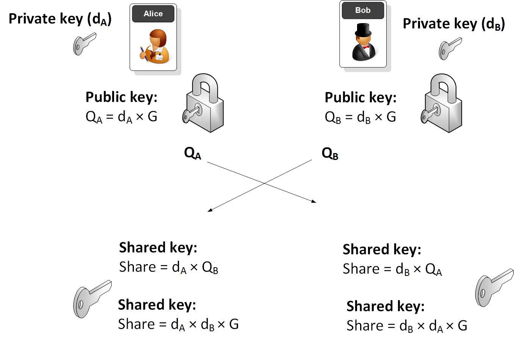
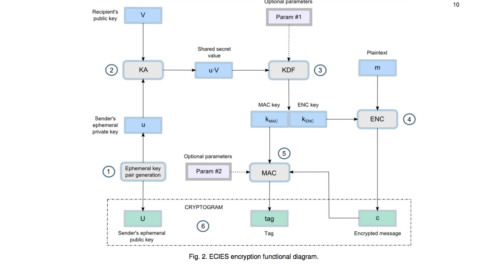
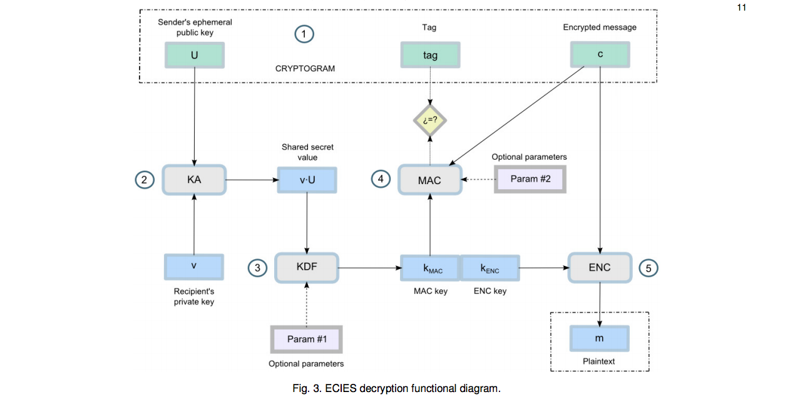
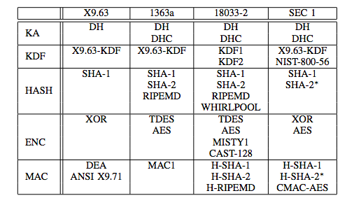
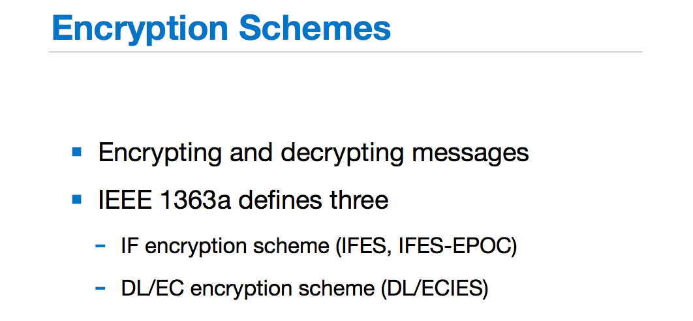

# ECC

## ECDSA 签名验签

内容来自[wiki](https://en.wikipedia.org/wiki/Elliptic_Curve_Digital_Signature_Algorithm)、[FIPS PUB 186-4](https://nvlpubs.nist.gov/nistpubs/FIPS/NIST.FIPS.186-4.pdf)

ECDSA是DSA在 elliptic curve cryptography 中的具体化算法。

### Signature generation algorithm

> Alice creates a key pair, consisting of a private key integer $d_{A}$, randomly selected in the interval ${\displaystyle [1,n-1]}$; and a public key curve point ${\displaystyle Q_{A}=d_{A}\times G}$. 
>
> For Alice to sign a message ${\displaystyle m}$, she follows these steps:
>
> 1. Calculate ${\displaystyle e={\textrm {HASH}}(m)}$, where HASH is a cryptographic hash function, such as SHA-2.
> 2. Let ${\displaystyle z}$ be the ${\displaystyle L_{n}}$ **leftmost** bits of ${\displaystyle e}$, where ${\displaystyle L_{n}}$ is the **bit length of the group order** ${\displaystyle n}$.
> 3. Select a **cryptographically secure random** integer ${\displaystyle k}$ from ${\displaystyle [1,n-1]}$.
> 4. Calculate the curve point ${\displaystyle (x_{1},y_{1})=k\times G}$.
> 5. Calculate ${\displaystyle r=x_{1}\,{\bmod {\,}}n}$. If ${\displaystyle r=0}$, go back to step 3.
> 6. Calculate ${\displaystyle s=k^{-1}(z+rd_{A})\,{\bmod {\,}}n}$. If ${\displaystyle s=0}$, go back to step 3.
> 7. The signature is the pair ${\displaystyle (r,s)}$.

每次签名，在第三步中，需要选择一个随机数k。也就是说，同样的messag和私钥进行签名，结果会是不一样的。而且这个k要保证随机，不然会有泄漏$d_A$的风险。
$$
d_A= (sk-z)/r\ mod(n)
$$
如果有两个ECDSA签名中的 $r$ 相等，那么可以认为使用的随机数 $k$ 相等。那个双方就可以很简单的解出对方的私钥$d_A$。

### Signature verification algorithm

> For Bob to authenticate Alice's signature, he must have a copy of her public-key curve point ${\displaystyle Q_{A}}$. Bob can verify ${\displaystyle Q_{A}}$ is a valid curve point as follows:
>
> 1. Check that ${\displaystyle Q_{A}}$ is not equal to the identity element ${\displaystyle O}$, and its coordinates are otherwise valid
> 2. Check that ${\displaystyle Q_{A}}$ lies on the curve
> 3. Check that ${\displaystyle n\times Q_{A}=O}$

先验证公钥的合法性。

> After that, Bob follows these steps:
>
> 1. Verify that ${\displaystyle r}$ and ${\displaystyle s}$ are integers in ${\displaystyle [1,n-1]}$. If not, the signature is invalid.
> 2. Calculate ${\displaystyle e={\textrm {HASH}}(m)}$, where HASH is the same function used in the signature generation.
> 3. Let ${\displaystyle z}$ be the ${\displaystyle L_{n}}$ leftmost bits of ${\displaystyle e}$.
> 4. Calculate ${\displaystyle w=s^{-1}\,{\bmod {\,}}n}$.
> 5. Calculate ${\displaystyle u_{1}=zw\,{\bmod {\,}}n}$ and ${\displaystyle u_{2}=rw\,{\bmod {\,}}n}$.
> 6. Calculate the curve point ${\displaystyle (x_{1},y_{1})=u_{1}\times G+u_{2}\times Q_{A}}$. If ${\displaystyle (x_{1},y_{1})=O}$ then the signature is invalid.
> 7. The signature is valid if ${\displaystyle r\equiv x_{1}{\pmod {n}}}$, invalid otherwise.

比较常规的验签的过程。

$$
(x_1,y_1)=u_1\times G+u_2\times Q_A=zs^{-1}\times G+rs^{-1}d_A\times G=(z+rd_A)s^{-1}\times G=s*k*s^{-1}\times G=k\times G
$$
所以，$r$ 应该等于 $x_1$。否则验证不通过。

## ECDH 密钥协商

### wiki 定义

> **Elliptic-curve Diffie–Hellman** (**ECDH**) is an anonymous **key agreement** protocol that allows two parties, each having an elliptic-curve public–private key pair, to establish a **shared secret** over an insecure channel.

ECDH是 DH密钥交换（密钥协商）在EC中的具体应用。目的是在不可靠的信道上双方协商得到一个相同的密钥。得到密钥之后一般是用来进行对称加密，或者经过KDF再作为密钥使用。

### 具体过程

wiki

> Initially, the **domain parameters** that is, $\displaystyle (p,a,b,G,n,h)$ in the prime case must be agreed upon. Also, each party must have **a key pair** suitable for elliptic curve cryptography, consisting of a **private key $\displaystyle d$**  (a randomly selected integer in the interval $[1,n-1]$ ) and a **public key** represented by a point $Q$ ( where $Q=dG$ ). 
>
> Let Alice's key pair be $d_{A},Q_{A}$ and Bob's key pair be $d_{B},Q_{B}$. Each party must know the other party's public key prior to execution of the protocol.
>
> Alice computes point $(x_{k},y_{k})=d_{A}Q_{B}$. Bob computes point $(x_{k},y_{k})=d_{B}Q_{A}$. The shared secret is $x_{k}$ (the ***x* coordinate of the point**). Most standardized protocols based on ECDH derive a symmetric key from $x_{k}$ using some hash-based key derivation function.
>
> The shared secret calculated by both parties is equal, because $d_{A}Q_{B}=d_{A}d_{B}G=d_{B}d_{A}G=d_{B}Q_{A}$.

上面原文介绍的很具体：

1. 椭圆循环群和素域上的参数钥事先规定好，包括椭圆曲线参数$a$、$b$、生成元 $G$ 等等。
2. Alice 和 Bob 分别生成一堆公私钥对，分别将自己的公钥公开出去。
3. Alice 用自己的私钥和 Bob 的公钥相乘得到一个点 $(x_k,\ y_k)$ ，将横坐标 $x_k$ 作为ECDH的结果。Bob 同理。
4. 就可以使用协商的结果去进行后续的使用。

## ECIES 集成加密模式

ECIES使用到了DH、KDF、HASH、ENC、MAC这五个元素，IES 是 Integrated Encryption Scheme。

### 论文

**论文** [A Survey of the Elliptic Curve Integrated Encryption Scheme](https://www.researchgate.net/publication/255970113_A_Survey_of_the_Elliptic_Curve_Integrated_Encryption_Scheme)

该论文先是将ECC与RSA进行对比，接下来详细介绍了ECC STANDARDS里面的三种应用模式：ECDH、ECDSA、ECIES，然后紧接着介绍ECIES的具体描述以及在不同标准文件中的不同描述，并进行了详细的对比。

下面两张图分别是ECIES的加解密流程图：

**论文** [A Comparison of the Standardized Versions of ECIES](http://citeseerx.ist.psu.edu/viewdoc/download?doi=10.1.1.819.9345&rep=rep1&type=pdf)

该论文综述了ECIES的发展以及在不同的标准文件中的描述：

### 标准

1、[**SEC 1: Elliptic Curve Cryptography**](http://www.secg.org/SEC1-Ver-1.0.pdf )

part 5：Encryption Schemes

5.1 Elliptic Curve Integrated Encryption Scheme

2、**IEEE 1363a-2004 - IEEE Standard Specifications for Public-Key Cryptography**

3、**ANS X9.63-199x**

[**Public Key Cryptography For The Financial Services Industry:
Key Agreement and Key Transport Using Elliptic Curve Cryptography**](https://cdn.preterhuman.net/texts/cryptography/Key%20Agreement%20and%20Key%20Transport%20Using%20Elliptic%20Curve%20Cryptography.pdf)

5.8.1 Elliptic Curve Encryption Scheme

4、[**ISO/IEC 18033-2: Information technology — Security techniques — Encryption algorithms — Part 2: Asymmetric Ciphers**](http://www.shoup.net/iso/std4.pdf)

10.2 ECIES-KEM

### SM2

SM2的加解密模式就是一种ECIES