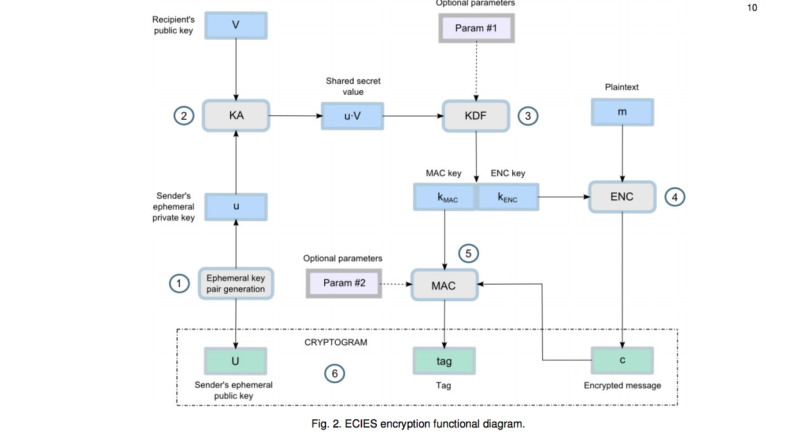
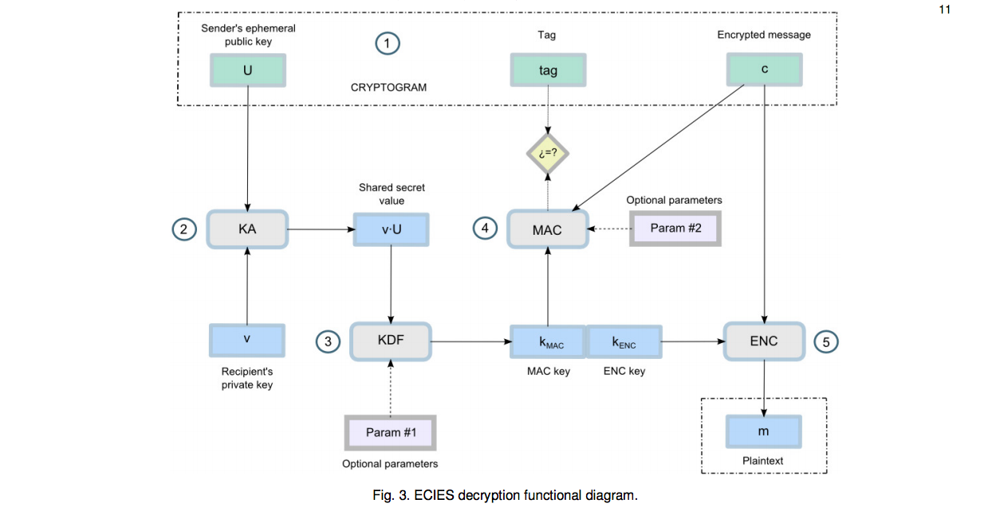
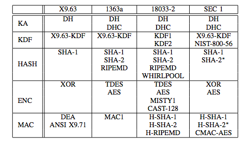
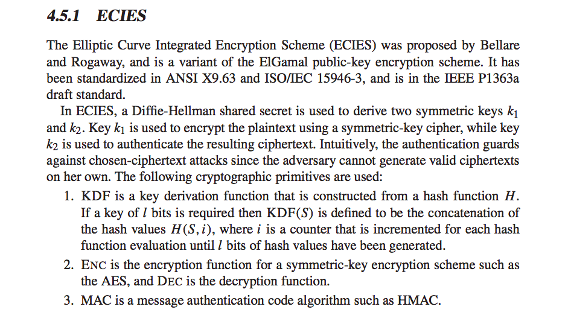
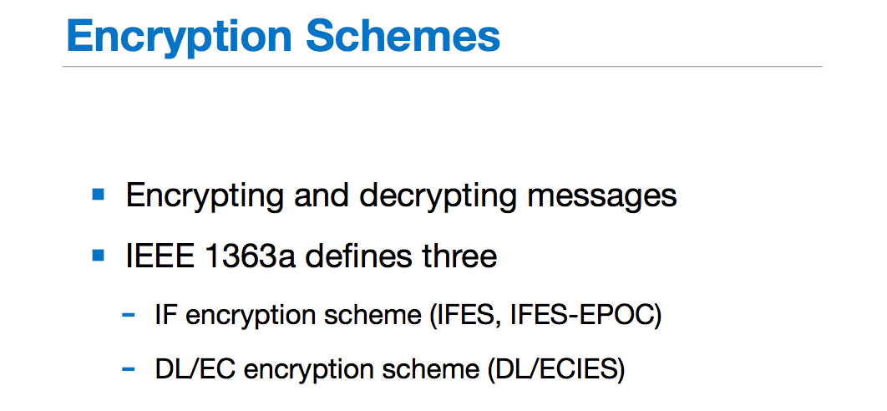
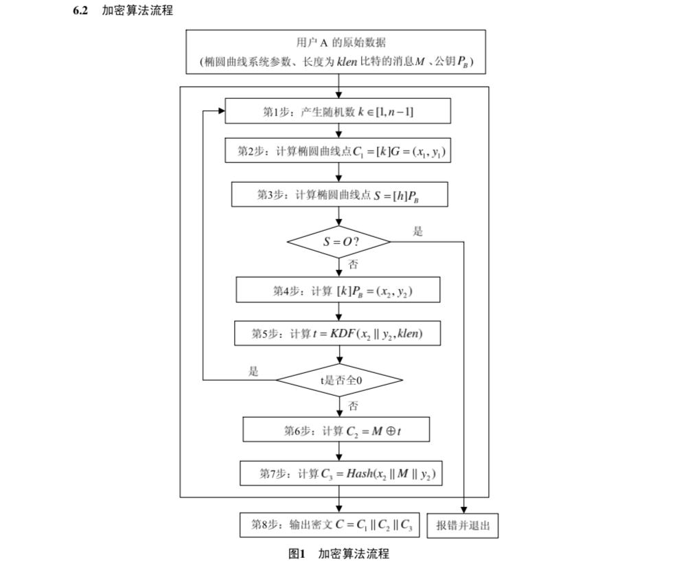
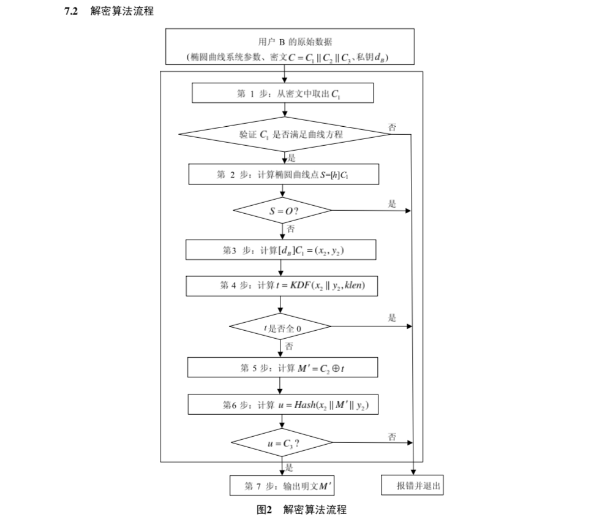

# 基于ECC的公钥加密算法--ECIES

Crypto++ wiki：**Elliptic Curve Integrated Encryption Scheme**, or **ECIES**, is a hybrid encryption system proposed by Victor Shoup in 2001. ECIES has been standardized in ANSI X9.63, IEEE 1363a, ISO/IEC 18033-2, and SECG SEC-1. Shoup's submission can be found at <http://www.shoup.net/papers/iso-2_1.pdf>.

下面从三个方面来介绍ECIES，分别是已发表的Paper、标准文件和具体实例。

## 一、Paper和书籍

### 1、A Survey of the Elliptic Curve Integrated Encryption Scheme

https://www.researchgate.net/publication/255970113_A_Survey_of_the_Elliptic_Curve_Integrated_Encryption_Scheme

该论文先是将ECC与RSA进行对比，接下来详细介绍了ECC STANDARDS里面的三种应用模式：ECDH、ECDSA、ECIES，然后紧接着介绍ECIES的具体描述以及在不同标准文件中的不同描述，并进行了详细的对比。

下面两张图分别是ECIES的加解密流程图：

### 2、A Comparison of the Standardized Versions of ECIES

http://citeseerx.ist.psu.edu/viewdoc/download?doi=10.1.1.819.9345&rep=rep1&type=pdf

该论文综述了ECIES的发展以及在不同的标准文件中的描述：

### 3、Darrel Hankerson, Alfred J. Menezes, Scott Vanstone. Guide to Elliptic Curve Cryptography

http://citeseerx.ist.psu.edu/viewdoc/download?doi=10.1.1.394.3037&rep=rep1&type=pdf

本书是椭圆曲线密码学的指导书，在4.5.1节介绍了ECIES模型：

## 二、Standard 

### 1、SEC 1: Elliptic Curve Cryptography

标准文件 http://www.secg.org/SEC1-Ver-1.0.pdf  

part 5：Encryption Schemes

5.1 Elliptic Curve Integrated Encryption Scheme

### 2、IEEE 1363a-2004 - IEEE Standard Specifications for Public-Key Cryptography

### 3、ANS X9.63-199x
Public Key Cryptography For The Financial Services Industry:
Key Agreement and Key Transport Using Elliptic Curve Cryptography
https://cdn.preterhuman.net/texts/cryptography/Key%20Agreement%20and%20Key%20Transport%20Using%20Elliptic%20Curve%20Cryptography.pdf

5.8.1 Elliptic Curve Encryption Scheme

### 4、ISO/IEC 18033-2: Information technology — Security techniques — Encryption algorithms — Part 2: Asymmetric Ciphers
http://www.shoup.net/iso/std4.pdf

10.2 ECIES-KEM

## 三、具体实例

### 1、Decentralized and Distributed Systems Research Lab at EPFL

https://github.com/dedis/kyber/tree/master/encrypt/ecies

这个github地址是比较知名的一个实验室写的**Advanced crypto library for the Go language**，里面有一个库专门写ECIES，里面这样一段注释“ <u>Encrypt first computes a shared DH key using the given public key, then HKDF-derives a symmetric key (and nonce) from that, and finally uses these values to encrypt the given message via AES-GCM.</u> “。

### 2、Crypto++实现的ECIES

https://www.cryptopp.com/docs/ref/struct_e_c_i_e_s.html

### 3、SM2

SM2椭圆曲线公钥密码算法 - 国家密码管理局 

http://www.oscca.gov.cn/sca/xxgk/2010-12/17/1002386/files/b791a9f908bb4803875ab6aeeb7b4e03.pdf

