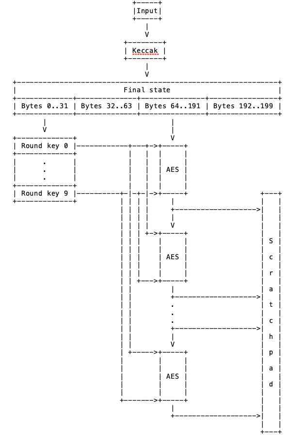
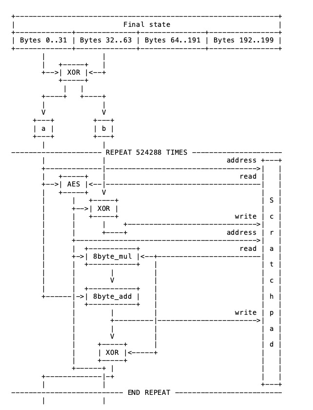
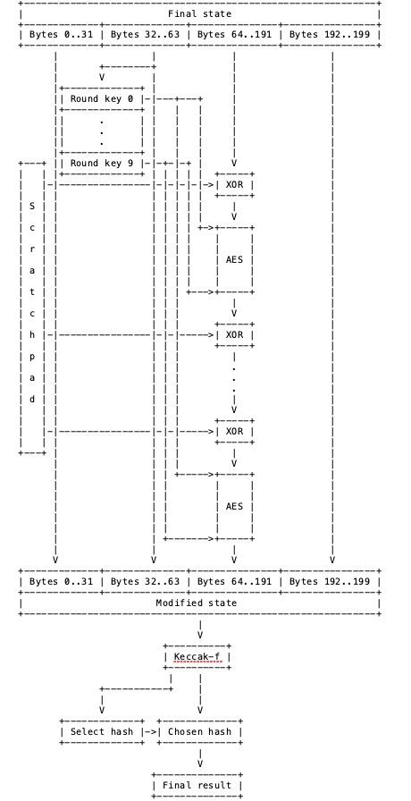

# CryptoNight Hash Function

## Abstract

This document is part of the CryptoNote Standards describing a peer-to-peer anonymous payment system. It defines the CryptoNote's default proof-of-work hash function, CryptoNight.

CryptoNote的默认POW算法CryptoNight。

## Table of Contents目录

[TOC]

## 1. Introduction

CryptoNight is a memory-hard hash function. It is designed to be inefficiently computable on GPU, FPGA and ASIC architectures. The CryptoNight algorithm's **first step is initializing large scratchpad with pseudo-random data**. The **next step is numerous read/write operations at pseudo-random addresses contained in the scratchpad**. The **final step is hashing the entire scratchpad to produce the resulting value**.

一个内存困难的哈希算法，使其在GPU、FPGA上效率低下。第一步是对 Scratchpad 利用伪随机数数据进行初始化；第二步是对伪随机的地址（Scratchpad上的地址）进行大量的读写操作，其实是对 Scratchpad 上的数据进行重新计算；第三步对 Scratchpad 上的数据进行最后的计算，选择一个哈希算法，求出最后的哈希值。

## 2. Definitions

hash function: an efficiently computable function which maps data of arbitrary size to data of fixed size and behaves similarly to a random function

scratchpad: a large area of memory used to store intermediate values during the evaluation of a memory-hard function

## 3. Scratchpad Initialization

First, the input is hashed using **Keccak [KECCAK] with parameters b =1600 and c = 512**. The bytes 0..31 of the Keccak final state are interpreted as **an AES-256 key** [AES] and **expanded to 10 round keys**. A scratchpad of 2097152 bytes (2 MiB) is allocated. The bytes 64..191 are extracted from the Keccak final state and split into 8 blocks of 16 bytes each. Each block is encrypted using the following procedure:

```
for i = 0..9 do:
          block = aes_round(block, round_keys[i])
```

首先用 Keccak 算法（b =1600 and c = 512）计算 Input。得到最终的1600bits 的状态，有200bytes。想知道keccak 算法的具体流程可以查看 SHA-3 的文件，里面有详细过程。

前32字节作为AES key扩展出10个轮密钥。scratchpad 的大小为2097152 bytes（2 MiB）。

64..191字节共128字节分成8个块，每块16字节。对每块进行10轮的AES加密，轮密钥匙上述扩展出来的。

Where **aes_round** function performs a round of AES encryption, which means that SubBytes, ShiftRows and MixColumns steps are performed on the block, and the result is XORed with the round key. Note that unlike in the AES encryption algorithm, the first and the last rounds are not special.

The resulting blocks are written into the first 128 bytes of the scratchpad. Then, these blocks are encrypted again in the same way, and the result is written into the second 128 bytes of the scratchpad. Each time 128 bytes are written, they represent the result of the encryption of the previously written 128 bytes. The process is repeated until the scratchpad is fully initialized.

8块数据加密完成后存储在 scratchpad 的128 bytes的空间上。每个128 bytes的空间都是对上一个128 bytes的加密的结果，直到 scratchpad 被填充完。（需要16384次计算）

This diagram illustrates scratchpad initialization:



Figure 3: Scratchpad initialization diagram

## 4. Memory-Hard Loop

Prior to the main loop, bytes 0..31 and 32..63 of the Keccak state are XORed, and the resulting 32 bytes are used to initialize variables a and b, 16 bytes each. These variables are used in the main loop. The main loop is **iterated 524,288 times**. 

Keccak算法结果的0..31字节和32..63字节抑或得到a和b的值，a和b各16 字节，用于主循环中，主循环 524288次。

When a 16-byte value needs to be converted into an address in the scratchpad, it is interpreted as a little-endian integer, and the 21 low-order bits are used as a byte index. However, the 4 low-order bits of the index are cleared to ensure the 16-byte alignment. The data is read from and written to the scratchpad in 16-byte blocks. Each iteration can be expressed with the following pseudo-code:

要将a和b转化为 scratchpad 中数据的地址 to_scratchpad_address () 。再对相应地址的数据进行计算操作，并重新存储。

```
scratchpad_address = to_scratchpad_address(a)	//获取数据
scratchpad[scratchpad_address] = aes_round(scratchpad[scratchpad_address], a)	//加密计算
b, scratchpad[scratchpad_address] = scratchpad[scratchpad_address],b xor scratchpad[scratchpad_address]	//抑或、互换

scratchpad_address = to_scratchpad_address(b)	//获取数据
a = 8byte_add(a, 8byte_mul(b, scratchpad[scratchpad_address]))	//计算
a, scratchpad[scratchpad_address] = a xor scratchpad[scratchpad_address], a	//抑或、互换
```

上述伪代码是每一轮要做的步骤，进行524288次循环。

* 对a地址的数据用AES加密，key 是a；加密的结果存储在a地址；
* b与a地址的新数据抑或得到新数据存储在a地址；
* b的值更新为AES加密的结果（即还没有和 b 抑或之前的数据）


* 找到b地址的数据，与b相乘的结果在与a相加；最终结果赋值给a；
* a更新为用a与b地址数据抑或的结果；并将b地址的数据更新为上一步骤的结果。

Where, the **8byte_add** function represents each of the arguments as a pair of 64-bit little-endian values and adds them together, component-wise, modulo $2^{64}$. The result is converted back into 16 bytes.

The **8byte_mul** function, however, uses only the first 8 bytes of each argument, which are interpreted as unsigned 64-bit little-endian integers and multiplied together. The result is converted into 16 bytes, and finally the two 8-byte halves of the result are swapped.

This diagram illustrates the memory-hard loop:



Figure 4: Memory-hard loop diagram

## 5. Result Calculation

After the memory-hard part, bytes 32..63 from the Keccak state are expanded into 10 AES round keys in the same manner as in the first part.

将 32..63 扩展成10个轮密钥。

Bytes 64..191 are extracted from the Keccak state and XORed with the first 128 bytes of the scratchpad. Then the result is encrypted in the same manner as in the first part, but using the new keys. The result is XORed with the second 128 bytes from the scratchpad, encrypted again, and so on. 

 64..191 字节与 scratchpad 的第一个128字节抑或。对本次抑或的结果的每块（16字节）进行10轮的AES加密。加密的结果再与 scratchpad 的下一个128字节抑或，抑或之后再一次10轮加密。

After XORing with the last 128 bytes of the scratchpad, the result is encrypted the last time, and then the bytes 64..191 in the Keccak state are replaced with the result. Then, the Keccak state is passed through Keccak-f (the Keccak permutation) with b = 1600. 

直到与 scratchpad 上的最后一个128字节抑或并加密完成后，得到的结果去替换掉 Keccak 1600状态中的64..191字节。Keccak 的最终状态就确定了。

Then, the **2 low-order bits of the first byte of the state** are used to select a hash function: **0=BLAKE-256** [BLAKE], **1=Groestl-256** [GROESTL], **2=JH-256** [JH], and **3=Skein-256** [SKEIN]. The chosen hash function is then applied to the Keccak state, and the resulting hash is the output of CryptoNight.

状态的前2个比特用来选择哈希算法， **0=BLAKE-256** [BLAKE], **1=Groestl-256** [GROESTL], **2=JH-256** [JH], and **3=Skein-256** [SKEIN]。确定选择哪个算法来计算最终的哈希值。上面四个哈希包括keccak是 SHA-3 竞赛中进入最后一轮的五个算法，最终是Keccak成为了SHA-3 的标准。

比如 00 的话就是：
$$
result = BLAKE-256(Keccak\ state\ 1600bits)
$$
The diagram below illustrates the result calculation:



### Hash examples:

      Empty string:
      eb14e8a833fac6fe9a43b57b336789c46ffe93f2868452240720607b14387e11.
    
      "This is a test":
      a084f01d1437a09c6985401b60d43554ae105802c5f5d8a9b3253649c0be6605.
## 6. References

[AES] "Announcing the ADVANCED ENCRYPTION STANDARD", FIPS 197, 2001.

[BLAKE] Aumasson, J.-P., Henzen, L., Meier, W., and R. C.-W. Phan, "SHA-3 proposal BLAKE", 2010.

[GROESTL] Gauravaram, P., Knudsen, L., Matusiewicz, K., Mendel, F.,

Rechberger, C., Schlaffer, M., and S. Thomsen, "Groestl - a SHA-3 candidate", 2011.

[JH] Wu, H., "The Hash Function JH", 2011.

[KECCAK] Bertoni, G., Daemen, J., Peeters, M., and G. Van Assche, "The Keccak reference", 2011.

[SKEIN] Ferguson, N., Lucks, S., Schneier, B., Whiting, D., Bellare, M., Kohno, T., Callas, J., and J. Walker, "The  Skein Hash Function Family", 2008.