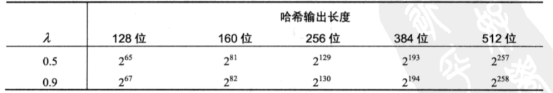
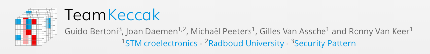

# HASH
*注：这篇是Hash算法的总则，其他算法分开编写。*

## 1. 概述

􏰲密码学上的hash算法能保证数据的完整性：对任意长度的明文m，经由哈希函数H可产生比较短的固定长度的哈希值H(m) 。这个值可以看作是明文m的“指纹“（fingerprint）或者“摘要”（message digest），一旦数据改变，哈希值就随之改变。所以可以通过数据的哈希值验证数据是否完整。

## 2. 性质 

密码学上的哈希算法应满足条件：

1. 对任意长度的明文，产生固定长度的哈希值；
2. 对任意的明文m，H（m）可通过软件或硬件实现计算；
3. 对任意的哈希值h，要找到一个明文x与它对应：H（x）= h在计算上是困难的；（即不能有效的求解原像，这个性质称为单向性）
4. 对一个明文x1，要找到令嗯一个明文x2，使得他们具有相同的哈希值在计算上是困难的；（第二原像性，也称为抗若碰撞性）
5. 要找到任意一对不同的明文（x1，x2），是的他们具有相同的哈希值在计算上是不可行的。（抗碰撞性，也成抗强碰撞）

* 对码长m的哈希函数穷举攻击的复杂度：

| 性质       | 复杂度              |
| ---------- | ------------------- |
| 单向性     | $$2^{m}$$           |
| 抗弱碰撞性 | $$2^{m}$$           |
| 抗强碰撞性 | $$2^{\frac{m}{2}}$$ |

## 3. 生日攻击 

由鸽巢原理知道，哈希算法必然存在冲突。通过生日悖论可以计算出在t个值的情况下冲突的概率：

假设哈希函数的输出值的长度是n，那么哈希值的空间大小就是2^n；

两个值不冲突的概率表示为：
$$
p(2)=(1- \frac{1}{2^n})
$$
三个值都不冲突的概率为：

$$
p(3)=(1- \frac{1}{2^n})(1-\frac{2}{2^n})
$$
t个值都不冲突的概率就是：

$$
p(t)=(1- \frac{1}{2^n})(1- \frac{2}{2^n})...(1- \frac{t-1}{2^n})
$$

$$
p(t)=\prod_{i=1}^{t-1}(1-\frac{i}{2^n})
$$

微积分中，当x趋近于0时，有：
$$
e^{-x} = 1-x
$$
所以，上述概率表达式可以表示为：
$$
p(t)=\prod_{i=1}^{t-1}e^{\frac{i}{2^n}}=e^{-\frac{1+2+3+...+(t-1)}{2^n}}=e^{-\frac{t(t-1)}{2^{n+1}}}
$$
那么t个值中至少存在一个冲突的概率$$\lambda​$$ 表示为：
$$
\lambda=1-p(t)=1-e^{-\frac{t(t-1)}{2^{n+1}}}
$$
变换为：
$$
ln(1-\lambda)=-\frac{t(t-1)}{2^{n+1}}
$$

$$
t(t-1)=2^{n+1}ln(\frac{1}{1-\lambda})
$$

在t较大的情况下，可以认为t-1= t，所以：
$$
t=\sqrt{2^{n+1}ln(\frac{1}{1-\lambda})}=2^{\frac{n}{2}}\sqrt{2ln(\frac{1}{1-\lambda})}
$$
从结果可以看出冲突概率$$\lambda$$和值的个数t的关系，下面给出两个概率下对不同的输出长度n所需要的值的个数t。

**不同哈希函数输出长度和两个不同冲突概率所需的个数**

## 4. Merkle–Damgård construction

Merkle-Damgård架构在1979年Ralph Merkle的博士论文中被提出。后来Ralph Merkle和Ivan Damgård都独立地证明了这个架构是合理的：就是说，如果使用适当的填充方案并且压缩函数是抗冲突的，那么哈希函数也将是抗冲突的。

这个架构主要强调几个部分：

1. 消息填充，压缩函数处理的消息的长度是固定的，需要选取合适的填充方案；
2. IV初始值，要求每个哈希函数有固定的初始值，初始寄存器的个数跟哈希输出位数有关；
3. 压缩函数f( )，要函数要求是单向函数而且能够抗冲突碰撞；
4. Finalisation，最后结果进一步处理，得到相应长度的哈希值。

### 4.1 算法 

从MD4到SHA-2都是基于这个架构设计的

	MD4 
	
	MD5
	
	RIPEMD-160
	
	SHA-1、SHA-0
	
	SHA-2（SHA-224、SHA-256、SHA-384、SHA-512、SHA-512/224、SHA-512/256）

*算法详情请见相应的文件下的文档描述。*

### 4.2 算法对比 

| 算法及其变体 | 输出长度 (位)                                                | 内部状态大小 (bit) | 块大小 (bit)                           | 最大消息长度 (bit) | 循环 |
| ------------ | ------------------------------------------------------------ | ------------------ | -------------------------------------- | ------------------ | ---- |
| **MD4**      | 128                                                          | 128 (4 × 32)       | 512                                    | 不限               | 48   |
| **MD5**      | 128                                                          | 128 (4 × 32)       | 512                                    | 不限               | 64   |
| **SHA-0**    | 160                                                          | 160 (5 × 32)       | 512                                    | 2^64 − 1           | 80   |
| **SHA-1**    | 160                                                          | 160 (5 × 32)       | 512                                    | 2^64 − 1           | 80   |
| **SHA-2**    | *SHA-224*   *SHA-256*                                   | 256 (8 × 32)       | 512                                    | 2^64 − 1           | 64   |
| **SHA-2**    | *SHA-384*   *SHA-512*   *SHA-512/224*   *SHA-512/256* | 512 (8 × 64)       | 1024                                   | 2^128 − 1          | 80   |
| SHA-3        | *SHA3-224*   *SHA3-256*   *SHA3-384*   *SHA3-512* | 1600 (5 × 5 × 64)  | 1152   1088   832   576 | 不限               | 24   |
| SHA-3        | *SHAKE128*  * SHAKE256 *输出长度可变               | 1600 (5 × 5 × 64)  | 1344   1088                       | 不限               | 24   |

### 4.3 安全

在密码学的学术理论中，任何攻击方式，其计算复杂度若少于暴力搜索法所需要的计算复杂度，就能被视为针对该密码系统的一种破密法；但这并不表示该破密法已经可以进入实际应用的阶段。

Generic Attacks https://ehash.iaik.tugraz.at/wiki/GenericAttacksMerkleDamgaard

## 5. SHA-3

*详细SHA-3算法流程见SHA-3文件*

**SHA-3**（**安全散列算法3**）是NIST于2015年8月5日发布的安全散列算法系列标准的最新成员，但SHA-3的内部结构与SHA-1和SHA-2的结构完全不同。

2006年，NIST开始组织**NIST哈希函数竞赛**以创建一个新的安全哈希算法SHA-3。SHA-3并不表示着要取代现有的SHA-2，因为还没有证明对SHA-2的重大攻击。但是鉴于对MD5，SHA-0和SHA-1的已有的成功攻击案例，NIST认为需要一种可替代的，结构不同的哈希算法，它就是SHA-3。

### 5.1 SHA-3竞赛

筛选标准：

筛选SHA-3标准，候选人散列函数必须满足四个由NIST设置的条件。如果一个候选算法未能满足这些条件，它将被淘汰:

- 候选散列函数必须好实现。它应该消耗最少的资源即使散列大量的消息文本。许多候选算法实际上是无法达到这个要求。
- 候选算法必须保守安全。它应该抵御已知的攻击，同时保持一个大的安全系数。它应该同SHA-2相同的四个散列大小(224bit、256bit、384bit或512bit)，但如果需要能够支持更长的散列位宽。
- 候选算法必须接受密码分析。源代码和分析结果公开为感兴趣的第三方审查和评论。在分析过程中发现的任何缺陷都需要解决，通过调整或通过重新设计。
- 候选算法必须使代码多样性。它**不能使用Merkle-Damgard引擎**产生消息散列。 

竞赛详情：

[NIST官方网站SHA-3 Project](https://csrc.nist.gov/projects/hash-functions/sha-3-project)

提交截止日期为2008年10月31日，共提交了64个方案，第一轮接受的候选人名单于同年12月9日公布，共51个。

NIST于2009年2月底举行了一次会议，提交者提交了他们的算法，NIST官员讨论了缩小第2轮候选人的范围。同年7月24日公布了第2轮接受的14名候选人名单。

2010年8月23日至24日讨论第二轮候选人。候选人的公告在同年12月10日发布，仅5个最终候选人。

2012年10月2日，NIST宣布其获奖者，由Guido Bertoni, Joan Daemen, Michael Peters和 Giles Van Assche提出的基于“海绵结构”（Sponge construction）的Keccak算法。

 [Keccak 胜出的原因：](https://csrc.nist.gov/publications/detail/nistir/7896/final)

> ► High security margin  
>
> ► High quality analysis  
>
> ► Elegant, clean design  
>
> ► Excellent hardware performance 
>
> ► Good overall performance 
>
> ► Design diversity from SHA2 

### 5.2 Sponge construction 

Sponge construction在SHA-3文件中详细阐述。

### 5.3 Keccak和SHA-3标准

[Keccak算法](https://keccak.team/index.html)（读作为“ket-chak”）是Guido Bertoni, Joan Daemen, Michael Peters和Gilles Van Assche的工作成果。 SHA-3的候选人在2008年10月提交。

2014年，NIST发布了 FIPS 202 的草案 ["SHA-3 Standard: Permutation-Based Hash and Extendable-Output Functions"](https://csrc.nist.gov/projects/hash-functions/sha-3-standardization)。

2015年8月5日，FIPS 202 最终被 NIST 批准。

至目前为止，第三方密码分析已经显示出Keccak没有严重的弱点。尽管如此，Keccak的创建者们还是启动了[Crunchy](https://keccak.team/crunchy_contest.html)加密比赛，鼓励发现和报告成功且可核查的攻击Keccak的方法。

