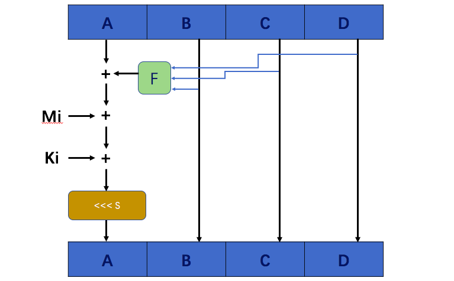
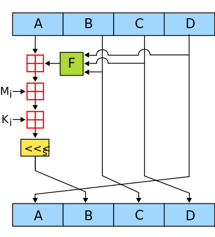

# MD4

## 1、背景介绍

**MD4**是麻省理工学院教授Ronald Rivest，也是RSA的三位作者之一，于1990年设计的一个哈希算法。其摘要长度为128位，一般128位长的MD4摘要被表示为32位的十六进制数字。MD4由于被发现存在严重的算法漏洞，后被1991年完善的MD5所取代。不过，MD4对后来出现的MD5、SHA家族和RIPEMD等算法产生了积极的引导作用。

MD：Messsage Digest 消息摘要

原始论文：[The MD4 Message Digest Algorithm](https://link.springer.com/content/pdf/10.1007%2F3-540-38424-3_22.pdf) 

这个 [文档](https://tools.ietf.org/rfc/rfc1186.txt) 有MD4算法的C语言实现


## 2、预处理和哈希计算

### 2.1 定义一些运算符号

```
XY ：X和Y“与”

X V Y：X和Y“或”

X xor Y：X和Y的“异或”

not(X): X二进制形式的补码

X+Y: 模2^32的整数加法

X<<<S: X循环左移S位（O≤S≤31）
```


### 2.2 计算过程

明文m有b比特
$$
m = m_0m_1m_2...m_{b-1}
$$

```
Step 1.给定一个消息比特串m，使用如下算法来填充构造M：
```

- 设d=(447 - ( b(mod 512) ) ) (mod 512)
- L= |m|(mod 2^64)或者L=b(mod 2^64)的二进制表示,|L|=64
- M=m||1||O^d||L
- 在M的构造中。在m后面附上一个1，然后并上足够多(d个)的0使得长度变成模512与448同余的数，最后并上64bit的L，它是m的长度的二进制表示。可以看出，M的长度是512的倍数。

```
Step 2.将M分解为字（32位）
```

- 将M表示成：M=M[0]M[1]…M[N-1]，其中每一个M[i]是一个长度为32bit的串且16整除N。我们称每一个M[i]为一个字。

```
Step 3. 初始化寄存器
```

- 给出寄存器A，B，C，D，初始化赋值：

  ​	A = 0x01234567（低字节优先）			0x67452301 （高字节优先）

  ​        B = 0x89abcdef						0xefcdab89 

  ​        C = 0xfedcba98						0x98badcfe 

  ​        D = 0x76543210						0x10325476 

```
Step 4. 哈希计算
```

- 首先先定义三个函数：输入都是三个32位的字X、Y、Z，输出一个32位字

  ```
  f(X,Y,Z)  =  XY V （not(X)Z）
  
  g(X,Y,Z)  =  XY V XZ V YZ
  
  h(X,Y,Z)  =  X xor Y xor Z
  ```

- 接着做哈希循环计算：

```
For i = 0 to N/16-1 do  //每次处理16个字，也就是512比特
                 For j = 0 to 15 do:  //将16个字存入X 
                   Set X[j] to M[i*16+j].
                 end //of loop on j
                 
                 set AA = A, BB = B, CC = C, DD = D.

                 [轮数1]
                   设六元组 [A B C D i s] 为以下运算：
                         A = (A + f(B,C,D) + X[i]) <<< s
                   进行十六次运算:
                         [A B C D 0 3]
                         [D A B C 1 7]
                         [C D A B 2 11]
                         [B C D A 3 19]
                         [A B C D 4 3]
                         [D A B C 5 7]
                         [C D A B 6 11]
                         [B C D A 7 19]
                         [A B C D 8 3]
                         [D A B C 9 7]
                         [C D A B 10 11]
                         [B C D A 11 19]
                         [A B C D 12 3]
                         [D A B C 13 7]
                         [C D A B 14 11]
                         [B C D A 15 19]

                 [轮数2]
                   设六元组 [A B C D i s] 为以下运算：
                         A = (A + g(B,C,D) + X[i] + 0x5A827999) <<< s
                   (
                   值5A827999是一个十六进制的32位常数；
                   该常数表示2的平方根，1.011010100000100111100110011001；
                   1011010100000100111100110011001（二进制） = 5A827999（十六进制）。
                   )
                   进行十六次运算:
                         [A B C D 0  3]
                         [D A B C 4  5]
                         [C D A B 8  9]
                         [B C D A 12 13]
                         [A B C D 1  3]
                         [D A B C 5  5]
                         [C D A B 9  9]
                         [B C D A 13 13]
                         [A B C D 2  3]
                         [D A B C 6  5]
                         [C D A B 10 9]
                         [B C D A 14 13]
                         [A B C D 3  3]
                         [D A B C 7  5]
                         [C D A B 11 9]
                         [B C D A 15 13]

                 [轮数3]
                   设六元组 [A B C D i s] 为以下运算：
                         A = (A + h(B,C,D) + X[i] + 0x6ED9EBA1) <<< s
                   (
                   值6ED9EBA1是一个十六进制的32位常数；
                   该常数表示3的平方根，1.101110110110011110101110100001；
                   1101110110110011110101110100001（二进制）= 6ED9EBA1（十六进制）
                   )
                   进行十六次运算:
                         [A B C D 0  3]
                         [D A B C 8  9]
                         [C D A B 4  11]
                         [B C D A 12 15]
                         [A B C D 2  3]
                         [D A B C 10 9]
                         [C D A B 6  11]
                         [B C D A 14 15]
                         [A B C D 1  3]
                         [D A B C 9  9]
                         [C D A B 5  11]
                         [B C D A 13 15]
                         [A B C D 3  3]
                         [D A B C 11 9]
                         [C D A B 7  11]
                         [B C D A 15 15]

         然后执行以下运算:
                         A = A + AA
                         B = B + BB
                         C = C + CC
                         D = D + DD
         也就是说，四个寄存器都加了该块（512bits）循环之前的值。

         end //of loop on i
```

- 最终结果

  ```
  H = A || B || C || D 
  
  四个字（32位）拼接而成的128位的哈希值。算法完成
  ```


### 2.3 简易流程图 

下图是MD4哈希计算循环过程中的循环步骤。F是每轮使用的不同的函数f(X,Y,Z)、g(X,Y,Z)、h(X,Y,Z)；Mi是每轮处理的消息数据；Ki是附加参数，第一轮为空，第二轮为0x5A827999，第三轮为0x6ED9EBA1。<<< s 表示循环左移s位。位于每512位（16个字）的消息m需要进行这样的运算16 * 3 = 48 次。

 



## 3、MD4安全

[论文](https://link.springer.com/content/pdf/10.1007%2F3-540-38424-3_22.pdf) Summary部分提到：“It is conjectured that the difficulty of coming up with two messages having the same message digest is on the order of 2^64 operations, and that the difficulty of coming up with any message having a given message digest is on the order of 2^128 operations.” 作者认为MD4算法的安全性在当时的条件下还是很高的。

但是，

Den Boer和Bosselaers在1991年发表的一篇[论文](https://web.archive.org/web/20030523231212/http://dsns.csie.nctu.edu.tw/research/crypto/HTML/PDF/C91/194.PDF)中证明了MD4的弱点；

Hans Dobbertin在1995年发现了第一次[MD4的“full-round”碰撞攻击](https://link.springer.com/content/pdf/10.1007%2F3-540-60865-6_43.pdf)，那时只用了几秒钟就完成了；

2004年8月，王小云等人。发现了一种非常有效的碰撞攻击算法，对MD4 / MD5 / SHA-1 / RIPEMD系列中的哈希函数进行了碰撞[攻击](https://eprint.iacr.org/2004/199.pdf)；

2005年，研究人员能够使用相同的哈希创建成对的PostScript文档[32]和X.509证书[33]。 那年晚些时候，MD5的设计师Ron Rivest写道“md5和sha1都明显被打破（在抗冲击性方面）”。[34]

2008年，GaëtanLeurent发表论文 [MD4 is Not One-Way](https://www.iacr.org/archive/fse2008/50860419/50860419.pdf) ，MD4不是单向函数！可以在2^102的计算步骤内找到特定的哈希值对应的原文。

在2011年，[RFC6150](https://tools.ietf.org/html/rfc6150)声明[RFC1320（MD4）](https://tools.ietf.org/html/rfc1320) “MD4 to Historic Status” 已过时！


所以，下一篇，MD5～