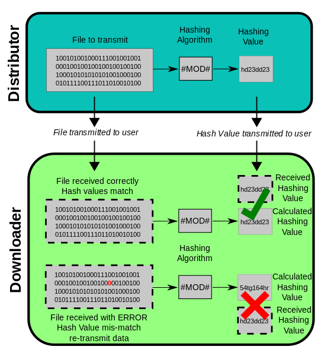
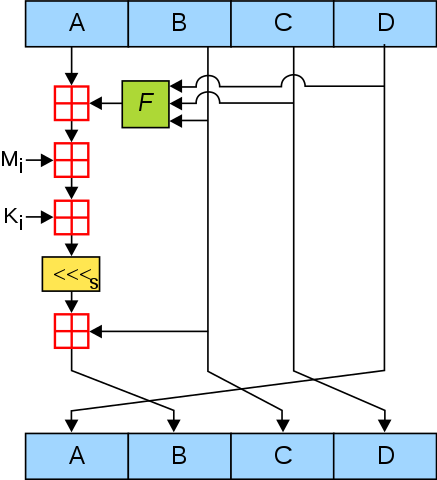

# MD5

## 1. 背景介绍

1992年，Ronald Linn Rivest罗纳德·李维斯特向[互联网工程任务组](https://en.wikipedia.org/wiki/Internet_Engineering_Task_Force)（IETF）提交了一份重要文件，描述了MD5算法的原理，因为Revist觉得MD4马上就要被分析出来是不安全的了。文档[The MD5 Message-Digest Algorithm](https://tools.ietf.org/html/rfc1321) 是IETF的一个征求意见稿（Request For Comments），描述了MD5的具体算法流程并给出了C语言版本的算法实现。

目前，MD5算法因其普遍、稳定、快速的特点，仍广泛应用于普通数据的错误检查领域。例如在一些P2P下载中，软件将通过计算MD5检验下载到的文件片段的完整性。

下图是哈希算法在文件传输保证数据完整性（防止缺失、恶意篡改）的应用：

文件发布者将文件通过HASH算法计算得到文件的哈希值H，将文件以及哈希值H一起传输给接收者。接收者在收到文件以及哈希值后，对文件用相应的哈希算法求得哈希值H ‘，与接收到的哈希值H进行比对，如果比对成功则文件安全，否则文件缺失或者被篡改。




## 2. 预处理和哈希计算

### 2.1 预处理：填充信息 

明文m有b比特
$$
m = m_0m_1m_2...m_{b-1}
$$

```
Step 1.给定一个消息比特串m，使用如下算法来填充构造M：
```

- 设d=(447 - ( b(mod 512) ) ) (mod 512)
- L= |m|(mod 2^64)或者L=b(mod 2^64)的二进制表示,|L|=64
- M=m||1||O^d||L
- 在M的构造中。在m后面附上一个1，然后并上足够多(d个)的0使得长度变成模512与448同余的数，最后并上64bit的L，它是m的长度的二进制表示。可以看出，M的长度是512的倍数。

### 2.2 哈希计算

```
Step 2.将M分解为字（32位）
```

* 将M表示成：M=M[0]M[1]…M[N-1]，其中每一个M[i]是一个长度为32bit的串且16整除N。我们称每一个M[i]为一个字。

```
Step 3. 初始化寄存器
```

* 给出寄存器A，B，C，D，初始化赋值：

  ​	A = 0x01234567（低字节优先）			0x67452301 （高字节优先）

  ​        B = 0x89abcdef						0xefcdab89 

  ​        C = 0xfedcba98						0x98badcfe 

  ​        D = 0x76543210						0x10325476 

```
Step 4. 哈希计算
```

* 首先先定义四个函数：输入都是三个32位的字X、Y、Z，输出一个32位字

  ```
  		  F(X,Y,Z) = XY V not(X) Z
            G(X,Y,Z) = XZ V Y not(Z)
            H(X,Y,Z) = X xor Y xor Z
            I(X,Y,Z) = Y xor (X V not(Z))
  ```

* 计算步骤中使用由正弦函数构造的64个元素的数组T [1 ... 64]。 令T [i]表示该表的第i个元素，等于

* $$
  4294967296 * abs( sin( i ) )
  $$

  的整数部分，其中i是弧度，abs表示绝对值。该表的元素在下面给出：
```
            T[ 1.. 4] = { 0xd76aa478, 0xe8c7b756, 0x242070db, 0xc1bdceee }
            T[ 5.. 8] = { 0xf57c0faf, 0x4787c62a, 0xa8304613, 0xfd469501 }
            T[ 9..12] = { 0x698098d8, 0x8b44f7af, 0xffff5bb1, 0x895cd7be }
            T[13..16] = { 0x6b901122, 0xfd987193, 0xa679438e, 0x49b40821 }
            T[17..20] = { 0xf61e2562, 0xc040b340, 0x265e5a51, 0xe9b6c7aa }
            T[21..24] = { 0xd62f105d, 0x02441453, 0xd8a1e681, 0xe7d3fbc8 }
            T[25..28] = { 0x21e1cde6, 0xc33707d6, 0xf4d50d87, 0x455a14ed }
            T[29..32] = { 0xa9e3e905, 0xfcefa3f8, 0x676f02d9, 0x8d2a4c8a }
            T[33..36] = { 0xfffa3942, 0x8771f681, 0x6d9d6122, 0xfde5380c }
            T[37..40] = { 0xa4beea44, 0x4bdecfa9, 0xf6bb4b60, 0xbebfbc70 }
            T[41..44] = { 0x289b7ec6, 0xeaa127fa, 0xd4ef3085, 0x04881d05 }
            T[45..48] = { 0xd9d4d039, 0xe6db99e5, 0x1fa27cf8, 0xc4ac5665 }
            T[49..52] = { 0xf4292244, 0x432aff97, 0xab9423a7, 0xfc93a039 }
            T[53..56] = { 0x655b59c3, 0x8f0ccc92, 0xffeff47d, 0x85845dd1 }
            T[57..60] = { 0x6fa87e4f, 0xfe2ce6e0, 0xa3014314, 0x4e0811a1 }
            T[61..64] = { 0xf7537e82, 0xbd3af235, 0x2ad7d2bb, 0xeb86d391 }
```
* 接着做哈希循环计算：

```
   
   For i = 0 to N/16-1 do // 每次循环处理16个字（512比特）的数据块
     For j = 0 to 15 do   // 将对应的16个字存入X 
       Set X[j] = M[i*16+j]
     end /* of loop on j
     
     AA = A
     BB = B
     CC = C
     DD = D

     //第一轮
     // 定义七元组 [abcd k s i] 为以下运算：
     //        a = b + ((a + F(b,c,d) + X[k] + T[i]) <<< s)
     //进行下面16次运算
     [ABCD  0  7  1]  [DABC  1 12  2]  [CDAB  2 17  3]  [BCDA  3 22  4]
     [ABCD  4  7  5]  [DABC  5 12  6]  [CDAB  6 17  7]  [BCDA  7 22  8]
     [ABCD  8  7  9]  [DABC  9 12 10]  [CDAB 10 17 11]  [BCDA 11 22 12]
     [ABCD 12  7 13]  [DABC 13 12 14]  [CDAB 14 17 15]  [BCDA 15 22 16]


     //第二轮
     // 定义七元组 [abcd k s i] 为以下运算：
     //        a = b + ((a + G(b,c,d) + X[k] + T[i]) <<< s)
     //进行下面16次运算
     [ABCD  1  5 17]  [DABC  6  9 18]  [CDAB 11 14 19]  [BCDA  0 20 20]
     [ABCD  5  5 21]  [DABC 10  9 22]  [CDAB 15 14 23]  [BCDA  4 20 24]
     [ABCD  9  5 25]  [DABC 14  9 26]  [CDAB  3 14 27]  [BCDA  8 20 28]
     [ABCD 13  5 29]  [DABC  2  9 30]  [CDAB  7 14 31]  [BCDA 12 20 32]


     //第三轮
     // 定义七元组 [abcd k s i] 为以下运算：
     //        a = b + ((a + H(b,c,d) + X[k] + T[i]) <<< s)
     //进行下面16次运算
     [ABCD  5  4 33]  [DABC  8 11 34]  [CDAB 11 16 35]  [BCDA 14 23 36]
     [ABCD  1  4 37]  [DABC  4 11 38]  [CDAB  7 16 39]  [BCDA 10 23 40]
     [ABCD 13  4 41]  [DABC  0 11 42]  [CDAB  3 16 43]  [BCDA  6 23 44]
     [ABCD  9  4 45]  [DABC 12 11 46]  [CDAB 15 16 47]  [BCDA  2 23 48]

     //第四轮
     // 定义七元组 [abcd k s i] 为以下运算：
     //        a = b + ((a + I(b,c,d) + X[k] + T[i]) <<< s)
     //进行下面16次运算
     [ABCD  0  6 49]  [DABC  7 10 50]  [CDAB 14 15 51]  [BCDA  5 21 52]
     [ABCD 12  6 53]  [DABC  3 10 54]  [CDAB 10 15 55]  [BCDA  1 21 56]
     [ABCD  8  6 57]  [DABC 15 10 58]  [CDAB  6 15 59]  [BCDA 13 21 60]
     [ABCD  4  6 61]  [DABC 11 10 62]  [CDAB  2 15 63]  [BCDA  9 21 64]


	 然后执行以下运算:
                     A = A + AA
                     B = B + BB
                     C = C + CC
                     D = D + DD

   end // of loop on i
```

* 最终结果

```
	H = A || B || C || D  
	
	四个字（32位）拼接而成的128位的哈希值。算法完成
```

### 2.3 流程图


 


## 3. MD5 vs MD4

MD5算法是MD4消息摘要算法的升级。 MD5的计算速度略慢于MD4，但在设计上更“保守”。 虽然MD4设计得比较快，但是在安全性方面是处在一个危险的边缘，所以Revist对它进行了升级扩展。

引用原版论文中一句话：“The MD5 algorithm is being placed in the public domain for review and possible adoption as a standard.”。Revist在设计完MD5之后觉得MD5会经过世界公开的攻击审查并成为一个新的标准。

MD5与MD4的对比：

> 1. 增加了第四轮运算 I (X,Y,Z) ；
> 2. 每一步都有一个唯一的加法常数；
> 3. 为减弱第二轮中函数G的对称性从 (XY) V (XZ) V (YZ) 变为 XZ V Y not(Z)；
> 4. 第一步加上了上一步的结果b,这将引起更快的雪崩效应；
> 5. 改变了第二轮和第三轮中访问消息子分组的次序,使其更不相似；
> 6. 各轮的位移量互不相同，优化了每一轮中的循环左移位移量以实现更快的雪崩效应。

MD5确实在MD4的基础上进行了不少的改进，使其不那么容易受到碰撞攻击。那么MD的安全性如何？

## 4. MD5安全

1996年，Dobbertin宣布了[MD5的伪碰撞](ftp://ftp.rsasecurity.com/pub/cryptobytes/crypto2n2.pdf)(可以将初始变量改变，找到两组不同的输入使得一轮压缩的值是相同的)。 这不是对完整MD5哈希函数的攻击，并且不认为它是一个致命的弱点，但密码学家们开始建议使用其他算法，例如SHA-1或RIPEMD-160。

2004年，王小云等人在[论文](http://101.96.10.64/merlot.usc.edu/csac-f06/papers/Wang05a.pdf)和欧密会议上的[报告](https://eprint.iacr.org/2004/199.pdf)中说明MD5不具有抗强碰撞性。因此，MD5不再适用于SSL证书或依赖此属性进行数字安全的数字签名的应用程序。

同样在2004年，在MD5中发现了更严重的缺陷，一组研究人员在 [论文](https://www.cs.colorado.edu/~jrblack/papers/md5e-full.pdf)中描述了如何创建一对共享相同MD5校验和的文件。

2008年12月，有研究人员伪造将MD5作为哈希算法的SSL证书的有效性。

截至2010年，CMU软件工程研究所认为 [MD5 vulnerable to collision attacks](https://www.kb.cert.org/vuls/id/836068) “安全被破坏且不适合进一步使用”，多数美国政府要求使用SHA-2系列的散列函数。

2012年，Flame恶意软件利用MD5中的弱点来伪造Microsoft数字签名。


最后，

MD5在目前仍然有一定的使用价值，因为其运算速度快适合于大量快速验证，在文件传输这样的安全性要求比较低的场景下可以发挥作用。但是在数字签名、密码算法中，MD5的安全性不再适用。而且128比特的输出长度在计算能力不断提升的情况下，也不能确保能抵抗暴力攻击。

