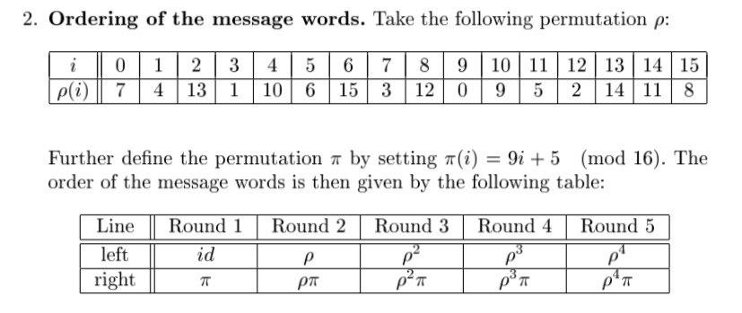
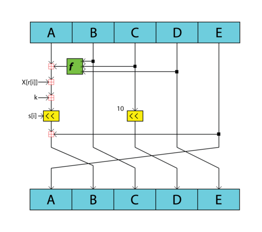
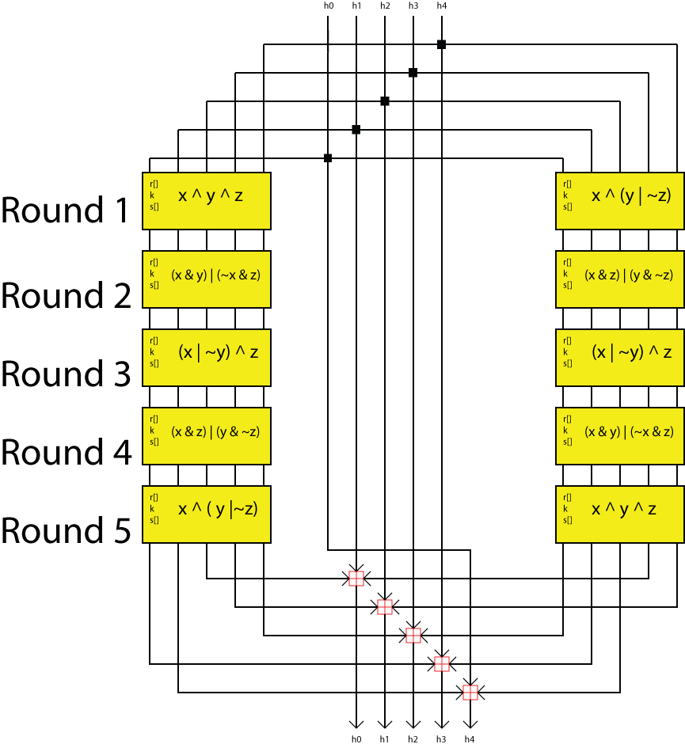
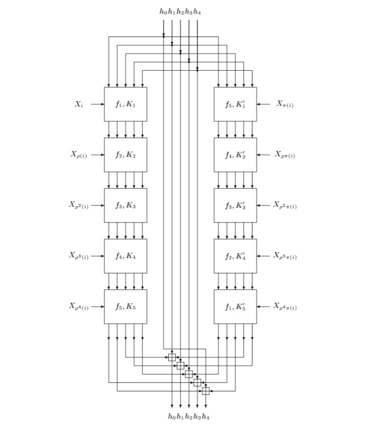

# RIPEMD-160

## 1. 背景介绍

**RIPEMD** (RACE Integrity Primitives Evaluation Message Digest) 由 比利时鲁汶大学Hans Dobbertin,Antoon Bosselaers 和 Bart Prenee组成的COSIC（Computer Security and Industrial Cryptography）研究小组发布于1996年。[The RIPEMD-160 page](https://homes.esat.kuleuven.be/~bosselae/ripemd160.html)

RIPEMD-160是以原始版RIPEMD-128所改进的160位输出的版本，是RIPEMD系列中最常用的版本。RIPEMD是在欧洲学术圈中提出的，有别于由美国国家安全局提出的SHA-1和SHA-2算法。RIPEMD的使用也没有安全哈希算法那样普遍。

RIPEMD是以MD4为基础原则所设计的。

## 2. 预处理和哈希计算

### 2.1 预处理

跟MD4、MD5一样的填充运算。先在原始信息m后面追加一个“1”，再添加d个“0”使得长度处以512余数为448，最后加上原始信息m的长度的二进制表示（64比特）。填充完成的信息的长度正好是512的倍数。

将填充完成的每512比特分为一个块，32个比特为一字word，每个块是16个字。
$$
M = M_{0}M_{1}...M_{N-1}
$$
N是信息M中块的个数，字的个数是16*N。

### 2.2 哈希计算

首先先给出SHA-1的一些函数、常数和初始值：

* 定义函数：

```
F(j,X,Y,Z) = X + Y + Z			(0 <= j <=15 )
F(j,X,Y,Z) = (XY) V (not(X)Z)	(16 <= j <=31 )
F(j,X,Y,Z) = (X V not(Y)) + Z	(32 <= j <=47 )
F(j,X,Y,Z) = (XZ) V (not(Z)Y)	(48 <= j <=63 )
F(j,X,Y,Z) = X + (Y V not(Z))	(64 <= j <=79 )
```

上述函数中，XY表示XY按位与，V表示按位或，+是模2^32的加法运算，not( )表示求补码。

* 常量：

```
K(j) = 0x00000000		 (0 <= j <=15 )  0
K(j) = 􏰕0x5A827999		  (16 <= j <=31 )  2的平方根 * 2^30
K(j) = 0x6ED9EBA1		(32 <= j <=47 )  3的平方根 * 2^30
K(j) = 0X8F1BBCDC		(48 <= j <=63 )  5的平方根 * 2^30
K(j) = 0XA953FD4E		(64 <= j <=79 )  7的平方根 * 2^30

K'(j) = 0x50A28BE6		 (0 <= j <=15 )  2的立方根 * 2^30
K'(j) = 􏰕0x5C4DD124	  (16 <= j <=31 )  3的立方根 * 2^30
K'(j) = 0x6D703EF3		(32 <= j <=47 )  5的立方根 * 2^30
K'(j) = 0x7A6D76E9		(48 <= j <=63 )  7的立方根 * 2^30
K'(j) = 0x00000000		(64 <= j <=79 )  0
```

* 每次计算选取的块内的字的顺序

  每次计算选取的信息块的顺序是由下图方法计算出来的：

  平方、三次方、四次方表示嵌套几次函数，即
  $$
  f^{2}(i) = f( f (i))
  $$

  $$
  f^{3}g(i) = f( f( f( g(i) ) ) )
  $$

  就可以计算出结果。



```
r(0...15)  = 0, 1, 2, 3, 4, 5, 6, 7, 8, 9, 10, 11, 12, 13, 14, 15
r(16...31) = 7, 4, 13, 1, 10, 6, 15, 3, 12, 0, 9, 5, 2, 14, 11, 8
r(32...47) = 3, 10, 14, 4, 9, 15, 8, 1, 2, 7, 0, 6, 13, 11, 5, 12
r(48...63) = 1, 9, 11, 10, 0, 8, 12, 4, 13, 3, 7, 15, 14, 5, 6, 2
r(64...79) = 4, 0, 5, 9, 7, 12, 2, 10, 14, 1, 3, 8, 11, 6, 15, 13

r'(0...15)  = 5, 14, 7, 0, 9, 2, 11, 4, 13, 6, 15, 8, 1, 10, 3, 12
r'(16...31) = 6, 11, 3, 7, 0, 13, 5, 10, 14, 15, 8, 12, 4, 9, 1, 2
r'(32...47) = 15, 5, 1, 3, 7, 14, 6, 9, 11, 8, 12, 2, 10, 0, 4, 13
r'(48...63) = 8, 6, 4, 1, 3, 11, 15, 0, 5, 12, 2, 13, 9, 7, 10, 14
r'(64...79) = 12, 15, 10, 4, 1, 5, 8, 7, 6, 2, 13, 14, 0, 3, 9, 11
```

* 循环左移偏移量（未说明如何得到这些数值）

```
s(0...15)  = 11, 14, 15, 12, 5, 8, 7, 9, 11, 13, 14, 15, 6, 7, 9, 8
s(16...31) = 7, 6, 8, 13, 11, 9, 7, 15, 7, 12, 15, 9, 11, 7, 13, 12
s(32...47) = 11, 13, 6, 7, 14, 9, 13, 15, 14, 8, 13, 6, 5, 12, 7, 5
s(48...63) = 11, 12, 14, 15, 14, 15, 9, 8, 9, 14, 5, 6, 8, 6, 5, 12
s(64...79) = 9, 15, 5, 11, 6, 8, 13, 12, 5, 12, 13, 14, 11, 8, 5, 6

s'(0...15)  = 8, 9, 9, 11, 13, 15, 15, 5, 7, 7, 8, 11, 14, 14, 12, 6
s'(16...31) = 9, 13, 15, 7, 12, 8, 9, 11, 7, 7, 12, 7, 6, 15, 13, 11
s'(32...47) = 9, 7, 15, 11, 8, 6, 6, 14, 12, 13, 5, 14, 13, 13, 7, 5
s'(48...63) = 15, 5, 8, 11, 14, 14, 6, 14, 6, 9, 12, 9, 12, 5, 15, 8
s'(64...79) = 8, 5, 12, 9, 12, 5, 14, 6, 8, 13, 6, 5, 15, 13, 11, 11
```

* 初始值 Initial value

```
h0 = 0x67452301			0x01234567
h1 = 0xEFCDAB89			0x89ABCDEF
h2 = 0x98BADCFE			0xFEDCBA98
h3 = 0x10325476			0x76543210
h4 = 0xC3D2E1F0			0xF0E1D2C3
```

* 计算过程

```
for i = 0 to t-1 {
	for k = 0 to 15 do   // 将对应的16个字M存入X 
       Set X[k] to M[i*16+k]
     end /* of loop on k

	//开始计算
    A = h0; B = h1; C = h2; D = h3; E = h4;
    A' = h0; B' = h1; C' = h2; D' = h3; E' = h4;
    
    for j = 0 to 79 {
        T = E + (A + F(j,B,C,D) + X[r[j]] + K[j]) <<< s(j)
        A = E; E = D; D = C <<< 10; C = B; B = T;
        
        T = E' + (A' + F(79-j,B',C',D') + X[r'[j]] + K'[j]) <<< s'(j)
        A' = E'; E' = D'; D' = C' <<< 10; C' = B'; B' = T;
    }
    
    T = h1 + C + D';
    h1 = h2 + D + E';
    h2 = h3 + E + A';
    h3 = h4 + A + B';
    h4 = h0 + B + C';
    h0 = T;
}
```

* 输出结果 

  在所有循环计算过程结束后，拼接输出结果（160 = 32 * 5）

  ```
  H = h0 || h1 || h2 || h3 || h4
  ```


### 2.3 流程图

#### 2.3.1 内循环的单个步骤 

这个流程图说明的是计算每次循环的T、A、E、D、C、B的值：



 #### 2.3.2 处理一个Block的大循环 

大循环包括5轮，每轮中包括16次上图现实的内循环。总共进行16*5=80次内循环的计算。而且左右两边各有一个隔离的计算相似的过程，当一个Block的计算完成后，要将左右两边的结果进行混合计算，得到的结果（h0、 h1、h2、h3、h4）在下一个Block的计算中使用。

这样的大循环要计算 N/512次，N是原文信息M填充后（padded）得到的信息的比特长度。

 



## 3. RIPEMD-160安全

#### 碰撞攻击

1. 王小云这个强碰撞是针对RIPEMD-128bit，对RIPEMD-160无效 https://eprint.iacr.org/2004/199.pdf
2. 2006年的一篇论文 [On the Collision Resistance of RIPEMD-160*]( https://online.tugraz.at/tug_online/voe_main2.getvolltext?pCurrPk=17675) 中给出结论：状态变量C的旋转增强了RIPEMD-160的安全级别。并且没有发现针对RIPEMD-160哈希函数的攻击，包括全部5轮，认为RIPEMD-160可以抵御已知的攻击。


在网络上几乎找不到对于**RIPEMD-160**进行攻击的论文，分析原因应该是该哈希算法本身就具有比较高的安全性，当然也可能是因为这个哈希算法的适用范围很小，使得密码学家和学者们对这个算法又比较小的研究热情从而没有太多的成果。

比特币在生成地址时使用了该哈希算法，相信中本聪是对其进行了一番研究并最终使用它？