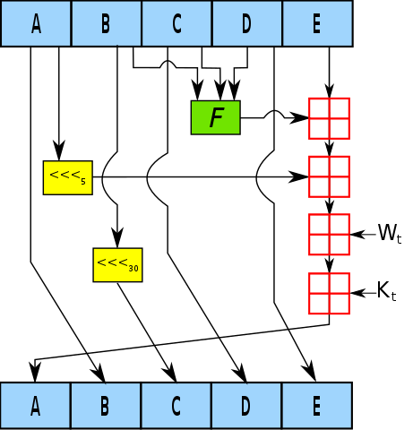
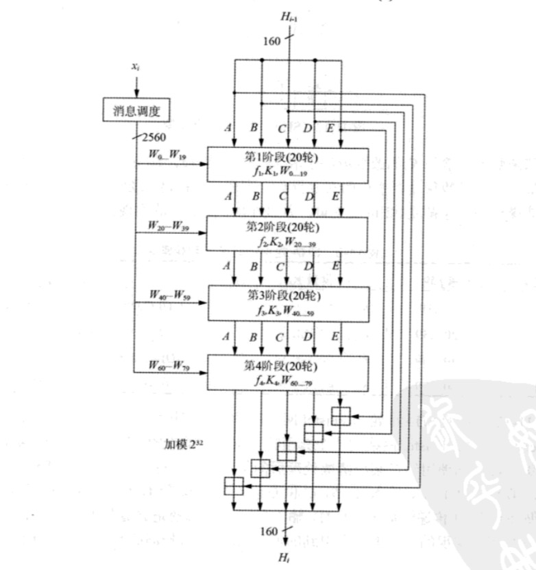

# SHA-1

## 1. 背景介绍

* SHA-1（Secure Hash Algorithm 1）是一种散列函数，1995年美国国家安全局（NSA）设计，并由美国国家标准技术研究所（NIST）发布为联邦数据处理标准(FIPS)。

  在SHA-1正式公布之前有一个被叫做SHA-0的哈希算法在1993年公布，但是不久后马上被撤回。根据NSA的说法，这是为了纠正SHA-0算法中的一个缺陷，这个缺陷降低了其加密安全性，但没有提供任何具体的解释。

* SHA-1生成160比特的散列值。输入最大2^64为比特的消息。

* SHA-1基于MD4哈希算法设计中使用的原理，但在安全性上具有更保守的设计。

* [安全哈希标准](https://csrc.nist.gov/csrc/media/publications/fips/180/4/final/documents/fips180-4-draft-aug2014.pdf) (Secure Hash Standard, SHS)是2015年8月FIPS发布的一个包含SHA-1和SHA-2家族的所有哈希算法的标准文件。下面给出的运算过程都遵循该文件的描述。

* SHA-1算法已不能在高安全性要求的环境下使用。

## 2. 预处理和哈希计算 

### 2.1 预处理

跟MD4、MD5一样的填充运算。先在原始信息m后面追加一个“1”，再添加d个“0”使得长度处以512余数为448，最后加上原始信息m的长度的二进制表示（64比特）。填充完成的信息的长度正好是512的倍数。

将填充完成的每512比特分为一个块，32个比特为一字word，每个块是16个字。
$$
M = M_{0}M_{1}...M_{N-1}
$$
N是信息M中字的个数，块的个数是N/16。

### 2.2 哈希计算 

SHA-1需要五个32位寄存器来存储每一轮的计算结果，最终结果也由这五个寄存器的值组成。

* 定义计算函数

```
F(X,Y,Z) = (XY) + (not(x)Z)		 0 <= t <= 19
F(X,Y,Z) = X + Y + Z			20 <= t <= 39
F(X,Y,Z) = (XY) + (XZ) + (YZ)	40 <= t <= 59
F(X,Y,Z) = X + Y + Z			60 <= t <= 79
```

上述函数中，XY表示XY按位与，V表示按位或，+是模2^32的加法运算，not( )表示求补码。

* 给出常数值

```
K = 0x5A827999		 0 <= t <= 19 		(2的平方根 * 2^30)
K = 0x6ED9EBA1		20 <= t <= 39		(3的平方根 * 2^30)
K = 0x8F1BBCDC		40 <= t <= 59		(5的平方根 * 2^30)
K = 0xCA62C1D6		60 <= t <= 79		(10的平方根 * 2^30)
```

* 设置初始值（大端表示法）

```
H0 = 0x67452301
H1 = 0xEFCDAB89
H2 = 0x98BADCFE
H3 = 0x10325476
H4 = 0xC3D2E1F0
```

* 计算过程

```
Set A = H0, B = H1, C = H2, D = H3, E = H4

//对每个块循环计算
For i = 0 to N/16-1 do
	//将一个块的信息复制给X
	For j = 0 to 15 do 
		Set X[j] = M[i*16+j]
	end
	
	//计算W[80]的值
	For t = 0 to 15 do 
		W[t] = X[t]
	end
	For t = 16 to 79 do
		W[t] = (W[t-1] + W[t-8] + W[t-14] + W[t-16]) <<< 1
		//(SHA-0在这个地方没有循环左移1位，其他地方都和SHA-1相同)
	end
		
	//寄存器赋值	
	Set AA = A, BB = B, CC = C, DD = D, EE = E
	
	For t = 0 to 79 do
		T = (A <<< 5) + F(B,C,D) + E + K[t] + W[t]
		E = D
		D = C
		C = B <<< 30
		B = A
		A = T
	end
	
	A = A + AA
	B = B + BB
	C = C + CC
	D = D + DD
	E = E + EE
end
```

* 最终结果

```
H = A || B || C || D || E
```

### 2.3 流程图







### 2.4 替代算法

上面算法计算过程需要一个80的数组存储中间变量W[80]，替代算法不再使用这么多的空间，只使用16个空间进行存储。设MASK = 0x0000000f。

```
Set A = H0, B = H1, C = H2, D = H3, E = H4 

//对每个块循环计算 
For i = 0 to N/16-1 do 
	//将一个块的信息复制给X 
	For j = 0 to 15 do  
		Set X[j] = M[i*16+j] 
	end 
	
	//计算W[80]的值 
	For t = 0 to 15 do  
		W[t] = X[t] 
	
	//寄存器赋值	 
	Set AA = A, BB = B, CC = C, DD = D, EE = E 
	
	For t = 0 to 79 do 
		s = t V MASK （按位或）
		if t >= 16
			Ws = (W[(s+13) V MASK] + W[(s+8) V MASK] + W[(s+2) V MASK] + W[s])
	
		T = (A <<< 5) + F(B,C,D) + E + K[t] + Ws 
		E = D 
		D = C 
		C = B <<< 30 
		B = A 
		A = T 
	end 
	
	A = A + AA 
	B = B + BB 
	C = C + CC 
	D = D + DD 
	E = E + EE 
end
```

结果

```
H = A || B || C || D || E
```


## 3. SHA-1安全

2005年，Rijmen和Oswald发表了对SHA-1较弱版本（reduced version with 53 rounds instead of 80）的[攻击](https://eprint.iacr.org/2005/010)：在2^80的计算复杂度之内找到碰撞。（*一般在分析哈希算法时若不能直接对全版本的哈希算法进行分析，那么学者们会构造一些弱版本的哈希算法，比如少了一些循环步骤或者不进行移位操作，通过对弱版本算法的攻击来试图寻找攻击全版本算法的方法。*）

2005年二月，王小云、殷益群及于红波发表了对完整版SHA-1的[攻击“SHA-1 Broken”](https://www.schneier.com/blog/archives/2005/02/sha1_broken.html)，只需少于2^69的计算复杂度，就能找到一组碰撞。[paper](https://www.iacr.org/archive/crypto2005/36210017/36210017.pdf)

2005年8月17日的国际密码讨论年会（CRYPTO）会议尾声中王小云、姚期智以及姚储枫再度[发表](https://www.schneier.com/blog/archives/2005/08/new_cryptanalyt.html)更有效率的SHA-1攻击法，能在2^63的计算复杂度内找到碰撞。

2017年2月23日，Google公司公告宣称他们与CWI Amsterdam合作共同创建了两个有着[相同的SHA-1值但内容不同的PDF文件](https://security.googleblog.com/2017/02/announcing-first-sha1-collision.html)。实际上共执行了 9,223,372,036,854,775,808 次 SHA-1 计算（9×10^18），一阶段攻击需要耗费 6500 年的 CPU 计算时间；二阶段攻击也需要 110 年的 GPU 计算时间。


SHA-1已经不再视为可抵御有充足计算资源的攻击者。2010年以来，许多组织建议用SHA-2或SHA-3来替换。微软、Google以及Mozilla都宣布，它们旗下的浏览器将在2017年前停止接受使用SHA-1算法签名的SSL证书。

SHA-1还是基于MD4的Merkle–Damgård 架构设计的，可能也是因为架构本身的问题，MD4家族的哈希算法先后被碰撞出来。SHA-2就SHA-3就脱离了这个架构设计新的哈希算法。