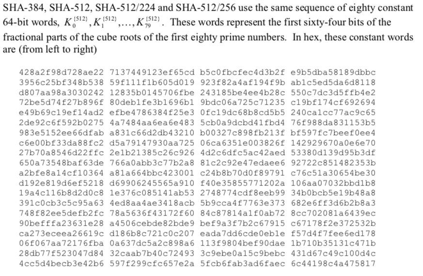

# SHA-2

## 1. 概述

## 2. SHA-256 / SHA-224 

### 2.1 SHA-256

#### 2.1.1 预处理、函数、常数 

* 填充与分块

  同MD4、MD5、SHA-1，填充得到一个长度为512倍数的信息（二进制表示）。一个块为512比特，一个字为32比特，每个块中包含16个字。

$$
M = M_{0}M_1M_2...M_{N-1}
$$

​	N是信息中包含的字的个数。N/16表示信息中块的个数。

* 定义函数

  ">>>"  循环右移，“>>”右移

* ```
  Ch(x,y,z) = (xy) ⊕ ((¬x)z)
  Maj(x,y,z) = (xy) ⊕ (xz) ⊕ (yz)
  ∑0(x) = (x >>> 2) ⊕ (x >>> 13) ⊕ (x >>> 22)
  ∑1(x) = (x >>> 6) ⊕ (x >>> 11) ⊕ (x >>> 25)
  σ0(x) = (x >>> 7) ⊕ (x >>> 18) ⊕ (x >> 3)
  σ1(x) = (x >>> 17) ⊕ (x >>> 19) ⊕ (x >> 10)
  ```

* 常数

  前64个素数2..311的立方根的二进制表示的小数部分的前32位。

```
k[0..63] := 
   0x428a2f98, 0x71374491, 0xb5c0fbcf, 0xe9b5dba5, 0x3956c25b, 0x59f111f1, 0x923f82a4, 0xab1c5ed5,
   0xd807aa98, 0x12835b01, 0x243185be, 0x550c7dc3, 0x72be5d74, 0x80deb1fe, 0x9bdc06a7, 0xc19bf174,
   0xe49b69c1, 0xefbe4786, 0x0fc19dc6, 0x240ca1cc, 0x2de92c6f, 0x4a7484aa, 0x5cb0a9dc, 0x76f988da,
   0x983e5152, 0xa831c66d, 0xb00327c8, 0xbf597fc7, 0xc6e00bf3, 0xd5a79147, 0x06ca6351, 0x14292967,
   0x27b70a85, 0x2e1b2138, 0x4d2c6dfc, 0x53380d13, 0x650a7354, 0x766a0abb, 0x81c2c92e, 0x92722c85,
   0xa2bfe8a1, 0xa81a664b, 0xc24b8b70, 0xc76c51a3, 0xd192e819, 0xd6990624, 0xf40e3585, 0x106aa070,
   0x19a4c116, 0x1e376c08, 0x2748774c, 0x34b0bcb5, 0x391c0cb3, 0x4ed8aa4a, 0x5b9cca4f, 0x682e6ff3,
   0x748f82ee, 0x78a5636f, 0x84c87814, 0x8cc70208, 0x90befffa, 0xa4506ceb, 0xbef9a3f7, 0xc67178f2
```

* 初始值

  取前八个素数的平方根的小数部分的前三十二位得到

```
H0 = 0x6a09e667 
H1 = 0xbb67ae85
H2 = 0x3c6ef372 
H3 = 0xa54ff53a 
H4 = 0x510e527f 
H5 = 0x9b05688c 
H6 = 0x1f83d9ab 
H7 = 0x5be0cd19
```

#### 2.1.2 哈希计算


### 2.2 SHA-224

#### 2.2.1 预处理、函数、常数

SHA-224在预处理阶段跟SHA-256的区别就只有初始值不同。

* 填充和分块（同SHA-256）
* 函数（同SHA-256）
* 常数（同SHA-256）
* 初始值

```
H0 = 0xc1059ed8
H1 = 0x367cd507
H2 = 0x3070dd17 
H3 = 0xf70e5939 
H4 = 0xffc00b31 
H5 = 0x68581511 
H6 = 0x64f98fa7 
H7 = 0xbefa4fa4
```

#### 2.2.2 哈希计算

SHA-224的计算过程跟SHA-256一样，只是初始值不同。

最后得到哈希值只拼接前七个寄存器的值（32 * 7 = 224），即

```
H = H0 || H1 || H2 || H3 || H4 || H5 || H6
```

 


## 3. SHA-512, SHA-384, SHA-512/224, SHA512/256

* 信息长度，0<= l <= 2^128；64bit的字；有8个64bit的寄存器。

* 函数

  这些函数计算的都是64bit的操作数


* 常数

  前80个素数的立方根的小数部分的前面64bit



* 填充

  先在消息的尾部添加一个“1”，在添加k个“0”，使得长度模1024的余数是896，再添加消息长度l的128bit二进制表达形式。最后填充完成的信息是1024bit的倍数。


* 分块

  每1024bit为一个块，每个块中包含16个64bit字。

### 3.1 SHA-512

* 初始值


​	取前八个素数的平方根的小数部分的前六十四位得到的

* 哈希计算


### 3.2 SHA-384

* 初始值


* 哈希计算

  SHA-384的运算跟SHA-256相同，只有初始值不同；

  最后计算哈希值时值使用前面六个寄存器的值（64 * 6  = 385）。


### 3.3 SHA-512/t

该算法是为了扩展出更多输出位数的的哈希值，t理论上可以任选，t属于（0，256）且不等于384.

* 关于不同的t，需要计算不同的初始值IV，计算算法如下:

  利用SHA-512算法计算“SHA-512/t”，例如“SHA-256/256”的哈希值，作为SHA-512/256的初始值。


#### 3.3.1 SHA-512/224

该算法有固定的初始值，计算过程跟SHA-512一样，最终结果值取最左边的224bits


#### 3.3.2 SHA-512/256

计算过程跟SHA-512一样，最终结果值取最左边的256bits。


## 4. SHA-2流程图


## 5. SHA-2 安全

从SHA-2哈希算法公布以来，还没有任何一个发布出来的攻击方法可以对SHA-2的全部循环轮数进行碰撞。一般都是对SHA-2的简化版本进行伪攻击实验，距离在实际生产过程中进行攻击还有很长的距离。

但是，SHA-2还是基于Merkle–Damgård架构设计出来的，NSA为了防止对于这一架构的攻击会取得突破的进展，在2006年，美国国家标准与技术研究院（**NIST**）开始组织[NIST哈希函数竞赛](https://en.wikipedia.org/wiki/NIST_hash_function_competition)，以创建一个新的哈希标准SHA-3，要求中有一点：不能使用Merkle–Damgård架构进行设计。
