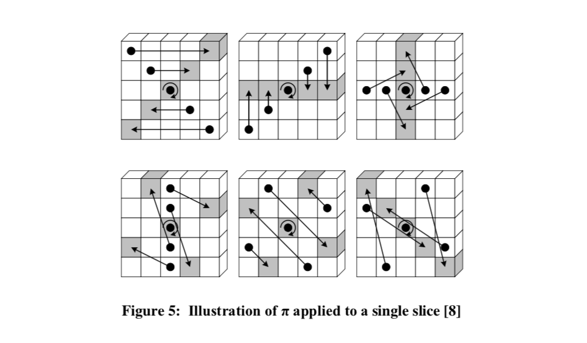

# SHA-3

##  1. 概述

**SHA-3**（**安全散列算法3**）是NIST于2015年8月5日发布的安全散列算法系列标准的最新成员，但SHA-3的内部结构与SHA-1和SHA-2的结构完全不同。

2006年，NIST开始组织**NIST哈希函数竞赛**以创建一个新的安全哈希算法SHA-3。SHA-3并不表示着要取代现有的SHA-2，因为还没有证明对SHA-2的重大攻击。但是鉴于对MD5，SHA-0和SHA-1的已有的成功攻击案例，NIST认为需要一种可替代的，结构不同的哈希算法，它就是SHA-3。

[Keccak算法](https://keccak.team/index.html)（读作为“ket-chak”）是Guido Bertoni, Joan Daemen, Michael Peters, and Giles Van Assche的工作。 SHA-3的候选人在2008年10月提交。2012年NIST宣布Keccak是竞赛的最终获胜者。

2014年，NIST发布了 FIPS 202 的草案 ["SHA-3 Standard: Permutation-Based Hash and Extendable-Output Functions"](https://csrc.nist.gov/projects/hash-functions/sha-3-standardization)。2015年8月5日，FIPS 202 最终被 NIST 批准。标准中将Keccak进行规范，形成SHA-3哈希函数族。

Keccak算法在竞赛胜出后正式成为SHA-3标准的过程：

| Date                  | Event                                                        |
| --------------------- | ------------------------------------------------------------ |
| 10/02/2012            | SHA-3 competition ended; [KECCAK announced as the winner](https://csrc.nist.gov/CSRC/media/Projects/Hash-Functions/documents/sha-3_selection_announcement.pdf). |
| 02/06/2013            | KECCAK team’s visit and [presentation on SHA-3](https://csrc.nist.gov/CSRC/media/Projects/Hash-Functions/documents/Keccak-slides-at-NIST.pdf). |
| 02/27/2013-11/01/2013 | NIST shared SHA-3 standardization plans *(see NIST Presentations below)* with cryptographic community at various events. |
| 05/28/2014            | [Draft FIPS 202](https://csrc.nist.gov/CSRC/media//Publications/fips/202/final/documents/fips_202_draft.pdf)[ ](https://csrc.nist.gov/CSRC/media//Publications/fips/202/final/documents/fips_202_draft.pdf)announced in the [Federal Register](https://csrc.nist.gov/news/2014/draft-fips-202,-sha-3-standard-and-request-for-com). Revision to the Applicability Clause of FIPS 180-4 also proposed to allow the use of hash functions specified in either FIPS 180-4 or FIPS 202 for Federal applications that require a cryptographic hash function. |
| 08/22/2014            | [SHA-3 Workshop](https://csrc.nist.gov/events/2014/sha-3-2014-workshop) at UCSB to obtain public feedback. |
| 08/26/2014            | Public comment period on Draft FIPS 202 ends.[FIPS 202 Public Comments](https://csrc.nist.gov/CSRC/media/Projects/Hash-Functions/documents/FIPS-202-public-comments-aug2014.pdf)[FIPS 180-4 Public Comments](https://csrc.nist.gov/CSRC/media/Projects/Hash-Functions/documents/FIPS-180-4-public-comments-aug2014.pdf) |
| 08/05/2015            | [FIPS 202](https://csrc.nist.gov/publications/detail/fips/202/final) and [Revised Applicability Clause of FIPS 180-4](https://csrc.nist.gov/publications/detail/fips/180/4/final) announced in the [Federal Register](https://csrc.nist.gov/news/2015/announcing-approval-federal-information-processin). |


## 2. SPONGE CONSTRUCTION

在密码学中，**海绵函数**（sponge function）或者**海绵结构**（sponge construction）是一种算法。它使用有限的状态集合state，接收任何长度的输入比特流，然后可以输出任何长度的结果。

Keccak团队给出的Sponge Constructioncan参考 [Cryptographic sponge functions](https://keccak.team/files/CSF-0.1.pdf)

Sponge的安全级别取决于capacity："Sponge capacity corresponds to a security level: s = c/2." [Sponge Functions](https://keccak.team/files/SpongeFunctions.pdf)

### 2.1 总体结构

海绵结构由三个部分组成：

- 一个状态集合S (State)，包含b个比特
- 一个能置换或者转换状态集合，固定大小的转换函数f (function)
- 一个填充函数P（padding function) 

状态集合分成两个部分，r（大小为r比特）与C（大小为 b-r比特）。这里的参数r又叫做*转换率*（bitrate），而c叫做容量（capacity）。

填充函数会在初始信息填充增加足够的长度，得到的比特流长度变成 r 的整数倍。因此填充过后的输入可以被切成长度为 r 的多个块。

Sponge Construction描述成函数式：**SPONGE[f, p, r] (N, d) **，其中f, P, r是上面三个组成部分，N是输入原文信息，d表示要输出的摘要的长度。


上图表示了原文信息N经过padding得到长度为4r的消息，在海绵结构中经过 absorbing阶段和 squeezing阶段，最后得到长度为d的消息。

### 2.2 详细过程 

海绵结构的详细过程包括：填充，分块，处理所有块，提取信息。

下面是伪代码：

```
Steps: 
    1. Let P=N || pad(r, len(N)).
    
    2. Let n = len(P)/r.
    
    3. Let c = b-r.
    
    4. Let P_0,...,P_n-1 be the unique sequence of strings of length r such that P = P0 || ... || P_n-1. 
    
    5. Let S = 0^b.
    
    6. For i from 0 to n-1, let //对每个r块进行转换
    	S = S ⊕ (Pi || 0^c).
    	S = f(S).
    
    7. Let Z be the empty string.
    
    8. Let Z=Z || Trunc_r(S). //截取前面r个比特
    
    9. If d ≤ |Z|, then return Trunc_d (Z); else continue. //如果消息长度不够，继续转换过程
    
    10. Let S=f(S), and continue with Step 8.
```

海绵结构是一个框架（或者称为架构），在这个结构里面可以加入自己的填充方法P以及转换函数f。Keccak算法就是在这个结构的基础上实现的一个具体算法。

## 3. Keccak

[Keccak算法](https://keccak.team/index.html)（读作为“ket-chak”）是Guido Bertoni, Joan Daemen, Michael Peters和Giles Van Assche的研究成果。 SHA-3的候选人在2008年10月提交。2012年NIST宣布Keccak是竞赛的最终获胜者。2015年NIST正式发布SHA-3标准。

Keccak团队给出的[Keccak算法参考3.0](https://keccak.team/files/Keccak-reference-3.0.pdf)

### 3.1 State

* 下面图中给出状态集合State的一些概念：


* 算法中给出的XYZ轴的坐标表示如下图，X、Y轴的坐标顺序跟正常的坐标表示不同。


* 在Keccak算法中，b可以是25、50、100、200、400、800、1600这7个选项，State的x轴y轴固定大小为5，那么Z轴的长度w就相应的可以计算出来，而且有

$$
w = 2^l
$$


* 下面是一些等式转换：

```
状态集合表示为一个一个比特：
S = S[0] || S[1] || ... || S[b-2] || S[b-1]

A表示三维矩阵，将线性的状态映射到矩阵上
A[x, y, z]=S[w(5y+x)+z]

Lane(i,j)= A[i,j,0] || A[i,j,1] || A[i,j,2] || ... || A[i,j,w-2] || A[i,j,w-1]

Plane(j)= Lane(0, j) || Lane(1, j) || Lane(2, j) || Lane(3, j) || Lane(4, j)

S = Plane (0) || Plane (1) || Plane (2) || Plane (3) || Plane (4)
```

### 3.2 Step Mappings 

Keccak算法的转换函数f包括五个步骤：θ, ρ, π, χ（西）, and ι （约塔），五个步骤最终组合成为一个转换函数。下面先给出五个步骤的具体变换：

```
θ:	同一x轴左侧一列（x-1）加上右下方一列（x+1，z-1）加上本身的值

Steps:
    1. For all pairs (x, z) such that 0≤x<5 and 0≤z<w, let
        C[x,z]=A[x,0,z] ⊕ A[x,1,z] ⊕ A[x,2,z] ⊕ A[x,3,z] ⊕ A[x,4,z].
    2. For all pairs (x, z) such that 0≤x<5 and 0≤z<w let
        D[x, z]=C[(x-1) mod 5, z] ⊕ C[(x+1) mod 5, (z –1) mod w].
    3. For all triples (x, y, z) such that 0≤x<5, 0≤y<5, and 0≤z<w, let
        A′[x,y,z] = A[x,y,z] ⊕ D[x,z].
```


```
ρ:在z轴上循环移位

Steps:
    1. For all z such that 0≤z<w, let A′ [0,0,z] = A[0,0,z].
    2. Let(x,y)=(1,0).
    3. For t from 0 to 23:
        a. for all z such that 0≤z<w, let A′[x, y, z] = A[x, y, (z–(t+1)(t+2)/2) mod w];
        b. let (x, y) = (y, (2x+3y) mod 5).
    4. Return A′.
```


```
π: 就是在每一个slice上面重新排列，slice是指一个Z轴面

Steps:
	1. For all triples (x, y, z) such that 0≤x<5, 0≤y<5, and 0≤z<w, let
        A′[x, y, z]= A[(x + 3y) mod 5, x, z]
	2. Return A′
```



```
χ（西）：本身跟X轴上同一行的“后面一个的非”和“后面第二个”相加，进行非线性变换

Steps:
    1. For all triples (x, y, z) such that 0≤x<5, 0≤y<5, and 0≤z<w, let
    	A′[x,y,z] = A[x,y,z] ⊕ ((A[(x+1) mod 5, y, z] ⊕ 1) ⋅ A[(x+2) mod 5, y, z]).
    	//式中的 ⋅ 表示与操作
    2. Return A′.
```


```
ι （约塔）：更改Z轴（0，0）（最中心那个）上的一些数
 
Steps:
    1. For all triples (x, y, z) such that 0≤x<5, 0≤y<5, and 0≤z<w, let 
    	A′[x, y, z] = A[x, y, z].
    2. Let RC=0^w.
    3. For j from 0 to l, let 		//l是w = 2^l中的l
    	RC[2^j –1]=rc(j+7i_r). 		//i_r是处理块的轮数
    4. For all z such that 0≤z<w, let 
    	A′[0,0,z]=A′[0,0,z] ⊕ RC[z].
    5. Return A′.
```

```
rc(t):轮常数
定义为二进制线性反馈移位寄存器（LFSR）的比特输出：rc[t]=(x^t mod (x^8+x^6+x^5+x^4+1)) mod x.

Steps:
    1. If t mod 255 = 0, return 1.
    2. Let R = 10000000.
    3. For i from 1 to t mod 255, let:
        a. R=0||R;
        b. R[0] = R[0] ⊕ R[8];
        c. R[4] = R[4] ⊕ R[8];
        d. R[5] = R[5] ⊕ R[8];
        e. R[6] = R[6] ⊕ R[8];
        f. R =Trunc_8[R].
    4. Return R[0].
```
* 下表给出的是从0到23轮中的RC常量值，每个都是64比特，对应w。如果state中的w小于64，那么直接截取每个值中前面部分即可。超过24轮的常数可以按照上述方法求得。

| RC[0]  | 0x0000000000000001 | RC[12] | 0x000000008000808B |
| ------ | ------------------ | ------ | ------------------ |
| RC[1]  | 0x0000000000008082 | RC[13] | 0x800000000000008B |
| RC[2]  | 0x800000000000808A | RC[14] | 0x8000000000008089 |
| RC[3]  | 0x8000000080008000 | RC[15] | 0x8000000000008003 |
| RC[4]  | 0x000000000000808B | RC[16] | 0x8000000000008002 |
| RC[5]  | 0x0000000080000001 | RC[17] | 0x8000000000000080 |
| RC[6]  | 0x8000000080008081 | RC[18] | 0x000000000000800A |
| RC[7]  | 0x8000000000008009 | RC[19] | 0x800000008000000A |
| RC[8]  | 0x000000000000008A | RC[20] | 0x8000000080008081 |
| RC[9]  | 0x0000000000000088 | RC[21] | 0x8000000000008080 |
| RC[10] | 0x0000000080008009 | RC[22] | 0x0000000080000001 |
| RC[11] | 0x000000008000000A | RC[23] | 0x8000000080008008 |

### 3.3 KECCAK-p[b,n_r]  

该函数是Keccak算法中转换函数对一个块进行处理的过程。填充完的信息有N个块就需要运行这个函数N次。N次计算也就是Sponge Constructure中的“吸收”过程。

```g
KECCAK-p[b, n_r](S) 

Steps:
    1. Convert S into a state array A. 
    2. For i_r from 12+2l–n_r to 12+2l–1,let		//共12+2*l轮
    	A=Rnd(A,i_r)= ι(χ(π(ρ(θ(A)))), i_r).
    3. Convert A into a string S′ of length b.
    4. Return S′.
```

### 3.4 填充方案 pad10*1 

填充方案是对原始信息尽心填充，使得得到的信息是r的倍数。

```
pad10*1(M,r,m) M是原始信息，正整数r是倍数，非负整数m是M的长度

Steps:
    1. Let j = (– m – 2) mod x.
    2. Return P=M || 1 || 0^j || 1.		//填充j个0
```
### 3.5 KECCAK[c] (N, d) 

定义函数，这是基于Sponge Construction的Keccak算法的完整描述。

```
KECCAK[c] (N, d) = SPONGE[KECCAK-p[1600, 24], pad10*1, 1600 – c] (N, d). 
```

## 4. SHA-3 FUNCTION SPECIFICATIONS 

NIST给出的标准中SHA-3家族包含有四个哈希算法，分别是SHA3-224, SHA3-256, SHA3-384和 SHA3-512，还有两个可拓展输出的函数SHAKE128和SHAKE256。六个函数都是上述 **KECCAK[c] (N, d) ** 的具体试实现。下面给出具体定义：

### 4.1 SHA-3 Hash Functions 

哈希函数的输出消息长度是固定的，格式为SHA3-X，X即是输出的长度。

SHA3-224(M) = KECCAK[448] (M || 01, 224); 		224是输出长度，448是capacity，capacity = 2*d

SHA3-256(M) = KECCAK[512] (M || 01, 256); 

SHA3-384(M) = KECCAK[768] (M || 01, 384); 

SHA3-512(M) = KECCAK[1024] (M || 01, 512). 

### 4.2 SHA-3 Extendable-Output Functions（XOF） 

可扩展输出函数的消息输出长度是不固定的，可以输出任意长度的消息。

SHAKE128(M, d) = KECCAK[256] (M || 1111, d)；

SHAKE256(M, d) = KECCAK[512] (M || 1111, d). 

### 4.3 对比

	在哈希函数中要在原始信息后面追加“01”，在可扩展输出函数中再原始信息后面追加“1111”，是为了在进行计算时区分这两种不同的模式。
	
	下面表格给出的是上述六个函数的对比信息：

| Function | *r*  | *c*  | Output length (bits) | Security level (bits) | Mbits |
| -------- | ---- | ---- | -------------------- | --------------------- | ----- |
| SHAKE128 | 1344 | 256  | unlimited            | 128                   | 1111  |
| SHAKE256 | 1088 | 512  | unlimited            | 256                   | 1111  |
| SHA3-224 | 1152 | 448  | 224                  | 112                   | 01    |
| SHA3-256 | 1088 | 512  | 256                  | 128                   | 01    |
| SHA3-384 | 832  | 768  | 384                  | 192                   | 01    |
| SHA3-512 | 576  | 1024 | 512                  | 256                   | 01    |


## 5 小结

SHA-3是目前哈希函数家族中最新的成员，在2015年NIST正式公布了SHA-3的标准文件。SHA-2家族在目前的计算能力以及学术研究下，暂时还没有公开发布出来的碰撞攻击。所以SHA-3的发布不是为了取代SHA-2，SHA-3用了区别于SHA-1、SHA-2的Sponge Construction，也给出了更多可扩展的空间。是对SHA-2的补充，也在当SHA-2一旦被攻击时，有SHA-3的替代方案。