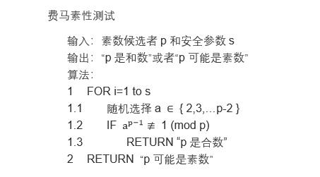
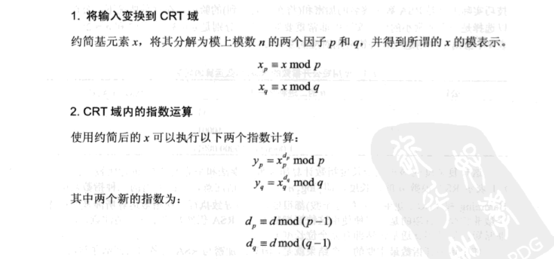

# RSA (cryptosystem)

[TOC]

## 一、背景
### 1.1 概述
1976年以前，所有的加密方法都是同一种模式: 对称加密算法（Symmetric-key algorithm）。对称密码的特点：计算量小、加密速度快、加密效率高。  

Whitfield Diffie和Martin Hellman在1976年在论文[ New directions in cryptography ](https://ieeexplore.ieee.org/document/1055638/)中提出非对称密码学模式(asymmetric-key algorithm)，也称为公钥密码算法。  


RSA公钥加密算法是1977年由Ron Rivest、Adi Shamirh和Len Adleman三人在美国麻省理工学院设计的。RSA取名来自他们三者的名字。RSA是最有影响力的公钥加密算法，被ISO推荐为公钥数据加密标准。RSA原始论文：[A Method for Obtaining Digital Signatures and Public-Key Cryptosystems](http://people.csail.mit.edu/rivest/Rsapaper.pdf)。

对极大整数做因数分解的难度决定了RSA算法的可靠性。就是说，对一极大整数做因数分解愈困难，RSA算法愈可靠。假如有人找到一种快速因数分解的算法的话，那么用RSA加密的信息的可靠性就肯定会极度下降。但找到这样的算法的可能性是非常小的。到目前为止，只有短的RSA密钥才可能被以强力方式解破，世界上还没有任何可靠的攻击RSA算法的方式。只要其密钥的长度足够长，用RSA加密的信息在理论上是不能被解破的。

RSA加密算法目前被破解的最长密钥长度是768个二进制位。也就是说，长度超过768位的密钥，还无法破解（至少没人公开宣布）。因此可以认为，1024位的RSA密钥基本安全，2048位的密钥相当安全。


近几年基于椭圆曲线的加密算法（Elliptic Curve Cryptography）越来越被重视，也是因为ECC加密算法比RSA具有的良好属性，RSA可能会使用的越来越少。

***
### 1.2 对称密码体系

对称密码体系中，只有一个密钥K，加密和解密都需要这个密钥的参与，且密钥不能泄漏。

  
***


### 1.3 非对称密码体系

加解密流程图


  


签名验签流程图

  

***

## 二、RSA算法具体流程
### 2.1 生成密钥对
    1 选择两个大素数p和q；  
    2 计算n=p*q；  
    3 计算Φ(n)=(p-1)*(q-1)；  
    4 选择公钥e，满足条件：1<e<Φ(n),且e与Φ(n)互质，互质保证e存在关于Φ(n)的逆元；  
    5 计算d，使得d*e≡1mod(Φ(n)),即d是e关于Φ(n)的逆元。
    6 其中 p、q、Φ(n)、d保密；e、n公开。

### 2.2 加解密

***注意：在RSA中，要求加密的明文m比模数n小。当m大于n时，需要对m进行分块使得每个分块都比n小。*** 

#### 加密
$$
c = m^e  (mod\ n)
$$

#### 解密
$$
m' = c^d (mod\ n）
$$

* 该式子的正确性证明将在三部分进行

### 2.3 签名验签（一般性流程）

#### 签名

$$
h = Hash(m)
$$

$$
s = h^d(mod\ n)
$$
    Then send {m, s, Hash()}                //包括原文、签名信息和哈希算法

#### 验签

$$
h = Hash(m)
$$

$$
h' = s^e(mod\ n)
$$
    Check if h == h'
***
## 三、正确性证明
### 3.1 一些数学定理
欧拉函数
>对正整数n，小于n的正整数中与n互质的数的个数


>推论1：m和n是互质的正整数，那么 Φ(mn)=Φ(m)Φ(n)


欧拉定理

>n是正整数，a是非0整数，且n和a互质，则
$$
a^{Φ(n)} = 1(mod\ n)
$$
费马小定理
>a是非0整数，p是素数，且p与a互质，则  
$$
a^{p-1}= 1(mod\ p)
$$

### 3.2 证明过程
证明：

解密的公式表示为：
$$
m' = c^d (mod\ n）= (m^e)^d (mod\ n) = m^{ed} (mod\ n)
$$
因为 d是e关于Φ(n)的逆元，表示为：
$$
ed = 1 (mod\ Φ(n)) --- > ed = t*Φ(n) + 1
$$

$$
m' = m * m^{t*Φ(n)} (mod\ n) = m^{t * Φ(n) + 1} (mod\ n)
$$

分类讨论：

（1）当m与n互质时，由欧拉定理可知
$$
m^{Φ(n)} = 1 (mod\ n)
$$
所以
$$
m' = m * m^{t*Φ(n)} (mod\ n) = m * 1^t (mod\ n) = m (mod\ n)
$$
（2）当m与n不互质时

因为m与n不互质，而且p和q均为素数，那么m必须是p或者q的倍数，不失一般性，假设
$$
m = rp
$$
 那么m与q互质
$$
m^{Φ(q)} = 1 (mod\ q)
$$
所以
$$
m^{t*Φ(n)} = m^{t(p-1)(q-1)} = m^{tΦ(q)(p-1) }= 1^{t(p-1)} (mod\ q) = 1 (mod\ q)
$$
设
$$
m^{t*Φ(n)} = 1 + uq
$$

$$
m*m^{t*Φ(n)} = m+ muq = m + rupq = m + run
$$

那么
$$
m^{t*Φ(n) + 1} (mod\ n) = m*m^{t*Φ(n)} (mod\ n) =  m + run (mod\ n) = m (mod\ n)
$$
综上，不管m与n是否互质，解密公式均正确。

***

##   四、整数因式分解难题
### 4.1 整数分解算法

在数论中，整数因子分解是将合数分解为较小整数的乘积。如果分解出来的整数进一步限制为素数，则该过程称为整数的素分解。如果想要破解RSA，目前最好的方法就是对n进行因式分解。以下是目前公开发布的针对整数因式分解的算法，分为三类：

#### 4.1.1 特殊分解算法 Special-purpose

试除法(Trial division) 

轮式因子分解法(Wheel factorization) 

Pollard's rho算法(Pollard's rho algorithm) 

代数群因子分解算法(Algebraic-group factorisation algorithms)，包括： 

- Pollard's p-1算法(Pollard'sp−1 algorithm) 
- Williams' p+1算法(Williams'p+1 algorithm) 
- Lenstra椭圆曲线因子分解法(Lenstra elliptic curve factorization) 

费马因子分解法(Fermat's factorization method) 

欧拉因子分解法(Euler's factorization method) 

特殊数域筛选法(Special number field sieve, SNFS) 

#### 4.1.2 一般用途算法 General-purpose

Dixon's算法(Dixon's algorithm) 

连分数因子分解法(Continued fraction factorization, CFRAC) 

二次筛选法(Quadratic sieve) 

自然筛选法(Rational sieve) 

普通数域筛选法(General number field sieve, GNFS) 

二次剩余因子分解法(Shanks' square forms factorization, SQUFOF) 

#### 4.1.3 其他重要算法

**量子算法(Shor's algorithm)** 


### 4.2 RSA problem

RSA实验室发布了54个RSA分解难题，给分解出质数的获胜者发放一定的奖励。截至2017年10月，54个列出的数字难题中有19个被分解出来：从RSA-100到RSA-220最小的18个，再加上RSA-768。  

* RSA numbers 
   

* 部分分解出来的RSA数对应的时间 

| RSAnumbers         | 算法            | 时间                                                         |
| ------------------ | --------------- | ------------------------------------------------------------ |
| RSA-100（330bits） | Quadratic sieve | 72分钟内（1991）                                             |
| RSA-110（364bits） | GGNFS           | 不到四小时内（1992）                                         |
| RSA-120（397bits） | --              | 不到三个月的实际计算机时间（1993）                           |
| RSA-640bits        | GNFS            | 在80个2.2 GHz AMD Opteron CPU上进行了五个月的计算（2005）    |
| RSA-200（663bits） | GNFS            | 相当于单个2.2 GHz Opteron计算机的75年工作量（2005）          |
| RSA-768bits        | --              | 相当于单核2.2 GHz基于AMD Opteron的计算机上近2000年的计算时间（2009） |

到目前为止，（除非量子计算机和量子算法成熟可行）。

***

## 五、素数测试
### 5.1 素数理论
>从不大于n的自然数随机选一个，它是素数的概率大约是1/Ln(n) 。

### 5.2 测试算法
#### 5.2.1 费马素性测试



费马小定理对所有的素数都成立，如果不满足1.2的式子，则一定是合数。

但是费马小定理的逆定理是不成立的，因为卡迈尔克数的存在，即使通过了费马素性测试，检测得到错误结果的可能性也很大。

* 卡迈尔克数：给定一个卡迈尔克数C，对所有与C互质的整数a，始终满足
  $$
  a^{C-1} = 1 (mod C)
  $$
  但是C是合数。

#### 5.2.2 Miller-Rabin素性测试


当测试算法输出“p可能是素数”时，其真实为素数的概率是$\frac{3}{4}$，即将合数错误判断为是素数的概率是$\frac{1}{4}$。在进行多次测试后，可以有很高的正确概率。
***

## 六、p 和 q的选取

（1）**RSA中的质数p和质数q不能离得太近** 

论文：Coppersmith D. [Finding a small root of a bivariate integer equation; factoring with high bits known.](https://dl.acm.org/citation.cfm?id=1754517) EUROCRYPT 1996. pp. 178-189, ACM, 1996.

D. Coppersmith在1996年指出：如果合数N的质因子p和质因子q离得很近，则存在快速算法将N分解。现在一般认为，如果合数N的位数为n，那么|p-q|要同时满足:
$$
log|p-q| > n/2 - 100 , log|p-q| > n/3.
$$
（2）**RSA中的e不能太小** 

论文：Coppersmith D. [Small solutions to polynomial equations, and low exponent RSA vulnerabilities,](https://www.di.ens.fr/~fouque/ens-rennes/coppersmith.pdf) Journal of Cryptology, 10: 233–260, 1997.

D. Coppersmith在1990年指出：用于RSA的指数e不能太小，否则存在快速算法计算得到私钥d。但是由于加密算法要计算m^e (mod n)，如果e太大的话加密过程可能会比较慢。现在一般认为令e=65537是比较合适的。

（3）**RSA中的d不能太小** 

论文：Wiener M. [Cryptanalysis of short RSA secret exponents.](http://www.reverse-engineering.info/Cryptography/ShortSecretExponents.pdf) IEEE Transactions on Information Theory. 36: 553–558, 1990.

M. Wiener在1990年指出：用于RSA的私钥d不能太小，否则存在快速算法得到私钥d。现在一般认为，如果合数N的位数为n，那么d的值要满足
$$
d > 2^{n/2}.
$$
**综合上述问题，我们能得到RSA参数的选取方法，大致流程如下：**  

1. 给定RSA所要求n的位数k，选择一个大于65537的公钥e。
2. 随机选择一个长度为(n + 1) / 2的质数p，通过素性检测算法检测。
3. 选择一个长度为n - (n + 1) / 2 = (n - 1) / 2的质数q，通过素性检测算法检测。
4. 求|p-q|，如果差值位数过小，则回到2，重新选取p。
5. 计算N = pq，判断N的位数是否确实为n，如果不是，则回到2，重新选取p。
6. 求e关于n的欧拉函数的逆元d，如果d过小，则回到2，重新选取p。
7. 返回RSA的参数p、q、e、d等。

## 七、快速指数运算

### 7.1 一个例子

假设要计算x^26，最直接的方法是进行25次乘法计算，每次计算乘以一个x。下面给出更为便捷方法：
$$
x-->x^2-->x^3-->x^6-->x^{12}-->x^{13}-->x^{26}
$$
该方法只需要进行6次计算，比原始的25次乘法有很大的性能提升。上面过程由两个基本过程组成：

* 对当前结果进行平方操作
* 将当前结果与x相乘

如何确定每次计算时是进行与x相乘还是自身平方，步骤由下面平方-乘算法给出。

### 7.2 平方-乘算法 Square-and-Multiply 
  

假设n的长度为t（二进制），在实际应用中一般会选择短公钥e，所以私钥d的长度接近与t。**在平方-乘算法中，总共需要计算平方t次，和计算乘法平均0.5t次。所以总的时间消耗为1.5t次模乘法和模平方计算**。

* $x^{26}$ 的求解过程
  $$
  (26)_{10} = (11010)_2
  $$
  （1）初始a = x

  （2）第二位为1
  $$
  a = x^2 * x = x^3
  $$
  （3）第三位为0
  $$
  a = (x^3)^2 = x^6
  $$
  （4）第四位为1
  $$
  a = (x^6)^2 * x = x^{13}
  $$
  （5）第五位为0
  $$
  a = (x^{13})^2 = x^{26} 
  $$
  （6）结束。


## 八、实际应用
### 8.1 短公钥

* 公钥e是用来进行加密和验证签名的。使用短公钥可以使得需要计算的步骤尽可能的少，加密和验证签名的速度就会很快。但是对解密以及签名操作没有效率上的提高。
### 8.2 中国剩余定理（Chinese Remainder Theorem，CRT）
* 中国剩余定理描述
    

* CRT-RSA解密算法（正确性待证明）
  
   


* 假设n的长度为t，在平方-乘算法中耗时为1.5t次模乘运算。 

  CRT_RSA算法中p和q的长度为t/2，那么总的计算次数表示为 2 * ( 1.5t/2 ) = 1.5t。这个复杂度和不使用CTRT的快速指数运算的复杂度是相同的。但是在这个算法中，每个平方和乘法操作涉及的整数的长度都只有t/2（第一步将输入变换为CRT域）。由于乘法的复杂度随着操作数的位长以二次方的速率下降，因此每个位长为t/2乘法比t位长乘法要快四倍。所以，通过CRT得到的总加速因子为4。


### 8.3 Attacks

#### 穷举攻击
* 穷举攻击法又称为强力或蛮力（Brute force）攻击。这种攻击方法是对截获到的密文尝试遍历所有可能的密钥，直到获得了一种从密文到明文的可理解的转换；或使用不变的密钥对所有可能的明文加密直到得到与截获到的密文一致为止。密钥空间越大，需要花费的时间越长。

#### 数学攻击
* 数学分析攻击是指密码分析者针对加解密算法的数学基础和某些密码学特性，通过数学求解的方法来破译密码。数学分析攻击是对基于数学难题的各种密码算法的主要威胁。时间取决于密码算法依赖的数学难解问题。

#### 统计分析攻击
* 统计分析攻击就是指密码分析者根据明文、密文和密钥的统计规律来破译密码的方法。统计分析攻击首先需要获得密文的统计规律，将密文的统计分析规律与已知的文明统计分析规律对照，提取明文、密文的对应关系，进而破解密文。

#### 选择密文攻击
* 选择密文攻击是指密码分析者可以选择一些密文，并得到相应的明文。


下面的攻击场景为：Alice是明文加密者，知道明文P；Eve是攻击者，要非法得到Alice的明文P；Bob是私钥持有者，且要满足Eve的一些解密需求。

* 针对RSA的潜在攻击都基于RSA的乘法特性，我们假定Alice创建了密文C并且把C发送给Bob。

$$
C = P^e (mod\ n)
$$
* 假定Bob要对Eve发送过来的密文进行解密并返回明文。Eve拦截到$C$并运用下列步骤求出$P$： 

(1) Eve选择 $Z_n^*$ 中的一个随机整数$X$，计算出  

$$
Y = C * X^{e} (mod\ n)
$$

(2) Eve把$Y$发送给Bob，Bob解密得到 $Z$ 发送给Eve

$$
Z = Y^d (mod\ n)
$$

(3) Eve得到$ Z$就能够很容易地计算得到$P$，因为  
$$
Z = Y^d(mod\ n) = (C*X^e)^{d} (mod\ n) = (C^d * X^{ed}) (mod\ n) = (C^d * X) (mod\ n)
$$
$$
Z = (P * X) (mod\ n)   --> P = Z * X^{-1} (mod\ n).
$$

#### 旁路攻击
* 针对加密电子设备在运行过程中泄露的物理信息（如时间消耗，功率消耗或者电磁辐射之类的边信道信息）而对加密设备进行攻击的方法。这种攻击的有效性远高于数学分析攻击。

#### 记时攻击（针对快速指数运算）
* 计时攻击是旁路攻击的一种，是利用密码设备工作运行时的时间特征推导出私钥的攻击方法。攻击者通过记录计算机解密或者签名时所用的时间信息确定私钥。

* RSA在实际应用时运用快速指数运算进行加解密以及签名验签，在解密阶段和签名阶段会用到私钥d。这个过程是对d的二进制形式的每一位进行计算，当进制位是1时，需要除了需要平方操作还需要多做一次乘法，当进制位是0时，只需要做一次平方乘法。如果攻击者可以获取到的解密者进行解密的硬件时间信息，可以恢复出d的每一个进制位，从而得到私钥。  
* 通过时间消耗分析得到私钥 


### 8.4 填充

#### 8.4.1 存在问题
上述“教科书式的RSA”系统是比较简单的，实际中RSA需要与填充方案（padding）一起使用。存在的主要问题有：

- RSA加密是确定的，即给定一个密钥，特定的明文会映射到特定的密文。攻击者可以从密文中获得明文的一些统计属性。
- 明文x=0，x=1产生的密文分别等于0和1
- 短公钥e和较小明文x容易受到攻击。

RSA加密常用的填充方式有下面2种：[Public-Key Cryptography Standards (PKCS)](https://tools.ietf.org/html/rfc3447) 

1. RSA_PKCS1_PADDING 
2. RSA_PKCS1_OAEP_PADDING

#### 8.4.2 加解密--普通填充

下面是RSA_PKCS1_PADDING（普通填充）的详细流程

```
PKCS1 encoding:
	  假设M是被填充的消息，k是n的字节长度，mLen表示M的对应的字节长度。PS是随机生成的满足一定长度的随机字符串。
      a. 随机生成 非零 的长度为 k - mLen - 3 的PS字节字符串。PS的长度最少是八个字节。（mLen的长度要小于 k-11 字节）

      b. EM由明文消息M、PS、以及三个单字节数组成，EM的长度是k。
            EM = 0x00 || 0x02 || PS || 0x00 || M.
```

```
PKCS1 decoding: 
	  将编码后的EM分解为五部分，可以得到明文消息M
         EM = 0x00 || 0x02 || PS || 0x00 || M.

      如果EM的第一个八位字节没有十六进制值0x00，如果EM的第二个八位字节没有十六进制值0x02，如果没有十六进制值为0x00的字节将PS与M分开，或者PS的长度小于8个八位字节，输出“解密错误”并停止。
```

#### 8.4.3 加解密--OAEP填充

下面是RSA_PKCS1_OAEP_PADDING的详细流程 

OAEP：Optimal Asymmetric Encryption Padding 最优非对称填充

```
OAEP编码 encoding (看下面附图):
	  假设M是被填充的消息，k是n的字节长度，lHash表示哈希函数输出长度的字节数，mLen表示M的对应的字节长度。
      a. L表示与消息相关的可选标注（否则，默认为一个空字符串），令lHash = Hash(L)。

      b. 生成一个长度为k - mLen - 2hLen - 2的 全零 字符串PS，PS的长度可能为0。

      c. 将lHash、PS、一个十六进制值为0x01的单字节和消息M连接起来形成长度为k - hLen - 1 的数据块DB：
            		DB = lHash || PS || 0x01 || M。

      d. 生成长度为hLen的随机字节字符串seed。

      e. 假设 dbMask = MGF(seed, k - hLen - 1)，其中MGF表示掩码生成函数。实际中常用哈希函数做为MGF（Mask Generation Function）。
      
      f. 假设 maskedDB = DB xor dbMask。

      g. 假设 seedMask = MGF(maskedDB, hLen)。

      h. 假设 maskedSeed = seed xor seedMask。

      i. 将十六进制值为0x00的单字节、maskedSeed、maskedDB连接起来，形成长度为k字节的编码后的消息EM：
            		EM = 0x00 || maskedSeed || maskedDB.
            
      __________________________________________________________________

                             +----------+---------+-------+-------+
                        DB = |  lHash   |    PS   |  0x01 |   M   |
                             +----------+---------+-------+-------+
                                            |
                  +----------+              V
                  |   seed   |--> MGF ---> xor
                  +----------+              |
                        |                   |
                        V                   |
                       xor <----- MGF <-----|
                        |                   |
                        |                   |
                        V                   V
               +----+----------+----------------------------+
         EM =  |0x00|maskedSeed|          maskedDB          |
               +----+----------+----------------------------+
     _____________________________________________________________________
```

```
OAEP解码 decoding:

      a. L表示与消息相关的可选标注（否则，默认为一个空字符串），令lHash‘ = Hash(L)。

      b. 将EM分解成三部分，一个十六进制单字节数据Y、长度为hLen的maskedSeed和k - hLen - 1的maskedDB
            EM = Y || maskedSeed || maskedDB。

      c. 计算 seedMask = MGF(maskedDB, hLen)。

      d. 计算 seed = maskedSeed xor seedMask.

      e. 计算 dbMask = MGF(seed, k - hLen - 1).

      f. 计算 DB = maskedDB xor dbMask.

      g. 讲DB分解为四部分，lHash‘、PS、0x01以及原始消息M
            DB = lHash' || PS || 0x01 || M.

         如果没有十六进制值0x01将PS与M分开，如果lHash不等于lHash'，则输出“解密错误”并停止。
```


#### 8.4.4 签名验签--PSS（Bellare and Rogaway's Probabilistic Signature Scheme ）

RSA 在签名验签时使用PSS模式，总体步骤为编码、签名、验证签名。

***补充：盐（Salt），在密码学中，是指在散列之前将散列内容（例如：密码）的任意固定位置插入特定的字符串。这个在散列中加入字符串的方式称为“加盐”。***

```
PSS-ENCODE (M)
步骤:

   1.  原文消息M，emLen是要输出的消息的字节长度，sLen是salt的字节长度。
   
   2.  计算 mHash = Hash(M), 长度为hLen。

   3.  随机生成一串长度为sLen的salt，如果长度为0，则salt为空字符串。
   
   4.  令 M' = (0x)00 00 00 00 00 00 00 00 || mHash || salt;
       M' 长度为 8 + hLen + sLen，前八个字节为0。

   5.  计算 H = Hash(M'), h长度位hLen。

   6.  生成长度 emLen - sLen - hLen - 2 的 全零 字节字符串PS，PS的长度可能为0。

   7.  令 DB = PS || 0x01 || salt; DB 长度为emLen - hLen - 1。
   
   8.  计算 dbMask = MGF(H, emLen - hLen - 1)。

   9.  计算 maskedDB = DB xor dbMask。

   10. 令 EM = maskedDB || H || 0xbc。长度为emLen。

   11. 输出 EM.
      __________________________________________________________________

                                      +-----------+
                                      |     M     |
                                      +-----------+
                                            |
                                            V
                                          Hash
                                            |
                                            V
                              +--------+----------+----------+
                         M' = |Padding1|  mHash   |   salt   |
                              +--------+----------+----------+
                                             |
                   +----+----+----+          V
             DB =  | PS |0x01|salt|         Hash
                   +----+----+----+          |
                             |               |
                             V               |    +--+
                            xor <--- MGF <---|    |bc|
                             |               |    +--+
                             |               |      |
                             V               V      V
                   +-------------------+----------+--+
             EM =  |    maskedDB       |     H    |bc|
                   +-------------------+----------+--+
      __________________________________________________________________

```


```
PSS-Sign（EM，d，n）
步骤：
   1. 签名者利用私钥d对EM进行签名 S = EM^d (mod n)。
   
   2. 打包{M, Hash(), S } 信息发给验证者。
```


```
PSS-VERIFY (M, EM)
步骤:

   验证者先对S进行解密得到 EM = S^e (mod n)。
   
   1.  计算 mHash = Hash(M), 长度为hLen。

   2.  如果EM的最右一个字节不是0xbc，输出“错误”并退出。

   3.  令 maskedDB 等于EM的左边的 emLen - hLen - 1 字节（PS）, 然后令 H 等于接下来
   	   的hLen字节，最后一个字节是0xbc。
       
   4.  计算 dbMask = MGF(H, emLen - hLen - 1)。

   5.  计算 DB = maskedDB xor dbMask。

   6. 如果DB的最左边 emLen - hLen - sLen - 2 个字节不是全0或者 emLen - hLen - sLen - 1的位置的数据不是0x01，输出“错误”并退出。

   7.  令 salt 等于DB的最右边sLen的字节。

   8.  令 M' = (0x)00 00 00 00 00 00 00 00 || mHash || salt。

   9. 计算 H' = Hash(M')。

   10. 判断 H 与 H' 是否相等,如果相等则输出“验证成功，”输出“错误”并退出。
```


### 8.5 非对称密码与对称密码结合

实际应用中，常将非对称密码与对称密码相结合进行使用。对称密码负责对明文信息进行加密，比如分组密码AES对大量明文进行加密，非对称密码负责对对称密码的密钥K进行加密。因为对称密码体系的密钥K都比较短，适合非对称密码的加解密场景，避免对称密码密钥在传输过程中被监听甚至篡改，而且对称密码在处理大量明文信息的效率上明显好于非对称密码。


## Reference

https://ieeexplore.ieee.org/document/1055638/

http://people.csail.mit.edu/rivest/Rsapaper.pdf

https://en.wikipedia.org/wiki/RSA_numbers

https://tools.ietf.org/html/rfc3447

