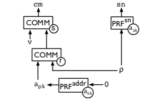
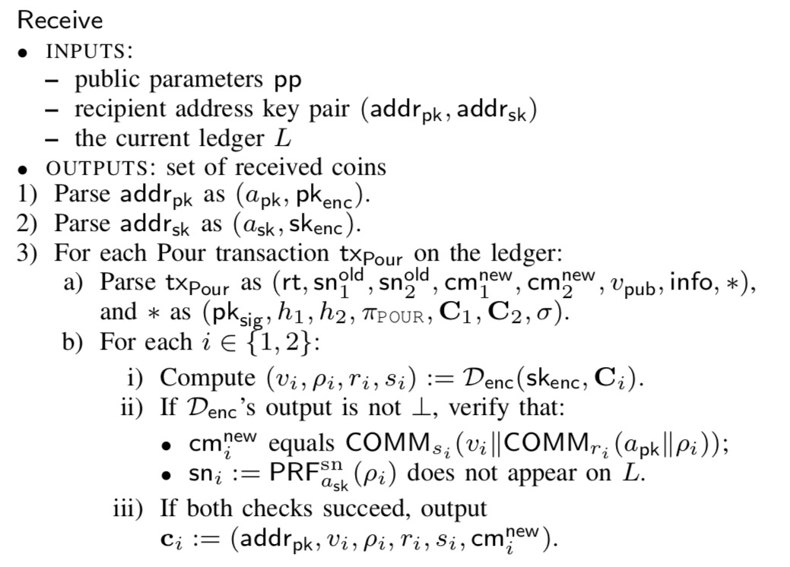

# Zerocash: Decentralized Anonymous Payments from Bitcoin

[TOC]

## 背景介绍

### 作者背景

**Eli Ben-Sasson** (Technion 以色列理工大学)

**Alessandro Chiesa** (MIT 麻省理工学院)

**Christina Garman** (JHU 约翰·霍普金斯大学)

**Matthew Green** (JHU)

**Ian Miers** (JHU)

**Eran Tromer** (Tel Aviv University 特拉维夫大学)

**Madars Virza** (MIT)

### bitcoin

> Bitcoin cannot offer strong privacy guarantees: payment transactions are recorded in a public decentralized ledger, from which much information can be deduced.

### Zerocoin

> Zerocoin (Miers et al., IEEE S&P 2013) tackles some of these privacy issues by **unlinking transactions from the payment’s origin**. Yet, it still **reveals payments’ destinations and amounts, and is limited in functionality**.
>
> Redeeming zerocoins requires **double-discrete-logarithm proofs of knowledge**, which have size that exceeds **45kB** and require **450 ms** to verify (at the 128-bit security level).

Zerocoin 的匿名性是通过对 origin 隐藏来实现。具体的说，每次发起的Spend交易无法得知具体是哪一个 $c$ 被花费，但是对金额和 destination 并没有隐藏，下图说明了Zerocoin的匿名交易过程。Zerocoin用的零知识方案是zkSoK，交易大小和验证时间都会比较大，受限于性能和实用性。


## Zerocash方案简介

> we construct a full-fledged ledger-based digital currency with strong privacy guarantees. Our results leverage recent advances in zero-knowledge Succinct Non-interactive AR- guments of Knowledge (zk-SNARKs). 
>
> we formulate and construct decentralized anonymous payment schemes (DAP schemes). A DAP scheme enables users to **directly pay each other privately**: the corresponding transaction **hides the payment’s origin, destination, and transferred amount**.

Zerocash使用的零知识方案是zk-SNARKs，本文构造了一个去中心化的匿名支付模式（DAP）。该模式支持直接的匿名转账支付，并且不仅隐藏origin还对destination、amount进行了隐藏。

> We achieve an implementation of the above primitive, via a system that we call **Zerocash**. Compared to **Zerocoin**, our system (at 128 bits of security): 
>
> - Reduces the **size of transactions** spending a coin by 97.7%. 
> - Reduces the **spend-transaction verification time** by 98.6%. 
> - Allows for anonymous transactions of **variable amounts**. 
> - **Hides** transaction amounts and the values of coins held by users. 
> - Allows for payments to be made **directly** to a user’s fixed address (without user interaction). 

Zerocash相比于Zerocoin，有以上五个方面的改进。

## Decentralized anonymous payment schemes

> Here, we outline the construction of DAP scheme in six incremental steps.
>
> - Step 1. User anonymity with fixed-value coins
> - Step 2. Compressing the list of coin commitments
> - Step 3. Extending coins for direct anonymous payments
> - Step 4. Sending coins
> - Step 5. Public outputs
> - Step 6. Non-malleability
>

Zerocash是在Zerocoin的基础上，通过六个渐进的步骤更改不足以及提出新的支持的功能，最后形成Zerocash的DAP完整方案。

### Step 1. User anonymity with fixed-value coins

> We first describe a simplified construction, in which all coins have the same value of, e.g., 1BTC. This construction, similar to the Zerocoin protocol, shows how to **hide a payment’s origin**.
>
> a new coin c is minted as follows: a user u samples a random **serial number $sn$** and a **trapdoor $r$**, computes a **coin commitment $cm := COMM_r(sn)$**, and sets $c := (r, sn, cm)$. A corresponding mint transaction txMint, containing cm (but not sn or r), is sent to the ledger; txMint is appended to the ledger only if u has paid 1BTC to a backing escrow pool.
>
> letting $CMList$ denote the list of **all coin commitments** on the ledger, u may spend $c$ by posting a **spend transaction** **txSpend** that contains: (i) the coin’s **serial number** $sn$; and (ii) a **zk-SNARK proof $π$** of the NP statement “**I know r such that $COMM_r(sn)$ appears in the list CMList of coin commitments**”. Assuming that $sn$ does not already appear on the ledger, u can redeem the deposited amount of 1 BTC, which u can either keep for himself, transfer to someone else, or immediately deposit into a new coin. (If sn does already appear on the ledger, this is considered double spending, and the transaction is discarded.)

第一步其实就是Zerocoin的设计，先得到两个随机数$r、 sn$ ， 利用$COMM_r(s)$ 函数求的一个coin commitment并将commitment上链。在花费时需要给出对应 commitment 的 serial number $sn$ 以及一个零知识证明$\pi$。serial number $sn$ 是用来防止双花问题的。

### Step 2. Compressing the list of coin commitments

> In the above NP statement, CMList is specified explicitly as a **list** of coin commitments. This **naive** representation severely limits scalability because the time and space complexity of most protocol algorithms (e.g., the proof verification algorithm) grows linearly with CMList. Moreover, coin commitments corresponding to already spent coins cannot be dropped from CMList to reduce costs, since they cannot be identified (due to the same zero-knowledge property that provides anonymity). 
>
> we rely on a **collision-resistant hash function CRH** to avoid an explicit representation of CMList. We maintain an **efficiently updatable append-only CRH-based Merkle tree Tree(CMList)** over the (growing) list CMList. Letting $rt$ denote the root of Tree(CMList), it is well-known that updating $rt$ to account for insertion of new leaves can be done with time and space proportional to the tree depth. Hence, the time and space complexity is reduced from linear in the size of CMList to logarithmic. 
>
> With this in mind, we modify the NP statement to the following one: “**I know $r$ such that $COMM_r(sn)$ appears as a leaf in a CRH-based Merkle tree whose root is $rt$**”. 

上一个方案中所有的commitment以线性(list)的形式存储且只追加不删除，在扩展性和性能上有很大的缺陷。使用基于抗碰撞的哈希函数（CRH）的Merkle tree来对commitment的集合进行压缩，并使得验证的速度加快。时间和空间复杂度都从线性（linear）的降低为对数（logarithmic）的。

这个方案下，在花费Zerocash时就要提供一个path，证明要花费的币是在这棵Merkle tree上的。


### Step 3. Extending coins for direct anonymous payments

上面的方案是不支持直接交易支付的，因为发送者知道所有的知识（即sn，r）。因为sn是固定的，接收者在花费这个coin时，公开sn，那么发送者是知道他花费了这笔钱的。而且接受者在接收到coin后必须马上发起另外一个交易，将这个coin转换为只有自己知道的参数对应的coin。

主要做了下面两部分变化：

**MINT**

> To provide targets for payments, we use **addresses**: each  user u generates an address key pair **$(a_{pk},a_{sk})$**. The coins of  u contain the value $a_{pk}$ and can be spent only with knowledge  of $a_{sk}$. A key pair $(a_{pk},a_{sk})$ is sampled by selecting a random  seed $a_{sk}$ and setting $a_{pk} := PRF^{addr}_{a_{sk}}(0)$. A user can generate and use any number of address key pairs.
>
> Next, we **re-design minting** to allow for greater functionality.  To mint a coin c of a desired value v, the user u first samples **$ρ$**, which is **a secret value that determines the coin’s serial number** as $sn := PRF^{sn}_{a_{sk}} (ρ)$. 
>
> Then, u commits to the tuple $(a_{pk} , v, ρ)$ in two phases: 
>
> (a) u computes $k := COMM_r (a_{pk} ∥ρ)$ for a random $r$; 
>
> (b) u computes $cm := COMM_s(v∥k)$ for a random $s$. 
>
> The minting results in a coin $c := (a_{pk}, v, ρ, r, s, cm)$ and a mint transaction txMint := $(v, k, s, cm)$.

首先要用地址来绑定coin，地址包含两部分：私钥和公钥。在Mint操作时，先生成一个随机数**ρ**，serial number sn的生成要依赖于ρ和私钥，这样需要有ρ以及私钥才能够生成sn，才能够花费coin。

更新了commitment的求法，将地址的公钥$a_{pk}$、币的价值$v$、和三个随机数绑定。这时coin的value就可以时任意值，而且coin c和地址绑定，拥有地址私钥和所有的秘密参数$(v, ρ, r, s)$的人才有coin的使用权。




**POUR**

> Coins are spent using the **pour** operation, which takes a set  of input coins, to be consumed, and “pours” their value into a  set of fresh output coins -- such that the total value of output  coins equals the total value of the input coins. Suppose that u, with address key pair $(a_{old} , a_{old} )$, wishes to consume his $c^{old} = (a^{old}_{pk}, v^{old}, ρ^{old}, r^{old}, s^{old}, cm^{old})$ and produce two new coins $c^{new}_1$ and $c^{new}_2$, with total value $v^{new}_1 + v^{new}_2 = v^{old}$, respectively targeted at address public keys $a^{new}_{pk, 1}$ and $a^{new}_{pk, 2}$ . (The addresses $a^{new}_{pk, 1}$ and $a^{new}_{pk, 2}$  may belong to u or to some other user.) The user u, for each $i ∈ {1, 2}$, proceeds as follows:
>
> (i) u samples serial number randomness $ρ^{new}_i$; 
>
> (ii) u computes $k^{new}_i:=COMM_{r^{new}_i} (a^{new}_{pk, i}∥ρ^{new}_{i})$ for a random $r^{new}_i$;
>
> (iii) u computes $cm^{new}_i := COMM_{s^{new}_i} (v^{new}_i∥k^{new}_i)$ for a random $s^{new}_i$. 
>
> This yields the coins $c^{new}_i := (a^{new}_{pk, i} , v^{new}_i, ρ^{new}_i, r^{new}_i, s^{new}_i, cm^{new}_i)$. Next, u produces a **zk-SNARK proof $π_{POUR}$** for the following NP statement, which we call $POUR$: 
>
> “Given the **Merkle-tree root** $rt$, **serial number** $sn^{old}$, and **coin commitments** $cm^{new}_1 , cm^{new}_2$ , I know **coins** $c^{old}, c^{new}_1, c^{new}_2$ and **address secret key** $a^{old}_{sk}$ such that: 
>
> • The **coins** are **well-formed**: for $c^{old}$ it holds that $k^{old} = COMM_{r^{old}} (a^{old}_{pk}∥ρ^{old})$ and $cm^{old} = COMM _{s^{old}} (v^{old}∥k^{old})$; and similarly for $c^{new}_1$ and $c^{new}_2$. 
>
> • The **address secret key** matchs the public key : $a^{old}_{pk} = PRF^{addr}_{a^{old}_{sk}}(0)$. 
>
> • The **serial number** is computed correctly: $sn^{old} := PRF^{sn}_{a^{old}_{sk}} (ρ^{old})$.
>
> • The **coin commitment** $cm^{old}$ appears as a leaf of a $Merkle\ tree$ with root $rt$.
>
> • The **values** add up: $v^{new}_1 + v^{new}_2 = v^{old}$.”
>
> A resulting **pour transaction** $tx_{POUR} := (rt,sn^{old},cm^{new}_1, cm^{new}_2,π_{POUR} )$ is appended to the ledger. (As before, the transaction is rejected **if the serial number $sn$ appears in a previous transaction**.) 

Zerocash中花费coin的动作叫做POUR，消费旧的coin $c^{old}$生成新的coin $c^{new}$。新的coin这样表示$c^{new}_i := (a^{new}_{pk, i} , v^{new}_i, ρ^{new}_i, r^{new}_i, s^{new}_i, cm^{new}_i)$，这个过程根Mint操作相同。

还要生成一个zk-SNARKs proof $π_{POUR}$，给出可公开的参数，利用自身的知识，求的满足上述五个方面的零知识证明，最后发送出去的交易是$tx_{POUR} := (rt,sn^{old},cm^{new}_1, cm^{new}_2,π_{POUR} )$，验证者根据proof和可公开的参数进行验证。

### Step 4. Sending coins

> Suppose that $a^{new}_{pk, 1}$ is the address public key of $u_1$. In order to allow $u_1$ to actually spend the new coin $c^{new}_1$ produced above, u must somehow send the secret values = in $c^{new}_1$ to $u_1$ .
>
> We modify the structure of an **address key pair**. Each user now has a key pair $(addr_{pk} , addr_{sk} )$, where $addr_{pk} = (a_{pk}, pk_{enc})$ and $addr_{sk} = (a_{sk}, sk_{enc})$. The values $(a_{pk}, a_{sk})$ are generated as before. In addition, $(pk_{enc}, sk_{enc})$ is a key pair for a **key-private encryption scheme** [21].
>
> Then, $u$ computes the ciphertext $C_1$ that is **the encryption of the plaintext** $(v^{new}_1, ρ^{new}_1, r^{new}_1, s^{new}_1)$, under $pk^{new}_{enc, 1}$ (which is part of $u_1$’s address public key $addr^{new}_{sk, 1}$), and includes $C_1$ in the pour transaction $tx_{Pour}$. The user $u_1$ can then find and decrypt this message (using his $sk^{new}_{enc, 1} )$ by scanning the pour transactions on the public ledger. 

$u_1$要想能够花费 $u$ 刚刚转给他的coin $c^{new}_1$就必须要秘密参数$(v, ρ, r, s)$，$u$要通过非对称加密的方式进行传输。那么就要对地址进行更新，加入一对加解密密钥$(pk_{enc}, sk_{enc})$，利用公钥加密密码参数，密文放在$tx_{POUR}$中，接收者$u_1$就可以自己解密得到秘密参数。这样就可以直接进行coin的转账。

### Step 5. Public outputs

> The construction so far allows users to **mint**, **merge**, and **split** coins. But how can a user redeem
> one of his coins, i.e., convert it back to the base currency (Bitcoin)? For this, we modify the pour operation to **include a public output**. When spending a coin, the user $u$ also specifies a nonnegative $v_{pub}$ and an arbitrary string info. The balance equation in **the NP statement POUR is changed** accordingly: “$v^{new}_1 + v^{new}_2 + v_{pub} = v^{old}$”. 
>
> Both $v_{pub}$ and **info** are now included in the resulting pour transaction $txPour$. (The public output is optional, as the user u can set vpub = 0.)

可以将Mint成Zerocash的coins再次redeem成公开的coin。添加一个值$v_{pub}$表示要公开出来的一个coin的值，知识零知识证明的values那句就要换成：$v^{new}_1 + v^{new}_2 + v_{pub} = v^{old}$。$tx_{POUR}$中还要附带info信息，表明是要将公开的coin转给谁。

### Step 6: non-malleability

> To prevent malleability attacks on a pour transaction txPour (e.g., embezzlement by re-targeting the public output of the pour by modifying info), we further **modify the NP statement POUR** and **use digital signatures**. 
>
> Specifically, during the pour operation, the user u 
>
> (i) samples a key pair $(pk_{sig}, sk_{sig})$ for a one-time signature scheme;  
>
> (ii) computes $h_{Sig} := CRH(pk_{sig})$; 
>
> (iii) computes the two values  $h_1 :=PRF^{pk}_{a^{old}_{sk, 1}} (h_{Sig})$ and $h_2 :=PRF^{pk}_{a^{old}_{sk, 2}} (h_{Sig})$, which act as MACs to “tie” $h_{Sig}$ to both address secret keys; 
>
> (iv) modifies POUR to include the three values $h_{Sig}$ , $h_1$ , $h_2$ and prove that the latter two are computed correctly;
>
> (v) uses $sk_{sig}$ to sign every value associated with the pour operation, thus obtaining a signature σ, which is included, along with $pk_{sig}$, in txPour.

因为公开的coin在传输时是通过info来说明转账给谁的，所以会出现被恶篡改的风险。所以就用到一次性不可伪造签名方案，每次生成一对key pair $(pk_{sig}, sk_{sig})$ ，用于对交易信息进行签名防止被篡改。


## Zerocash的实现方案

### New transaction

> Besides Basecoin transactions, there are two new types of transactions.
>
> • **Mint transactions**.  A mint transaction **txMint** is a tuple $(cm, v, ∗)$, where cm is a coin commitment, v is a coin value, and ∗ denotes other (implementation-dependent) information. The transaction txMint records that a coin c with coin commitment cm and value v has been minted.
>
> • **Pour transactions**.  A pour transaction **txPour** is a tuple $(rt, sn^{old}_1 , sn^{old}_2 , cm^{new}_1 , cm^{new}_2 , v_{pub} , info, ∗)$, where $rt$ is a root of a Merkle tree, $sn^{old}_1,sn^{old}_2$ are two coin serial numbers, $cm^{new}_1 ,cm^{new}_2$ are two coin commitments, $v_{pub}$ is a coin value, info is an arbitrary string, and ∗ denotes other (implementation-dependent) information. The transaction txPour records the pouring of two input (and now consumed) coins $c^{old}_{1}$ , $c^{cold}_{2}$ , with respective serial numbers $sn^{old}_1$ , $sn^{old}_2$ ,into two new output coins $c^{new}_1$ , $c^{new}_2$ , with respective coin commitments $cm^{new}_1$,$cm^{new}_2$, as well as a public output $v_{pub}$  (which may be zero). Furthermore, txPour also records an information string info (perhaps containing information on who is the recipient of $v_{pub}$ basecoins).

除了Basecoin的基本交易之外，Zerocash添加了两种新的操作：**Mint**、**Pour**。

**txMint**：a tuple $(cm, v, ∗)$

**txPour**：a tuple $(rt, sn^{old}_1 , sn^{old}_2 , cm^{new}_1 , cm^{new}_2 , v_{pub} , info, ∗)$

*中包含的信息会详细说明。

### Construction

DAP模式具体的实现方案

#### One-time strongly-unforgeable digital signatures

> **One-time strongly-unforgeable digital signatures**. We use a digital signature scheme $Sig = (\cal{G}_{sig} , \cal{K}_{sig} , \cal{S}_{sig} , \cal{V}_{sig} )$ that works as follows.
>
> - $\cal{G}_{sig} (1^λ)$ → $pp_{sig}$ . Given a security parameter λ (presented in unary), $\cal{G}_{sig}$ samples public parameters $pp_{enc}$ for the encryption scheme. 
> - $\cal{K}_{sig} (pp_{sig} ) → (pk_{sig} , sk_{sig} )$. Given public parameters $pp_{sig}$ , $\cal{K}_{sig}$ samples a public key and a secret key for a single user. 
> - $\cal{S}_{sig}(sk_{sig}, m)$ → $σ$. Given a secret key $sk_{sig}$ and a message $m$, $\cal{S}_{sig}$ signs $m$ to obtain a signature $σ$.
> - $\cal{V} (pk_{sig} , m, σ) → b$. Given a public key $pk_{sig}$ , message $m$, and signature $σ$, $V_{sig}$ outputs b = 1 if the signature σ is valid  for message m; else it outputs b = 0.
>

一次性不可伪造签名，给出了四个函数，分别是生成签名系统的公共参数、生成密钥对、签名、验签。之后会用到Pour的过程当中。

#### Key-private public-key encryption

> **Key-private public-key encryption**. We use a public-key encryption scheme Enc = $(\cal{G}_{enc}, \cal{K}_{enc}, \cal{E}_{enc}, \cal{D}_{enc})$ that works as follows. 
>
> - $\cal{G}_{enc}(1^λ ) → pp_{enc}$ . Given a security parameter λ (presented in unary), $\cal{G}_{enc}$ samples public parameters $pp_{enc}$ for the encryption scheme. 
> - $\cal{K}_{enc}(pp_{enc}) → (pk_{enc} , sk_{enc})$. Given public parameters $pp_{enc}$ , $\cal{K}_{enc}$ samples a public key and a secret key for a single user. 
> - $\cal{E}_{enc}(pk_{enc} , m) → c$. Given a public key $pk_{enc}$ and a message $m$, $\cal{E}_{enc}$ encrypts $m$ to obtain a ciphertext $c$. 
> - $\cal{D}_{enc}(sk_{enc} , c) → m$. Given a secret key $sk_{enc}$ and a ciphertext $c$, $\cal{D}_{enc}$ decrypts $c$ to produce a message $m$ (or $⊥$ if decryption fails).

非对称加密，也是四个函数：生成加密系统的公共参数、生成密钥对、加密、解密。用来加密秘密参数给接收者，在Pour中会详细用到。

#### The statement POUR

> **The statement POUR**. Concretely, the NP statement POUR is defined as follows.
>
> • **Instances** are of the form $ \vec{x} = (rt, sn^{old}_1 , sn^{old}_2 , cm^{new}_1 , cm^{new}_2 , v_{pub} , h_{Sig} , h_1 , h_2 )$. Thus, an instance  $\vec{x}$ specifies a root $rt$ for a CRH-based Merkle tree (over the list of commitments so far), the two serial numbers of the consumed coins, two coin commitments for the two new coins, a public value, and fields $h_{Sig}, h_1,h_2$ used for non-malleability.
>
> • **Witnesses** are of the form $\vec{a} = (path_1 , path_2 , c^{old}_1 , c^{old}_2 , addr^{old}_{sk, 1} ,addr^{old}_{sk, 2} ,c^{new}_1,c^{new}_2).$ Thus, a witness $\vec{a}$ specifies authentication paths for the two new coin commitments, the entirety of coin information about both the old and new coins, and address secret keys for the old coins.

在证明系统中有这样两个statement：Instance和Witness。

Instance在Zerocash中表示为：$ \vec{x} = (rt, sn^{old}_1 , sn^{old}_2 , cm^{new}_1 , cm^{new}_2 , v_{pub} , h_{Sig} , h_1 , h_2 )$。这些信息在Pour阶段都要公开出去。

Witness在Zerocash中表示位为：$\vec{a} = (path_1 , path_2 , c^{old}_1 , c^{old}_2 , addr^{old}_{sk, 1} ,addr^{old}_{sk, 2} ,c^{new}_1,c^{new}_2)$。witness中都是用户的知识，是不能泄漏出去的信息。

在Prove和Verify过程中要使用到这两个信息。

> Recall that in this paper zk-SNARKs are relative to the language of arithmetic circuit satisfiability (see Section II); thus, we **express the checks in POUR via an arithmetic circuit,denoted $C_{POUR}$**. In particular, the depth $d_{tree}$ of the Merkle tree needs to be hardcoded in $C_{POUR}$, and we thus make it a parameter of our construction (see below); the maximum number of supported coins is then $2^{d_{tree}}$ .

POUR的检验是需要通过算数电路来实现的，在系统的setup阶段会生成电路$C_{POUR}$。还有要将Merkle tree的深度硬编码到算数电路中。本文不会介绍关于算数电路的具体内容。

下面是Section II的截取内容

> Known constructions and security
>
> There are many zk-SNARK constructions in the literature [9, 10, 11, 12, 13, 14, 15, 16]. We are interested in zk-SNARKs for arithmetic circuit satisfiability, and the most efficient ones for this language are based on quadratic arithmetic programs [12, 11, 13, 14, 16]; such constructions provide a linear-time KeyGen, quasilinear-time Prove, and linear-time Verify.


#### Algorithm constructions

下面是Zerocash DAP模式每个算法的具体实现：


系统Setup过程输入安全参数 λ，输出公共参数PP。生成用于POUR过程中求proof $\pi$ 的算术电路（ arithmetic circuit）$C_{POUR}$ ，pp包括用于POUR Prove的prove key $pk_{POUR}$和Verify的verify key $vk_{POUR}$。还有用于非对称加密的公共参数$pp_{enc}$ ，用于签名验签的公共参数$pp_{sig}$。

setup过程需要由可信的第三方运行，输入安全参数 λ，输出公共参数 pp。setup过程只在整个系统开始前运行一次且只运行一次，运行结束后生成公共参数的所有秘密参数都不用保存。


每个用户可以根据公共参数生成自己的地址。输入PP，计算得出接收地址对 $(a_{sk}, a_{pk})$，和非对称加密的密钥对 $(sk_{enc}, pk_{enc})$ 。其中需要注意的是$a_{sk}, a_{pk}$的关系，


Mint过程是要将basecoin铸造成Zerocash。需要生成三个随机数$ρ、r、s$ ，并计算coin的commitment cm。在这个过程中不需要Prove的过程，$c$保密，$txMint$公开到链上。

从这个过程来看，Mint出来的coin的接收者是自己本身，因为在$txMint$中没有将秘密参数进行加密然后传输出去，也就是别的接收者不能知道 $ρ$ 的值，也就不能花费这个coin。


POUR过程：

**Generate new coin**

* 要先获取到要花费的每个old coin的所有参数；

* 为每一个new coin生成秘密参数$（v, ρ, r, s）$，并计算new coin的commitment，构造出$c^{new}_i$；
* 将new coin的秘密参数用接收方的非对称密码的公钥加密成 $C_i$；

**Generate verification data**

* 接着生成一次性不可篡改签名的密钥对，接着生成$h_{Sig}, h_{1}, h_{2}$；
* 初始化 $ \vec{x} = (rt, sn^{old}_1 , sn^{old}_2 , cm^{new}_1 , cm^{new}_2 , v_{pub} , h_{Sig} , h_1 , h_2 )$；
* 初始化 $\vec{a} = (path_1 , path_2 , c^{old}_1 , c^{old}_2 , addr^{old}_{sk, 1} ,addr^{old}_{sk, 2} ,c^{new}_1,c^{new}_2)$；
* 计算proof $\pi_{POUR}=Prove(pk_{POUR},\vec{x},\vec{a})$。此处的$Prove$需要使用计算电路。
* 构造messag m，并对message签名；

**Generate transaction**

* 利用自身的地址私钥计算出每一个old coin的Serial number $sn^{old}$，这个$sn^{old}$是需要公开出去的；
* 构造$tx_{POUR}$发布到链上。


Verify过程：

Mint：

* 验证Mint比较简单没有画图，利用公开参数计算一下commitment的值是否正确即可。

Pour：

* 首先拿到一个$tx_{POUR}$的所有信息，查看sn是否出现过，没出现过进行下面步骤。若出现过以双花处理，退出verify输出0。
* 构造出 $ \vec{x} = (rt, sn^{old}_1 , sn^{old}_2 , cm^{new}_1 , cm^{new}_2 , v_{pub} , h_{Sig} , h_1 , h_2 )$；
* 构造messag m，并对message进行验签；
* 进行zk-SNARKs的Verify，这个过程不需要电路的参与；
* 要同时验签通过以及零知识证明通过，才算这个Pour交易是有效的。





Receive过程：

* 遍历链上的所有Pour交易，对交易中的$C_i$进行解密，解密错误则一定不是自己的；
* 若解密成功，要计算commitment是否与交易上的相等，计算sn查看是否已经出现在链上；
* 都验证通过，则输出所有符合条件的$c^{new}$。


## R1CS

Range 1 Constraint System.

```
<a, b, c>
<s · a> * <s · b> = <s · c>
```

作用是将多项式$f(x)$转换为Constraint的形式，求出A、B、C矩阵。

任何的操作都可以通过电路表示成多项式的形式，比如哈希算法SHA256、伪随机函数PRF、求merkel root rt等等。

证明者的知识会转化为多项式的系数。

这张图是一个电路的例子，实现了$(c_1*c_2)*(c_1+c_3)$ ，每一个gate都可以表示为一个约束条件Constraint。


## QAP

R1CS是要证明每个Constraint都成立，而QAP的作用是将成千上万的Constraint转化为一个多项式等式$A(x)*B(x)-C(x)=H*Z(x)$，如果等式成立那么就证明Prover是拥有知识的。

下面的图来自Vitalik的post，


但是zk-SNARKs到这边还没有结束，到上一步为止是说明了怎么证明拥有知识。

## Pairing

怎么做到零知识性就需要用到Pairing的同态隐藏特性。

两篇参考文献：[PGHR13](https://www.microsoft.com/en-us/research/wp-content/uploads/2016/02/pinocchio.pdf)，[SCTV15](https://eprint.iacr.org/2013/879.pdf) 


## Experiment

Zerocash做的实验数据，pp参数容量是比较大的，Pour的过程话费时间也比较长，主要是在$Prove$的过程中钥进行很多的计算，通过计算电路将要证明的computation转化为R1CS、QAP，再通过Pairing进行同态隐藏，最后给出proof $\pi_{POUR}$。


