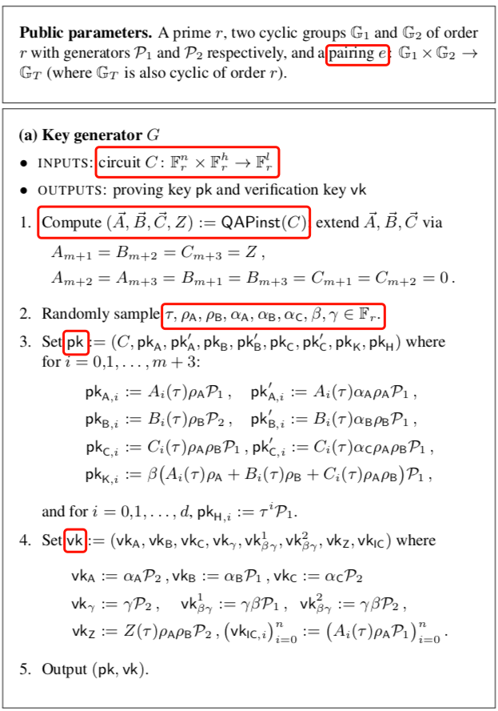

# zk-SNARKs

**SNARKs** are short for ***succinct non-interactive arguments of knowledge***. The generally desired properties are that no prover can convince the verifier about a wrong statement (**soundness**) and there is a certain strategy for the prover to convince the verifier about any true statement (**completeness**). The individual parts of the acronym have the following meaning: 

- **Succinct**: the sizes of the messages are tiny in comparison to the length of the actual computation.
- **Non-interactive**: there is no or only little interaction. For zkSNARKs, there is usually a setup phase and after that a single message from the prover to the verifier. Furthermore, SNARKs often have the so-called “public verifier” property meaning that anyone can verify without interacting anew, which is important for blockchains. 
- **ARguments**: the verifier is only protected against computationally limited provers. Provers with enough computational power can create proofs/arguments about wrong statements (Note that with enough computational power, any public-key encryption can be broken). This is also called “computational soundness”, as opposed to “perfect soundness”. 
- **of Knowledge**: it is not possible for the prover to construct a proof/argument without knowing a certain so-called **witness** (for example the address she wants to spend from, the preimage of a hash function or the path to a certain Merkle-tree node). 

上述原文摘自[zkSNARKs in a Nutshell](https://chriseth.github.io/notes/articles/zksnarks/zksnarks.pdf)

知识证明要求是健壮性（soundness）、完整性（completeness），健壮性是指作恶者很难证明成功，完整性是证明者有方法证明成功他拥有知识。零知识证明多了一个特性：零知识性（zero-knowledge），证明者在证明过程中不会向验证者透露任何的知识。还有，zk-SNARKs是“computational soundness”的，不能抵御量子攻击。

[TOC]

a picture from [**Vitalik**](https://medium.com/@VitalikButerin/quadratic-arithmetic-programs-from-zero-to-hero-f6d558cea649) 


上图是Vitalik Medium上blog的一张图片，展示了zk-SNARKs的大体上的过程，过程来自[Succinct Non-Interactive Arguments via Linear Interactive Proofs](https://eprint.iacr.org/2012/718.pdf)。

我们下面的介绍过程和上图不完全一样，因为到QAP之后，我们要使用The Pinocchio Protocol来进行证明和用Pairing来隐藏知识。

## Computation

> Next, u produces a **zk-SNARK proof $π_{POUR}$** for the following NP statement, which we call $POUR$: 
>
> “Given the **Merkle-tree root** $rt$, **serial number** $sn^{old}$, and **coin commitments** $cm^{new}_1 , cm^{new}_2$ , I know **coins** $c^{old}, c^{new}_1, c^{new}_2$ and **address secret key** $a^{old}_{sk}$ such that: 
>
> • The **coins** are **well-formed**: for $c^{old}$ it holds that $k^{old} = COMM_{r^{old}} (a^{old}_{pk}∥ρ^{old})$ and $cm^{old} = COMM _{s^{old}} (v^{old}∥k^{old})$; and similarly for $c^{new}_1$ and $c^{new}_2$. 
>
> • The **address secret key** matchs the public key : $a^{old}_{pk} = PRF^{addr}_{a^{old}_{sk}}(0)$. 
>
> • The **serial number** is computed correctly: $sn^{old} := PRF^{sn}_{a^{old}_{sk}} (ρ^{old})$.
>
> • The **coin commitment** $cm^{old}$ appears as a leaf of a $Merkle\ tree$ with root $rt$.
>
> • The **values** add up: $v^{new}_1 + v^{new}_2+v_{pub} = v^{old}$.”
>
> A resulting **pour transaction** $tx_{POUR} := (rt,sn^{old},cm^{new}_1, cm^{new}_2,π_{POUR} )$ is appended to the ledger. (As before, the transaction is rejected **if the serial number $sn$ appears in a previous transaction**.) 

Zerocash原文中说明了要对以上五个方面进行零知识证明的构造，以上五个等式就是computation。

> **The statement POUR**. Concretely, the NP statement POUR is defined as follows.
>
> • **Instances** are of the form $ \vec{x} = (rt, sn^{old}_1 , sn^{old}_2 , cm^{new}_1 , cm^{new}_2 , v_{pub} , h_{Sig} , h_1 , h_2 )$. Thus, an instance  $\vec{x}$ specifies a root $rt$ for a CRH-based Merkle tree (over the list of commitments so far), the two serial numbers of the consumed coins, two coin commitments for the two new coins, a public value, and fields $h_{Sig}, h_1,h_2$ used for non-malleability.
>
> • **Witnesses** are of the form $\vec{a} = (path_1 , path_2 , c^{old}_1 , c^{old}_2 , addr^{old}_{sk, 1} ,addr^{old}_{sk, 2} ,c^{new}_1,c^{new}_2).$ Thus, a witness $\vec{a}$ specifies authentication paths for the two new coin commitments, the entirety of coin information about both the old and new coins, and address secret keys for the old coins.

在证明系统中有这样两个statement：Instance和Witness。

Instance在Zerocash中表示为：$ \vec{x} = (rt, sn^{old}_1 , sn^{old}_2 , cm^{new}_1 , cm^{new}_2 , v_{pub} , h_{Sig} , h_1 , h_2 )$。这些信息在Pour阶段都要公开出去。

Witness在Zerocash中表示位为：$\vec{a} = (path_1 , path_2 , c^{old}_1 , c^{old}_2 , addr^{old}_{sk, 1} ,addr^{old}_{sk, 2} ,c^{new}_1,c^{new}_2)$。witness中都是用户的知识，是不能泄漏出去的信息。

在Prove和Verify过程中要使用到这两个信息。目的是在不泄漏witness的情况下证明拥有这些知识。

## Circuit

> Recall that in this paper zk-SNARKs are relative to the language of arithmetic circuit satisfiability (see Section II); thus, we **express the checks in POUR via an arithmetic circuit,denoted $C_{POUR}$**. In particular, the depth $d_{tree}$ of the Merkle tree needs to be hardcoded in $C_{POUR}$, and we thus make it a parameter of our construction (see below); the maximum number of supported coins is then $2^{d_{tree}}$ .

选取 **serial number** : $sn^{old} := PRF^{sn}_{a^{old}_{sk}} (ρ^{old})$ 来当作例子。PRF是伪随机函数，输入是$a^{old}_{sk},\ ρ^{old}$ ,输出是$sn^{old}$。

下面给出一个简单的电路示意图：


任何的计算过程都能够用门（gate）电路集合来表示，不管这个计算过程有多复杂。

因为Zerocash中的计算过程都比较复杂，一个SHA256的电路文件就有23万行。所以下面我们给出一个简单的例子来说明电路是如何工作的，令$f(x)=x^3 + x + 5$。**有一点需要说明：Zerocash中的计算过程一般是单向不可逆的，为了简便我们认为$f(x)$也是单向不可逆的**。

### Flattening

将多项式转换成最简单的表达式（gate）的集合：$y=x\ or\ y=x\ (op)\ z$
$$
\begin{equation}
f(x)=x^3+x+5\ ==>\left\{
\begin{aligned}
sym\_1 & = & x * x \\
y & = & sym\_1 * x \\
sym\_2 & = & y + x \\
out & = & sym\_2 + 5
\end{aligned}
\right.
\end{equation}\\
solution:[one，x，out，sym\_1，y，sym\_2]
$$
假设我们拥有知识x，经过单向函数$f(x)$的计算得出的结果是35，即$f(x)=x^3+x+5=35$。这个知识是$x=3$，那么对应的 **solution** 就是 [1，3，35，9，27，30] 。


## R1CS

$$
\begin{equation}
\left\{
\begin{aligned}
sym\_1 & = & x * x \\
y & = & sym\_1 * x \\
sym\_2 & = & y + x \\
out & = & sym\_2 + 5
\end{aligned}
\right.
\end{equation}\\
solution:[one，x，out，sym\_1，y，sym\_2]
$$

接下来要将上述结果转化为R1CS。R1CS 是指 rank-1 constraint system。

> An R1CS is a sequence of groups of three vectors `<a, b, c>`, and the **solution** to an R1CS is a vector `s`, where `s` must satisfy the equation `<s . a> * <s . b> = <s . c> `.

Flattening的结果中每一个等式表示一个constraint，每个constraint要用一组向量`<a, b, c>`表示，而且要满足关系式： `<s . a> * <s . b> = <s . c> `。

第一个constraint：$sym\_1=x*x$ 有
$$
a_1 = [0, 1, 0, 0, 0, 0]\ \ \
b_1 = [0, 1, 0, 0, 0, 0]\ \ \
c_1 = [0, 0, 0, 1, 0, 0]
$$
验证如下：s=[1，3，35，9，27，30]，其他的constrain同理
$$
s.a_1\ *\ s.b_1\ -s.c_1 = 0
$$
第二个constrain：$y=sym\_1*x$有
$$
a_2 = [0, 0, 0, 1, 0, 0]\ \ \
b_2 = [0, 1, 0, 0, 0, 0]\ \ \
c_2 = [0, 0, 0, 0, 1, 0]
$$

第三个constrain：$sym\_2=y+x$有

$$
a_3 = [0, 1, 0, 0, 1, 0]\ \ \
b_3 = [1, 0, 0, 0, 0, 0]\ \ \
c_3 = [0, 0, 0, 0, 0, 1]
$$

第四个constrain：$out=sym\_2+5​$有

$$
a_4 = [5, 0, 0, 0, 0, 1]\ \ \
b_4 = [1, 0, 0, 0, 0, 0]\ \ \
c_4 = [0, 0, 1, 0, 0, 0]
$$
将所有的constrain整合到一起：
```
a
[0, 1, 0, 0, 0, 0]
[0, 0, 0, 1, 0, 0]
[0, 1, 0, 0, 1, 0]
[5, 0, 0, 0, 0, 1]

b
[0, 1, 0, 0, 0, 0]
[0, 1, 0, 0, 0, 0]
[1, 0, 0, 0, 0, 0]
[1, 0, 0, 0, 0, 0]

c
[0, 0, 0, 1, 0, 0]
[0, 0, 0, 0, 1, 0]
[0, 0, 0, 0, 0, 1]
[0, 0, 1, 0, 0, 0]
```

上述是三个向量的集合，也就是R1CS的结果。

## QAP

接下来将R1CS的结果转化为QAP。为什么要这样做在介绍完QAP后会给出原因。

QAP：Quadratic Arithmetic Programs

> Now, let’s use **Lagrange interpolation** to transform our R1CS. What we are going to do is take the first value out of every `a` vector, use Lagrange interpolation to make a polynomial out of that (where evaluating the polynomial at `i` gets you the first value of the ith `a` vector), repeat the process for the first value of every `b` and `c` vector, and then repeat that process for the second values, the third, values, and so on. For convenience I'll provide the answers right now:

拿a来举例

```
a
[0, 1, 0, 0, 0, 0]
[0, 0, 0, 1, 0, 0]
[0, 1, 0, 0, 1, 0]
[5, 0, 0, 0, 0, 1]
```

先取每个向量的第一个值，那么多项式要过点 $(1, 0), (2, 0), (3, 0), (4, 5)$，利用拉格朗日插值法求解该多项式：


得到多项式$f(x)=\frac56x^3-5x^2+\frac{55}6x-5$，将系数由低阶到高阶排列为 [-5.0, 9.166, -5.0, 0.833]。

对a，b，c中每个向量做同样的过程可以得到；

```
A polynomials
A_1(x): [-5, 9.166, -5, 0.833]
A_2(x): [8, -11.333, 5, -0.666]
A_3(x): [0, 0, 0, 0]
A_4(x): [-6, 9.5, -4, 0.5]
A_5(x): [4, -7, 3.5, -0.5]
A_6(x): [-1, 1.833, -1, 0.166]

B polynomials
B_1(x): [3, -5.166, 2.5, -0.333]
B_2(x): [-2, 5.166, -2.5, 0.333]
B_3(x): [0, 0, 0, 0]
B_4(x): [0, 0, 0, 0]
B_5(x): [0, 0, 0, 0]
B_6(x): [0, 0, 0, 0]

C polynomials
C_1(x): [0, 0, 0, 0]
C_2(x): [0, 0, 0, 0]
C_3(x): [-1, 1.833, -1, 0.166]
C_4(x): [4, -4.333, 1.5, -0.166]
C_5(x): [-6, 9.5, -4, 0.5]
C_6(x): [4, -7, 3.5, -0.5]
```
分别将$x=1,2,3,4$带入可以还原出上面R1CS的结果向量。
> This set of polynomials (plus a Z polynomial that I will explain later) makes up the parameters for this particular QAP instance. Note that all of the work up until this point needs to be done only once for every function that you are trying to use zk-SNARKs to verify; once the QAP parameters are generated, they can be reused.

上面这句话的意思是：上述多项式构成了一个特定QAP实例的参数。 在使用zk-SNARKs进行验证的每个函数$f(x)$ 时，QAP的工作只需执行一次;，生成QAP参数后，可以重复使用它们。对于每次证明，上述多项式是一样的。只是我们的知识不同，solution就会有不同的值，我们的solution要与结果（比如上述的$f(x)=35$）相对应。

### Checking the QAP

下面这段话解释了为什么要用QAP来检验。

> Now what’s the point of this crazy transformation? The answer is that instead of **checking the constraints in the R1CS individually**, we can now check ***all of the constraints at the same time* by doing the dot product check *on the polynomials***.


$$
A(x)=\sum_{i=1}^6s_i*A_i(x)\\
B(x)=\sum_{i=1}^6s_i*B_i(x)\\
C(x)=\sum_{i=1}^6s_i*C_i(x)
$$
我们需要检查结果多项式$ A(x) * B(x) - C(x)$ 在 $x=1,2,3,4$ 处是否都为 $0$，若在这四个点处有一处不为 $0$，那么验证失败，否则，验证成功。

根据代数学原理，正确性检查等价于结果多项式 $A(x) * B(x) - C(x) $是否能够整除多项式 $Z(x) = (x-1)(x-2)(x-3)(x-4)$。如果能够整除说明了在电路中的每个gate上都是满足的，也就是验证成功。


最后，要验证的就是这个式子：
$$
A(x)\ * \ B(x)-C(x)=H(x)\ * \ Z(x)
$$
在给定的instance中，$Z(x)$是固定的。如果计算中有$n$个gate，那么$Z(x)=\prod_{i=1}^{n}(x-i)$，而solution向量中也会有$n$个值。求出$A(x),\ B(x),\ C(x)$后，就可以求出$H(x)$。

在真正的应用上，不会在实数域上运算，而是会在有限域上进行操作，这样可以避免一系列舍入误差。但是，原理都是相同的。目前所做的事情，相对于上一步的R1CS，通过多项式的方式简化了验证的方式，QAP相对于R1CS是一个效率上的改进。

现在只是说明了如何对知识进行证明，也就是完成了 **soundness** 和 **completeness** 。还没有做到零知识，还是依赖于证明者未被隐藏的向量 $s$ ，因为如果我们把$A(x),\ B(x),\ C(x)$公开出去，攻击者就反推出solution。接下来要先介绍Pairing，进而用Pairing来对知识进行保护并保证上述两个特性也能够满足。

## Elliptic curve pairing / bilinear maps

双线性映射定义了三个素数p阶群乘法循环群$G_1$，$G_2$,和$G_T$。并且定义在这三个群上的一个映射关系$e: G_1\times G_2 \rightarrow G_T$，并且满足以下的性质：

1. 双线性：对于任意的$g_1 \in G_1,\ g_2 \in G_2,\ a,\ b\in Z_p$，均有$e(a*g_1,\ b*g_2)=e(g_1,\ g_2)^{ab}$成立；
2. 非退化性：$\exists g_1\in G_1,\ g_2\in G_2$满足$e(g_1,\ g_2) \neq 1_{G_T}$。
3. 可计算性：存在有效的算法，对于$\forall g_1\in G_1,\ g_2\in G_2$，均可计算$e(g_1,\ g_2)$。

如果则称上述双线性配对是对称的，否则是非对称的。另外，上述的双线性配对是素数阶的，还存在一种合数阶的双线性配对。

## Homomorphic Hiding

> In the previous articles, we introduced the quadratic arithmetic program, a way of representing any computational problem with a polynomial equation that is much more amenable to various forms of mathematical trickery. We also introduced elliptic curve pairings, which allow a very limited form of one-way homomorphic encryption that lets you do equality checking.

上面QAP小结中要证明的形式是：$A(x) * B(x) - C(x) = H(x) * Z(x)$。其中：

多项式 $A(X)$ 是多项式组 ${A_1(x),A_2(x),..., A_n(x)}$ 的线性组合；

多项式 $B(X)$ 是与 $A(x)$ 相同系数的多项式组 ${B_1(x),B_2(x),..., B_n(x)}$ 的线性组合；

多项式 $C(X)$ 是与 $A(x)$ 相同系数的多项式组 ${C_1(x),C_2(x),..., C_n(x)}$ 的线性组合。

### 验证优化

整个多项式$A(x),\ B(x),\ C(x)$ 会有成千数万个子项，所以我们需要优化一下这个验证方法。我们只需要验证在 ![x=t]处多项式是否成立即可，即验证$A(t)*B(t)-C(t)=H(t)*Z(t)$  。当然，这里存在着一些风险，即会不会出现虽然整个多项式并不满足，但是恰好在$x=t$  也成立的情况？以及，会不会证明者精心构造数据使得其恰好在 $x=t$ 处成立？

第一个问题用[Schwartz-Zippel](https://en.wikipedia.org/wiki/Schwartz%E2%80%93Zippel_lemma)定理来回答，即两个2d阶（最高阶是2d）多项式最多在2d个点处值相等，因此我们选一个随机值 $t$，由于我们所使用的有限域的阶远大于多项式的阶，因此找到另一个多项式使得这个多项式在 t 处取值和此多项式相等的概率小到可以忽略)。所以，虽然概率存在，但是足够小。

第二个问题， $t$ 在Setup阶段就会销毁，因为没有人知道 $t$ 究竟是多少，因此想要针对 $x=t$ 进行伪造数据是极其困难的。

### 简化的验证过程

完整的过程在下一节的paper中，这里将验证过程简化便于理解。总共需要对三个方面的数据进行验证。

**Step1**

**第一步验证证明者给出了多项式$A(x),\ B(x),\ C(x)$的系数，即知道solution。**

要使用Pairing，就必须把参数映射到椭圆曲线上。在Key generate阶段，构造以下的公共参数：

> **PK:**
> $G * A_1(t),\ G * A_1(t) * k_a\\
>   G * A_2(t),\ G * A_2(t) * k_a\\
>   …\\
>   G * B_1(t),\ G * B_1(t) * k_b\\
>   G * B_2(t),\ G * B_2(t) * k_b\\
>   …\\
>   G * C_1(t),\ G * C_1(t) * k_c\\
>   G * C_2(t),\ G * C_2(t) * k_c\\
>   …\\$

> **VK:**
> $vk_a = G* k_a\\
>   vk_b = G* k_b\\
>   vk_c = G* k_c$

其中$G$是椭圆曲线的循环群的生成元，$t,\ k_a,\ k_b,\ k_c$ 称为 “toxic waste”，可信第三方在生成这些参数后必须将这些参数销，保证没人知道这些参数的值。因为椭圆曲线乘法是基于离散对数难题的，当获取到$G*k$ 时，很难恢复出k的值。

证明者计算给出：
$$
π_a =G * A(t),\ π’_a = G * A(t) * k_a\\
π_b = G * B(t),\ π’_b = G * B(t) * k_b\\
π_c = G * C(t),\ π’_c = G * C(t) * k_c
$$

下面是$π_a$和$π'_a$的计算过程，$π_b$和$π_c$同理：
$$
π_a =G * A(t)=\sum_{i=1}^ns_i*G*A_i(t)\\
π’_a = G * A(t) * k_a=\sum_{i=1}^ns_i*G*A_i(t)*k_a
$$
验证者验证：
$$
e(\pi'_a,\ G)\ ?=\ e(\pi_a,\ vk_a)\\
e(\pi'_b,\ G)\ ?=\ e(\pi_b,\ vk_b)\\
e(\pi'_c,\ G)\ ?=\ e(\pi_c,\ vk_c)
$$
**Step2**

**确保这三个线性组合都具有相同的系数。**

在公开参数 PK 和 VK 中添加新的值：

> **PK：**
>
> $ G * (A_1(t) + B_1(t) + C_i(t)) * b\\ G * (A_2(t) + B_2(t) + C_2(t)) * b\\...$

> **VK:**
>
> $vk_{\beta}=G*b$

同样的b是 “toxic waste”，计算出PK和VK后b要销毁。

证明者给出：
$$
π_k = G * (A(t) + B(t) + C(t)) * b=\sum_{i=1}^ns_i*G * (A_i(t) + B_i(t) + C_i(t)) * b\\
$$
验证者验证：

$$
e(π_k,\ G)\ ?=\ e(π_a+π_b+π_c,\ vk_{\beta})
$$

**Step3**

**证明$A(t) * B(t) – C(t) = H(t) * Z(t)$**

在公开参数 PK 和 VK 中添加新的值：

> **PK：**
>
> $ G\\G*t\\G*t^2\\G*t^3\\...​$

> **VK:**
>
> $vk_z = G * Z(t)=G*(\prod_{i=1}^nt-i),\ t\gg n$

证明者计算：
$$
H(x)=\frac{A(x)*B(x)-C(x)}{Z(x)}
$$
令$h_i$是多项式$H(x)$的系数，接着：
$$
π_h =G * H(t)=\sum_{i=0}^{n-2}h_i*(G*t^i)
$$
给出$π_h$

验证者验证：
$$
e(π_a,\ π_b)\ ?=\ e(π_c,\ G)*e(π_h,\ vk_z)
$$
**验证过程小结：**

* 系统在初始化阶段要根据电路计算出$A_i(x),\ B_i(x),\ C_i(x),\ Z(x)$。在合理范围内随机出 $t,\ b,\ k_a,\ k_b,\ k_c​$这些“toxic waste”，这些参数在计算完PK与VK后要销毁。接着计算存储数量巨大的PK以及VK，这两个参数是系统唯一且公开的，有数据显示PK接近1GB的大小。
* 证明者在QAP中输入知识（knowledge）得到solution，solution是$A(x),\ B(x),\ C(x)$的组成多项式的系数，进一步可以求出$H(x)$。
* 证明者结合PK，计算出proof $π := (π_a,π′_a ,π_b,π'_b ,π_c,π′_c ,π_k,π_h)$。
* 验证者分三部分验证证明者给出的证明，全部验证通过则**以一个相对大的概率认为**证明者有相应的知识。

上述是一个简化的验证过程（完整过程是PGHR13），具体在应用中会有更多参数和计算来保证更强的零知识性和健壮性。

###  PGHR13

下面给出的图片是[SCTV15](https://eprint.iacr.org/2013/879.pdf)中总结的[PGHR13](https://eprint.iacr.org/2013/279.pdf)的详细过程。包括选择Pairing参数、生成PK和VK、Prover以及Verifier。




## Reference

https://chriseth.github.io/notes/articles/zksnarks/zksnarks.pdf

https://medium.com/@VitalikButerin/quadratic-arithmetic-programs-from-zero-to-hero-f6d558cea649

https://medium.com/@VitalikButerin/exploring-elliptic-curve-pairings-c73c1864e627

https://medium.com/@VitalikButerin/zk-snarks-under-the-hood-b33151a013f6

PGHR13 https://eprint.iacr.org/2013/279.pdf

SCTV15 https://eprint.iacr.org/2013/879.pdf


